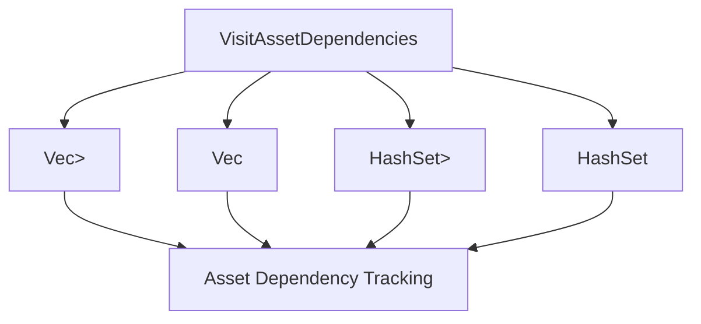

+++
title = "#20735 impl `VisitAssetDependencies` for `HashSet`"
date = "2025-09-03T00:00:00"
draft = false
template = "pull_request_page.html"
in_search_index = true

[taxonomies]
list_display = ["show"]

[extra]
current_language = "en"
available_languages = {"en" = { name = "English", url = "/pull_request/bevy/2025-09/pr-20735-en-20250903" }, "zh-cn" = { name = "中文", url = "/pull_request/bevy/2025-09/pr-20735-zh-cn-20250903" }}
labels = ["D-Trivial", "A-Assets", "C-Usability"]
+++

# impl `VisitAssetDependencies` for `HashSet`

## Basic Information
- **Title**: impl `VisitAssetDependencies` for `HashSet`
- **PR Link**: https://github.com/bevyengine/bevy/pull/20735
- **Author**: ItsDoot
- **Status**: MERGED
- **Labels**: D-Trivial, A-Assets, C-Usability, S-Ready-For-Final-Review
- **Created**: 2025-08-24T08:15:48Z
- **Merged**: 2025-09-03T02:56:45Z
- **Merged By**: alice-i-cecile

## Description Translation
The original description is in English, so it's included as-is:

**Objective**

I want to use `HashSet<Handle<T>>` over `Vec<Handle<T>>` for fast contains checking. Partially adopts #14162: I only need the `HashSet` implementation at the moment.

**Solution**

Implement `VisitAssetDependencies` for `HashSet`.

**Testing**

Added derive macro compatibility tests for `HashSet`.

## The Story of This Pull Request

This PR addresses a practical performance optimization need in Bevy's asset system. The developer wanted to use `HashSet<Handle<T>>` instead of `Vec<Handle<T>>` for asset dependency tracking to benefit from faster containment checks, but discovered that `HashSet` didn't implement the required `VisitAssetDependencies` trait.

The core issue was straightforward: while `Vec` had implementations for `VisitAssetDependencies`, `HashSet` was missing this capability. This meant developers couldn't use hash sets for asset dependencies even when they needed O(1) containment checks instead of Vec's O(n) linear searches.

The solution implemented follows the same pattern already established for `Vec`. Two implementations were added:

1. For `HashSet<Handle<A>>` where `A: Asset`
2. For `HashSet<UntypedHandle>`

Both implementations iterate through the set's elements and call the visitor function for each dependency, exactly mirroring how the `Vec` implementation works. This consistency ensures that all collection types handle asset dependencies in the same way.

To validate the implementation, the developer added comprehensive tests that verify the derive macro works correctly with `HashSet` fields. The tests include both typed (`Handle<TestAsset>`) and untyped (`UntypedHandle`) hash sets, ensuring coverage for both implementation variants.

The changes are minimal and focused - this is a classic example of extending existing functionality to support additional types while maintaining consistency with established patterns. The implementation doesn't introduce new concepts or complex logic, making it easy to review and maintain.

From an architectural perspective, this change enhances the flexibility of Bevy's asset system by allowing developers to choose the appropriate collection type for their specific performance needs without sacrificing functionality.

## Visual Representation



## Key Files Changed

**File: `crates/bevy_asset/src/lib.rs`**

This file received two main changes:
1. Added `VisitAssetDependencies` implementations for `HashSet`
2. Added test coverage for `HashSet` usage with asset dependencies

**Code Changes:**

1. Implementation for `HashSet<Handle<A>>`:
```rust
impl<A: Asset> VisitAssetDependencies for HashSet<Handle<A>> {
    fn visit_dependencies(&self, visit: &mut impl FnMut(UntypedAssetId)) {
        for dependency in self {
            visit(dependency.id().untyped());
        }
    }
}
```

2. Implementation for `HashSet<UntypedHandle>`:
```rust
impl VisitAssetDependencies for HashSet<UntypedHandle> {
    fn visit_dependencies(&self, visit: &mut impl FnMut(UntypedAssetId)) {
        for dependency in self {
            visit(dependency.id());
        }
    }
}
```

3. Test additions (excerpt):
```rust
// Added to test structs:
#[dependency]
set_handles: HashSet<Handle<TestAsset>>,
#[dependency]
untyped_set_handles: HashSet<UntypedHandle>,
```

## Further Reading

- [Rust HashSet documentation](https://doc.rust-lang.org/std/collections/struct.HashSet.html)
- [Bevy Assets documentation](https://bevyengine.org/learn/books/introduction/assets/)
- [PR #14162](https://github.com/bevyengine/bevy/pull/14162) - Original issue discussing broader collection support
- [Trait implementation patterns in Rust](https://rust-lang.github.io/api-guidelines/future-proofing.html)