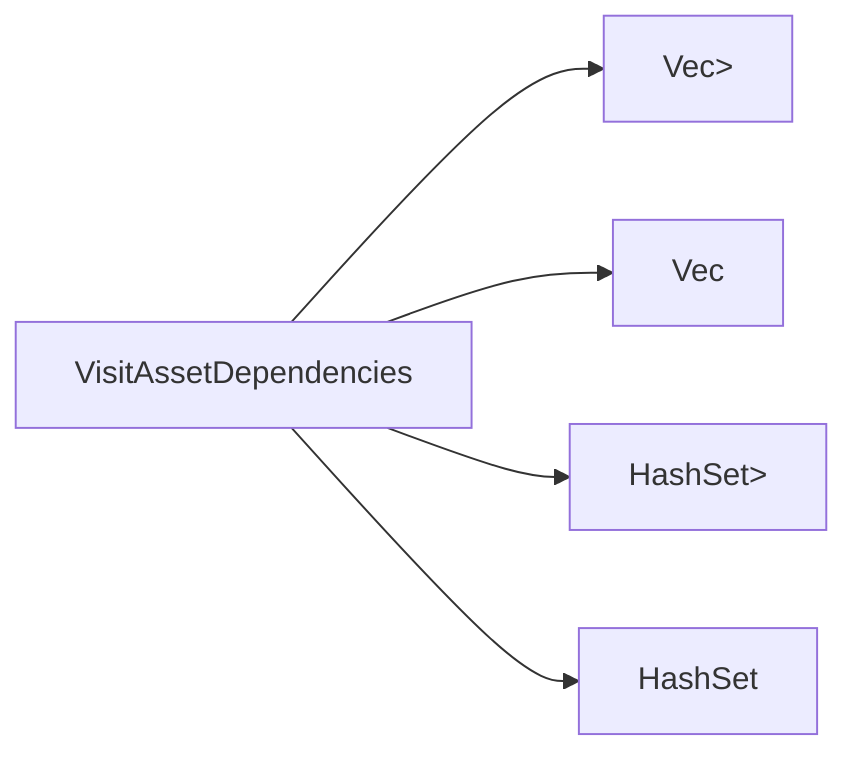

+++
title = "#20735 impl `VisitAssetDependencies` for `HashSet`"
date = "2025-09-03T00:00:00"
draft = false
template = "pull_request_page.html"
in_search_index = false

[extra]
current_language = "zh-cn"
available_languages = {"en" = { name = "English", url = "/pull_request/bevy/2025-09/pr-20735-en-20250903" }, "zh-cn" = { name = "中文", url = "/pull_request/bevy/2025-09/pr-20735-zh-cn-20250903" }}
labels = ["D-Trivial", "A-Assets", "C-Usability"]
+++

# Title
实现 `VisitAssetDependencies` 用于 `HashSet`

## Basic Information
- **Title**: impl `VisitAssetDependencies` for `HashSet`
- **PR Link**: https://github.com/bevyengine/bevy/pull/20735
- **Author**: ItsDoot
- **Status**: MERGED
- **Labels**: D-Trivial, A-Assets, C-Usability, S-Ready-For-Final-Review
- **Created**: 2025-08-24T08:15:48Z
- **Merged**: 2025-09-03T02:56:45Z
- **Merged By**: alice-i-cecile

## Description Translation
# 目标

我希望使用 `HashSet<Handle<T>>` 替代 `Vec<Handle<T>>` 来实现快速的包含检查。部分采用了 #14162：目前我只需要 `HashSet` 的实现。

## 解决方案

为 `HashSet` 实现 `VisitAssetDependencies`。

## 测试

添加了针对 `HashSet` 的派生宏兼容性测试。

## The Story of This Pull Request

这个 PR 解决了一个简单的但实用的需求：在使用 Bevy 资产系统时，开发者希望能够使用 `HashSet<Handle<T>>` 来存储资产句柄，以获得 O(1) 时间复杂度的包含检查，而不是 `Vec<Handle<T>>` 的 O(n) 时间复杂度。

问题的核心在于 Bevy 的资产依赖追踪系统需要能够遍历资产的所有依赖项。系统通过 `VisitAssetDependencies` trait 来实现这一功能，但该 trait 之前只为 `Vec<Handle<T>>` 和 `Vec<UntypedHandle>` 实现了实现，而没有为 `HashSet` 提供相应的实现。

解决方案很直接：为 `HashSet<Handle<A>>` 和 `HashSet<UntypedHandle>` 实现 `VisitAssetDependencies` trait。实现方式与现有的 `Vec` 实现保持一致，遍历集合中的所有元素并访问它们的依赖关系。

从技术角度看，这个实现：

1. 保持了与现有代码的一致性
2. 使用了相同的访问模式（遍历并调用 `visit` 函数）
3. 正确处理了类型化和非类型化的句柄

测试方面，PR 添加了针对 `HashSet` 的派生宏兼容性测试，确保 `#[derive(Asset)]` 宏能够正确处理包含 `HashSet` 字段的结构体。

这个改动虽然不大，但提供了实用的功能提升，让开发者能够在需要快速查找的场景中使用更合适的数据结构，同时保持与资产依赖系统的完整集成。

## Visual Representation



## Key Files Changed

### `crates/bevy_asset/src/lib.rs` (+25/-1)

这个文件包含了主要的实现改动和测试添加：

1. 为 `HashSet<Handle<A>>` 实现 `VisitAssetDependencies`：
```rust
impl<A: Asset> VisitAssetDependencies for HashSet<Handle<A>> {
    fn visit_dependencies(&self, visit: &mut impl FnMut(UntypedAssetId)) {
        for dependency in self {
            visit(dependency.id().untyped());
        }
    }
}
```

2. 为 `HashSet<UntypedHandle>` 实现 `VisitAssetDependencies`：
```rust
impl VisitAssetDependencies for HashSet<UntypedHandle> {
    fn visit_dependencies(&self, visit: &mut impl FnMut(UntypedAssetId)) {
        for dependency in self {
            visit(dependency.id());
        }
    }
}
```

3. 在测试模块中添加了 `HashSet` 的导入：
```rust
use bevy_platform::collections::{HashMap, HashSet};
```

4. 在测试结构体中添加了 `HashSet` 字段的测试：
```rust
#[derive(Asset, TypePath)]
struct TestAsset {
    value: u8,
    #[dependency]
    handle: Handle<TestAsset>,
    #[dependency]
    untyped_handle: UntypedHandle,
    #[dependency]
    vec_handles: Vec<Handle<TestAsset>>,
    #[dependency]
    embedded: TestAsset,
    #[dependency]
    set_handles: HashSet<Handle<TestAsset>>,        // 新增
    #[dependency]
    untyped_set_handles: HashSet<UntypedHandle>,    // 新增
}
```

## Further Reading

- [Rust HashSet 文档](https://doc.rust-lang.org/std/collections/struct.HashSet.html)
- [Bevy 资产系统指南](https://bevyengine.org/learn/books/the-assets-system/)
- [PR #14162](https://github.com/bevyengine/bevy/pull/14162) - 相关的先前工作