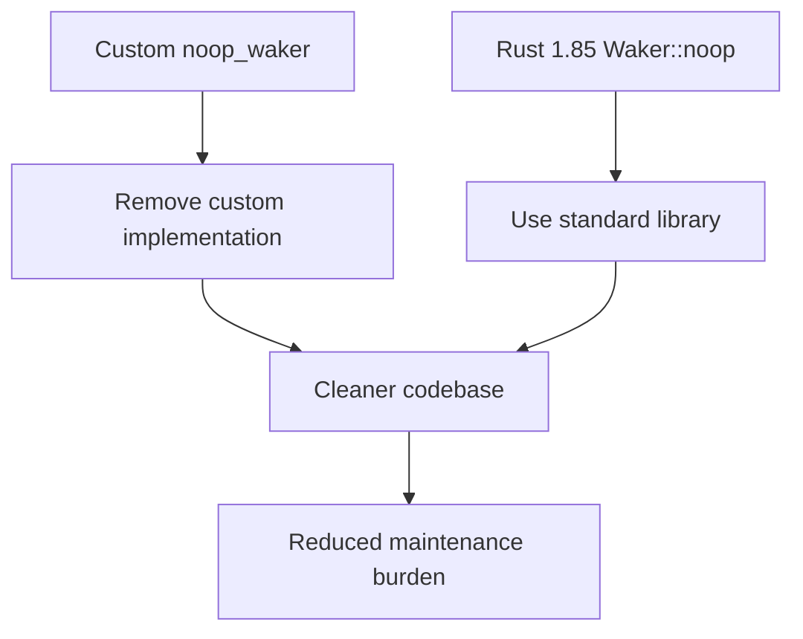

+++
title = "#20744 Cleanup bevy_tasks::future module"
date = "2025-09-02T00:00:00"
draft = false
template = "pull_request_page.html"
in_search_index = true

[taxonomies]
list_display = ["show"]

[extra]
current_language = "en"
available_languages = {"en" = { name = "English", url = "/pull_request/bevy/2025-09/pr-20744-en-20250902" }, "zh-cn" = { name = "中文", url = "/pull_request/bevy/2025-09/pr-20744-zh-cn-20250902" }}
labels = ["D-Trivial", "C-Code-Quality", "A-Tasks"]
+++

# Cleanup bevy_tasks::future module

## Basic Information
- **Title**: Cleanup bevy_tasks::future module
- **PR Link**: https://github.com/bevyengine/bevy/pull/20744
- **Author**: james7132
- **Status**: MERGED
- **Labels**: D-Trivial, C-Code-Quality, S-Ready-For-Final-Review, A-Tasks
- **Created**: 2025-08-25T06:56:38Z
- **Merged**: 2025-09-01T23:33:14Z
- **Merged By**: alice-i-cecile

## Description Translation
# Objective
`Waker::noop` was stabilized in Rust 1.85, and we have a vendored version in tree.

## Solution
Remove it and clean up related code.

## Testing
CI

## The Story of This Pull Request

This PR addresses a straightforward but important maintenance task: removing custom implementations of functionality that has been stabilized in the Rust standard library. The core issue was that Bevy maintained a vendored implementation of a no-op waker (`noop_waker`) because `Waker::noop` wasn't stable in previous Rust versions. With Rust 1.85 stabilizing this functionality, the custom implementation became redundant technical debt.

The solution approach was direct: replace all uses of the custom `noop_waker` with the standard `Waker::noop()` and remove the now-unnecessary implementation code. This cleanup also revealed an opportunity to simplify the `check_ready` function, which was essentially doing the same thing as `now_or_never` but with slightly different pinning semantics.

In the implementation, the `now_or_never` function was significantly simplified. Previously, it manually created a no-op waker using unsafe code and raw waker operations:

```rust
// Before
pub fn now_or_never<F: Future>(mut future: F) -> Option<F::Output> {
    let noop_waker = noop_waker();
    let mut cx = Context::from_waker(&noop_waker);
    let future = unsafe { Pin::new_unchecked(&mut future) };
    match future.poll(&mut cx) {
        Poll::Ready(x) => Some(x),
        _ => None,
    }
}
```

The updated version uses the standard `Waker::noop()` and the safe `pin!` macro:

```rust
// After
pub fn now_or_never<F: Future>(future: F) -> Option<F::Output> {
    let mut cx = Context::from_waker(Waker::noop());
    match pin!(future).poll(&mut cx) {
        Poll::Ready(x) => Some(x),
        _ => None,
    }
}
```

This change eliminates unsafe code and makes the function more readable. The `check_ready` function was then simplified to just call `now_or_never`, removing code duplication.

The technical insights here are about leveraging language stabilizations to reduce maintenance burden and improve code safety. The switch from unsafe manual waker creation to the standard library's safe implementation reduces the potential for bugs and makes the code more accessible to developers unfamiliar with the intricacies of waker implementation.

The impact of these changes is primarily in code quality and maintainability:
- Removal of 32 lines of custom waker implementation code
- Elimination of unsafe code in the future utilities
- More idiomatic Rust using standard library functionality
- Reduced cognitive load for developers working with this code

## Visual Representation



## Key Files Changed

### `crates/bevy_tasks/src/futures.rs` (+6/-38)
This file contained the custom no-op waker implementation and future utility functions. The changes removed the custom waker implementation and simplified the future polling functions.

**Key changes:**
```rust
// Before: Custom no-op waker implementation
fn noop_clone(_data: *const ()) -> RawWaker {
    noop_raw_waker()
}
fn noop(_data: *const ()) {}

const NOOP_WAKER_VTABLE: RawWakerVTable = RawWakerVTable::new(noop_clone, noop, noop, noop);

fn noop_raw_waker() -> RawWaker {
    RawWaker::new(core::ptr::null(), &NOOP_WAKER_VTABLE)
}

pub(crate) fn noop_waker() -> Waker {
    unsafe { Waker::from_raw(noop_raw_waker()) }
}

// After: Removed entirely, using Waker::noop() instead
```

### `crates/bevy_tasks/src/lib.rs` (+1/-2)
This file contained one usage of the custom `noop_waker` function in the `block_on` implementation.

**Key changes:**
```rust
// Before:
let waker = futures::noop_waker();
let cx = &mut Context::from_waker(&waker);

// After:
let cx = &mut Context::from_waker(core::task::Waker::noop());
```

## Further Reading

- [Rust 1.85.0 Release Notes](https://blog.rust-lang.org/2025/01/30/Rust-1.85.0.html) - Details about Waker::noop stabilization
- [Rust Standard Library Waker Documentation](https://doc.rust-lang.org/std/task/struct.Waker.html#method.noop) - Official documentation for Waker::noop
- [Rust Pin API Guide](https://doc.rust-lang.org/std/pin/index.html) - Understanding pinning and why it's necessary for futures