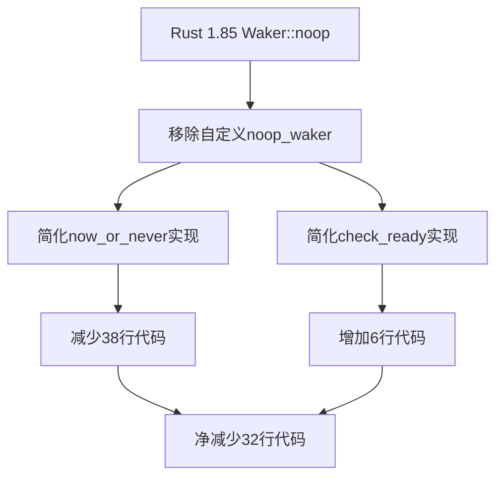

+++
title = "#20744 Cleanup bevy_tasks::future module"
date = "2025-09-02T00:00:00"
draft = false
template = "pull_request_page.html"
in_search_index = false

[extra]
current_language = "zh-cn"
available_languages = {"en" = { name = "English", url = "/pull_request/bevy/2025-09/pr-20744-en-20250902" }, "zh-cn" = { name = "中文", url = "/pull_request/bevy/2025-09/pr-20744-zh-cn-20250902" }}
+++

# Cleanup bevy_tasks::future module

## 基本信息
- **标题**: Cleanup bevy_tasks::future module
- **PR链接**: https://github.com/bevyengine/bevy/pull/20744
- **作者**: james7132
- **状态**: 已合并
- **标签**: D-Trivial, C-Code-Quality, S-Ready-For-Final-Review, A-Tasks
- **创建时间**: 2025-08-25T06:56:38Z
- **合并时间**: 2025-09-01T23:33:14Z
- **合并者**: alice-i-cecile

## 描述翻译
### 目标
Rust 1.85 中稳定了 `Waker::noop`，而我们在代码库中有一个自行实现的版本。

### 解决方案
移除它并清理相关代码。

### 测试
CI

## PR的技术故事

这个PR的核心故事是关于如何利用Rust语言新版本提供的标准库特性来简化代码并移除重复实现。随着Rust 1.85版本的发布，标准库正式提供了`Waker::noop()`方法，这使得Bevy引擎中自行实现的noop waker相关代码变得冗余。

### 问题背景
在异步编程中，Waker是Future执行机制的关键组成部分。当Future需要等待某个事件时，它会保存一个Waker，在事件就绪时通过Waker来通知执行器重新调度该Future。然而，在某些场景下，我们只需要简单地轮询Future而不需要真正的唤醒功能，这时就需要一个no-op（无操作）的Waker。

在Rust 1.85之前，Bevy需要自行实现noop waker的功能，包括定义RawWakerVTable和各种辅助函数。这种实现虽然功能正确，但增加了代码复杂性和维护负担。

### 解决方案
PR采取了最直接的解决方案：移除所有自定义的noop waker实现，转而使用标准库提供的`Waker::noop()`方法。这不仅减少了代码量，还提高了代码的可靠性和可维护性，因为标准库的实现经过了更广泛的测试和验证。

### 具体实现
实现过程主要涉及两个关键改动。首先是在`futures.rs`中，完全重写了`now_or_never`函数，使用`pin!`宏和`Waker::noop()`来简化实现：

```rust
// 修改前:
pub fn now_or_never<F: Future>(mut future: F) -> Option<F::Output> {
    let noop_waker = noop_waker();
    let mut cx = Context::from_waker(&noop_waker);
    let future = unsafe { Pin::new_unchecked(&mut future) };
    match future.poll(&mut cx) {
        Poll::Ready(x) => Some(x),
        _ => None,
    }
}

// 修改后:
pub fn now_or_never<F: Future>(future: F) -> Option<F::Output> {
    let mut cx = Context::from_waker(Waker::noop());
    match pin!(future).poll(&mut cx) {
        Poll::Ready(x) => Some(x),
        _ => None,
    }
}
```

这个改动带来了几个好处：移除了不安全的`unsafe`代码块，使用了更简洁的`pin!`宏，并且直接使用标准库的`Waker::noop()`。

第二个重要优化是发现`check_ready`函数实际上与`now_or_never`功能重复，因此将其实现简化为直接调用`now_or_never`：

```rust
// 修改前:
pub fn check_ready<F: Future + Unpin>(future: &mut F) -> Option<F::Output> {
    let noop_waker = noop_waker();
    let mut cx = Context::from_waker(&noop_waker);
    let future = Pin::new(future);
    match future.poll(&mut cx) {
        Poll::Ready(x) => Some(x),
        _ => None,
    }
}

// 修改后:
pub fn check_ready<F: Future + Unpin>(future: &mut F) -> Option<F::Output> {
    now_or_never(future)
}
```

在`lib.rs`文件中，也进行了相应的简化：

```rust
// 修改前:
let waker = futures::noop_waker();
let cx = &mut Context::from_waker(&waker);

// 修改后:
let cx = &mut Context::from_waker(core::task::Waker::noop());
```

### 技术洞察
这个PR展示了几个重要的软件工程实践：

1. **及时跟进语言特性**：当编程语言引入新的标准库特性时，及时迁移可以简化代码并减少维护成本。

2. **代码简化**：通过移除38行代码只添加6行，实现了净减少32行代码，同时提高了代码质量和可读性。

3. **消除重复**：识别并消除了功能重复的代码（`check_ready`和`now_or_never`）。

4. **安全性提升**：移除了不安全的代码块，减少了潜在的错误来源。

### 影响评估
这个改动虽然看似简单，但对代码base有积极影响：
- 减少了代码复杂性和维护负担
- 提高了代码安全性（移除unsafe代码）
- 保持了完全相同的API和行为，对使用者透明
- 为未来可能的进一步优化奠定了基础

## 可视化表示



## 关键文件变更

### `crates/bevy_tasks/src/futures.rs` (+6/-38)
这个文件包含了主要的清理工作，移除了自定义的noop waker实现，并简化了相关函数。

**主要变更：**
```rust
// 移除了整个自定义noop waker实现：
fn noop_clone(_data: *const ()) -> RawWaker {
    noop_raw_waker()
}
fn noop(_data: *const ()) {}

const NOOP_WAKER_VTABLE: RawWakerVTable = RawWakerVTable::new(noop_clone, noop, noop, noop);

fn noop_raw_waker() -> RawWaker {
    RawWaker::new(core::ptr::null(), &NOOP_WAKER_VTABLE)
}

pub(crate) fn noop_waker() -> Waker {
    unsafe { Waker::from_raw(noop_raw_waker()) }
}

// 简化了now_or_never函数：
pub fn now_or_never<F: Future>(future: F) -> Option<F::Output> {
    let mut cx = Context::from_waker(Waker::noop());
    match pin!(future).poll(&mut cx) {
        Poll::Ready(x) => Some(x),
        _ => None,
    }
}

// 简化了check_ready函数：
pub fn check_ready<F: Future + Unpin>(future: &mut F) -> Option<F::Output> {
    now_or_never(future)
}
```

### `crates/bevy_tasks/src/lib.rs` (+1/-2)
这个文件中的改动相对较小，主要是将自定义的noop waker替换为标准库实现。

**主要变更：**
```rust
// 修改前:
let waker = futures::noop_waker();
let cx = &mut Context::from_waker(&waker);

// 修改后:
let cx = &mut Context::from_waker(core::task::Waker::noop());
```

## 延伸阅读

对于想深入了解相关概念的开发者，建议阅读以下资源：

1. [Rust标准库Waker文档](https://doc.rust-lang.org/std/task/struct.Waker.html)
2. [Rust异步编程指南](https://rust-lang.github.io/async-book/)
3. [Pin和Unpin trait的详细解释](https://doc.rust-lang.org/std/pin/index.html)
4. [Rust 1.85版本发布说明](https://blog.rust-lang.org/2025/01/16/Rust-1.85.0.html)（特别是关于Waker::noop稳定的部分）

# 完整代码差异
```diff
diff --git a/crates/bevy_tasks/src/futures.rs b/crates/bevy_tasks/src/futures.rs
index 7bc6c59c00f5c..3f0c72c890ef5 100644
--- a/crates/bevy_tasks/src/futures.rs
+++ b/crates/bevy_tasks/src/futures.rs
@@ -1,24 +1,17 @@
-#![expect(unsafe_code, reason = "Futures require unsafe code.")]
-
 //! Utilities for working with [`Future`]s.
 use core::{
     future::Future,
-    pin::Pin,
-    task::{Context, Poll, RawWaker, RawWakerVTable, Waker},
+    pin::pin,
+    task::{Context, Poll, Waker},
 };
 
 /// Consumes a future, polls it once, and immediately returns the output
 /// or returns `None` if it wasn't ready yet.
 ///
 /// This will cancel the future if it's not ready.
-pub fn now_or_never<F: Future>(mut future: F) -> Option<F::Output> {
-    let noop_waker = noop_waker();
-    let mut cx = Context::from_waker(&noop_waker);
-
-    // SAFETY: `future` is not moved and the original value is shadowed
-    let future = unsafe { Pin::new_unchecked(&mut future) };
-
-    match future.poll(&mut cx) {
+pub fn now_or_never<F: Future>(future: F) -> Option<F::Output> {
+    let mut cx = Context::from_waker(Waker::noop());
+    match pin!(future).poll(&mut cx) {
         Poll::Ready(x) => Some(x),
         _ => None,
     }
@@ -27,30 +20,5 @@ pub fn now_or_never<F: Future>(mut future: F) -> Option<F::Output> {
 /// Polls a future once, and returns the output if ready
 /// or returns `None` if it wasn't ready yet.
 pub fn check_ready<F: Future + Unpin>(future: &mut F) -> Option<F::Output> {
-    let noop_waker = noop_waker();
-    let mut cx = Context::from_waker(&noop_waker);
-
-    let future = Pin::new(future);
-
-    match future.poll(&mut cx) {
-        Poll::Ready(x) => Some(x),
-        _ => None,
-    }
-}
-
-fn noop_clone(_data: *const ()) -> RawWaker {
-    noop_raw_waker()
-}
-fn noop(_data: *const ()) {}
-
-const NOOP_WAKER_VTABLE: RawWakerVTable = RawWakerVTable::new(noop_clone, noop, noop, noop);
-
-fn noop_raw_waker() -> RawWaker {
-    RawWaker::new(core::ptr::null(), &NOOP_WAKER_VTABLE)
-}
-
-pub(crate) fn noop_waker() -> Waker {
-    // SAFETY: the `RawWakerVTable` is just a big noop and doesn't violate any of the rules in `RawWakerVTable`s documentation
-    // (which talks about retaining and releasing any "resources", of which there are none in this case)
-    unsafe { Waker::from_raw(noop_raw_waker()) }
+    now_or_never(future)
 }
diff --git a/crates/bevy_tasks/src/lib.rs b/crates/bevy_tasks/src/lib.rs
index ddb014bb9867b..7ec4f3748c692 100644
--- a/crates/bevy_tasks/src/lib.rs
+++ b/crates/bevy_tasks/src/lib.rs
@@ -132,8 +132,7 @@ cfg::switch! {
             let mut future = core::pin::pin!(future);
 
             // We don't care about the waker as we're just going to poll as fast as possible.
-            let waker = futures::noop_waker();
-            let cx = &mut Context::from_waker(&waker);
+            let cx = &mut Context::from_waker(core::task::Waker::noop());
 
             // Keep polling until the future is ready.
             loop {
```