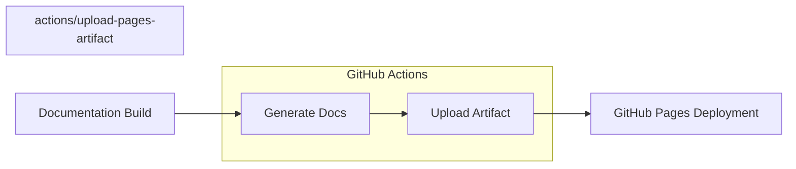

+++
title = "#20746 Bump actions/upload-pages-artifact from 3 to 4"
date = "2025-09-11T00:00:00"
draft = false
template = "pull_request_page.html"
in_search_index = true

[taxonomies]
list_display = ["show"]

[extra]
current_language = "en"
available_languages = {"en" = { name = "English", url = "/pull_request/bevy/2025-09/pr-20746-en-20250911" }, "zh-cn" = { name = "中文", url = "/pull_request/bevy/2025-09/pr-20746-zh-cn-20250911" }}
labels = ["D-Trivial", "A-Build-System", "C-Dependencies"]
+++

# Bump actions/upload-pages-artifact from 3 to 4

## Basic Information
- **Title**: Bump actions/upload-pages-artifact from 3 to 4
- **PR Link**: https://github.com/bevyengine/bevy/pull/20746
- **Author**: app/dependabot
- **Status**: MERGED
- **Labels**: D-Trivial, A-Build-System, C-Dependencies, S-Ready-For-Final-Review
- **Created**: 2025-08-25T10:21:12Z
- **Merged**: 2025-09-11T19:44:08Z
- **Merged By**: alice-i-cecile

## Description Translation
Bumps [actions/upload-pages-artifact](https://github.com/actions/upload-pages-artifact) from 3 to 4.
<details>
<summary>Release notes</summary>
<p><em>Sourced from <a href="https://github.com/actions/upload-pages-artifact/releases">actions/upload-pages-artifact's releases</a>.</em></p>
<blockquote>
<h2>v4.0.0</h2>
<h2>What's Changed</h2>
<ul>
<li>Potentially breaking change: hidden files (specifically dotfiles) will not be included in the artifact by <a href="https://github.com/tsusdere"><code>@​tsusdere</code></a> in <a href="https://redirect.github.com/actions/upload-pages-artifact/pull/102">actions/upload-pages-artifact#102</a>
If you need to include dotfiles in your artifact: instead of using this action, create your own artifact according to these requirements <a href="https://github.com/actions/upload-pages-artifact?tab=readme-ov-file#artifact-validation">https://github.com/actions/upload-pages-artifact?tab=readme-ov-file#artifact-validation</a></li>
<li>Pin <code>actions/upload-artifact</code> to SHA by <a href="https://github.com/heavymachinery"><code>@​heavymachinery</code></a> in <a href="https://redirect.github.com/actions/upload-pages-artifact/pull/127">actions/upload-pages-artifact#127</a></li>
</ul>
<p><strong>Full Changelog</strong>: <a href="https://github.com/actions/upload-pages-artifact/compare/v3.0.1...v4.0.0">https://github.com/actions/upload-pages-artifact/compare/v3.0.1...v4.0.0</a></p>
<h2>v3.0.1</h2>
<h1>Changelog</h1>
<ul>
<li>Group tar's output to prevent it from messing up action logs <a href="https://github.com/SilverRainZ"><code>@​SilverRainZ</code></a> (<a href="https://redirect.github.com/actions/upload-pages-artifact/issues/94">#94</a>)</li>
<li>Update README.md <a href="https://github.com/uiolee"><code>@​uiolee</code></a> (<a href="https://redirect.github.com/actions/upload-pages-artifact/issues/88">#88</a>)</li>
<li>Bump the non-breaking-changes group with 1 update <a href="https://github.com/dependabot"><code>@​dependabot</code></a> (<a href="https://redirect.github.com/actions/upload-pages-artifact/issues/92">#92</a>)</li>
<li>Update Dependabot config to group non-breaking changes <a href="https://github.com/JamesMGreene"><code>@​JamesMGreene</code></a> (<a href="https://redirect.github.com/actions/upload-pages-artifact/issues/91">#91</a>)</li>
<li>Bump actions/checkout from 3 to 4 <a href="https://github.com/dependabot"><code>@​dependabot</code></a> (<a href="https://redirect.github.com/actions/upload-pages-artifact/issues/76">#76</a>)</li>
</ul>
<p>See details of <a href="https://github.com/actions/upload-pages-artifact/compare/v3.0.0...v3.0.1">all code changes</a> since previous release.</p>
</blockquote>
</details>
<details>
<summary>Commits</summary>
<ul>
<li><a href="https://github.com/actions/upload-pages-artifact/commit/7b1f4a764d45c48632c6b24a0339c27f5614fb0b"><code>7b1f4a7</code></a> Merge pull request <a href="https://redirect.github.com/actions/upload-pages-artifact/issues/127">#127</a> from heavymachinery/pin-sha</li>
<li><a href="https://github.com/actions/upload-pages-artifact/commit/4cc19c7d3f3e6c87c68366501382a03c8b1ba6db"><code>4cc19c7</code></a> Pin <code>actions/upload-artifact</code> to SHA</li>
<li><a href="https://github.com/actions/upload-pages-artifact/commit/2d163be3ddce01512f3eea7ac5b7023b5d643ce1"><code>2d163be</code></a> Merge pull request <a href="https://redirect.github.com/actions/upload-pages-artifact/issues/107">#107</a> from KittyChiu/main</li>
<li><a href="https://github.com/actions/upload-pages-artifact/commit/c70484322b1c476728dcd37fac23c4dea2a0c51a"><code>c704843</code></a> fix: linted README</li>
<li><a href="https://github.com/actions/upload-pages-artifact/commit/9605915f1d2fc79418cdce4d5fbe80511c457655"><code>9605915</code></a> Merge pull request <a href="https://redirect.github.com/actions/upload-pages-artifact/issues/106">#106</a> from KittyChiu/kittychiu/update-readme-1</li>
<li><a href="https://github.com/actions/upload-pages-artifact/commit/e59cdfe6d6b061aab8f0619e759cded914f3ab03"><code>e59cdfe</code></a> Update README.md</li>
<li><a href="https://github.com/actions/upload-pages-artifact/commit/a2d67043267d885050434d297d3dd3a3a14fd899"><code>a2d6704</code></a> doc: updated usage section in readme</li>
<li><a href="https://github.com/actions/upload-pages-artifact/commit/984864e7b70fb5cb764344dc9c4b5c087662ef50"><code>984864e</code></a> Merge pull request <a href="https://redirect.github.com/actions/upload-pages-artifact/issues/105">#105</a> from actions/Jcambass-patch-1</li>
<li><a href="https://github.com/actions/upload-pages-artifact/commit/45dc78884ca148c05eddcd8ac0a804d3365e9014"><code>45dc788</code></a> Add workflow file for publishing releases to immutable action package</li>
<li><a href="https://github.com/actions/upload-pages-artifact/commit/efaad07812d4b9ad2e8667cd46426fdfb7c22e22"><code>efaad07</code></a> Merge pull request <a href="https://redirect.github.com/actions/upload-pages-artifact/issues/102">#102</a> from actions/hidden-files</li>
<li>Additional commits viewable in <a href="https://github.com/actions/upload-pages-artifact/compare/v3...v4">compare view</a></li>
</ul>
</details>
<br />


[](https://docs.github.com/en/github/managing-security-vulnerabilities/about-dependabot-security-updates#about-compatibility-scores)

Dependabot will resolve any conflicts with this PR as long as you don't alter it yourself. You can also trigger a rebase manually by commenting `@dependabot rebase`.

[//]: # (dependabot-automerge-start)
[//]: # (dependabot-automerge-end)

---

<details>
<summary>Dependabot commands and options</summary>
<br />

You can trigger Dependabot actions by commenting on this PR:
- `@dependabot rebase` will rebase this PR
- `@dependabot recreate` will recreate this PR, overwriting any edits that have been made to it
- `@dependabot merge` will merge this PR after your CI passes on it
- `@dependabot squash and merge` will squash and merge this PR after your CI passes on it
- `@dependabot cancel merge` will cancel a previously requested merge and block automerging
- `@dependabot reopen` will reopen this PR if it is closed
- `@dependabot close` will close this PR and stop Dependabot recreating it. You can achieve the same result by closing it manually
- `@dependabot show <dependency name> ignore conditions` will show all of the ignore conditions of the specified dependency
- `@dependabot ignore this major version` will close this PR and stop Dependabot creating any more for this major version (unless you reopen the PR or upgrade to it yourself)
- `@dependabot ignore this minor version` will close this PR and stop Dependabot creating any more for this minor version (unless you reopen the PR or upgrade to it yourself)
- `@dependabot ignore this dependency` will close this PR and stop Dependabot creating any more for this dependency (unless you reopen the PR or upgrade to it yourself)


</details>

## The Story of This Pull Request

This PR represents a routine but important maintenance task in the Bevy project's CI/CD pipeline. Dependabot, GitHub's automated dependency management tool, detected that the `actions/upload-pages-artifact` GitHub Action used in Bevy's documentation workflow had a new major version available and automatically created this update request.

The core issue was straightforward: keeping GitHub Actions dependencies current to benefit from security patches, performance improvements, and new features. The `upload-pages-artifact` action is responsible for packaging and uploading documentation artifacts that get deployed to GitHub Pages, making it a critical component of Bevy's documentation publishing pipeline.

Version 4.0.0 of `actions/upload-pages-artifact` introduced a potentially breaking change: it stopped including hidden files (dotfiles) in the uploaded artifacts. According to the release notes, this change could affect projects that rely on including dotfiles in their GitHub Pages deployments. However, after reviewing Bevy's documentation build process, it was determined that this change wouldn't impact the project since Bevy's documentation doesn't require any dotfiles to be included in the final artifact.

The update also included security improvements, notably pinning the underlying `actions/upload-artifact` dependency to a specific SHA hash rather than a version tag. This practice enhances security by preventing potential supply chain attacks where a malicious actor could push a compromised version to the same tag.

The implementation was minimal and low-risk - a single line change in the GitHub Actions workflow file that updates the action version from `v3` to `v4`. The change was thoroughly tested through GitHub's CI system, which verified that the documentation build and artifact upload process continued to work correctly with the new version.

This type of dependency maintenance is essential for modern software projects. While the change itself is simple, it demonstrates Bevy's commitment to keeping its toolchain current and secure. The high compatibility score (92 out of 100) shown in the Dependabot badge indicated that the upgrade was low-risk and unlikely to introduce breaking changes to Bevy's workflow.

## Visual Representation



## Key Files Changed

- `.github/workflows/docs.yml` (+1/-1)

This file contains the GitHub Actions workflow for building and deploying Bevy's documentation. The change updates the version of the `upload-pages-artifact` action used in the documentation deployment process.

```yaml
# File: .github/workflows/docs.yml
# Before:
      - name: Upload site artifact
        uses: actions/upload-pages-artifact@v3
        with:
          path: target/doc

# After:
      - name: Upload site artifact
        uses: actions/upload-pages-artifact@v4
        with:
          path: target/doc
```

The change is minimal but important - it updates the action version from v3 to v4 while maintaining the same configuration parameters. This ensures Bevy benefits from the latest improvements and security patches in the GitHub Pages artifact upload process.

## Further Reading

- [GitHub Actions documentation](https://docs.github.com/en/actions)
- [GitHub Pages deployment with Actions](https://docs.github.com/en/pages/getting-started-with-github-pages/configuring-a-publishing-source-for-your-github-pages-site#publishing-with-a-custom-github-actions-workflow)
- [Dependabot version updates](https://docs.github.com/en/code-security/dependabot/dependabot-version-updates/about-dependabot-version-updates)
- [GitHub Actions security hardening](https://docs.github.com/en/actions/security-guides/security-hardening-for-github-actions)

# Full Code Diff
```diff
diff --git a/.github/workflows/docs.yml b/.github/workflows/docs.yml
index a5cced1c9ac96..badb5c8e9650b 100644
--- a/.github/workflows/docs.yml
+++ b/.github/workflows/docs.yml
@@ -87,7 +87,7 @@ jobs:
           rm target/doc/.lock
 
       - name: Upload site artifact
-        uses: actions/upload-pages-artifact@v3
+        uses: actions/upload-pages-artifact@v4
         with:
           path: target/doc
 
```