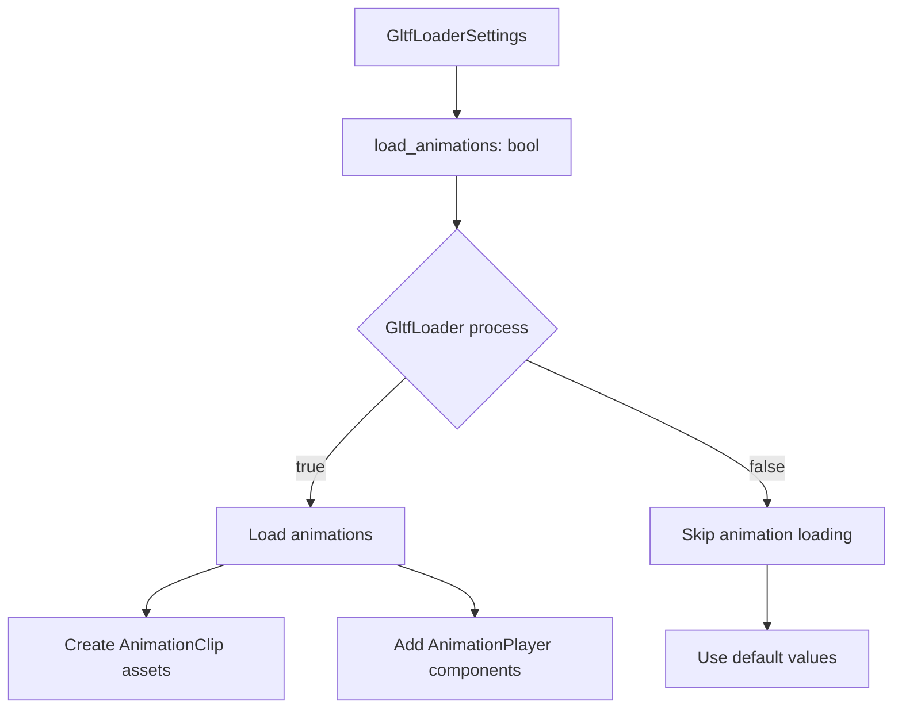

+++
title = "#20750 Make loading GLTF animations optional"
date = "2025-09-09T00:00:00"
draft = false
template = "pull_request_page.html"
in_search_index = true

[taxonomies]
list_display = ["show"]

[extra]
current_language = "en"
available_languages = {"en" = { name = "English", url = "/pull_request/bevy/2025-09/pr-20750-en-20250909" }, "zh-cn" = { name = "中文", url = "/pull_request/bevy/2025-09/pr-20750-zh-cn-20250909" }}
labels = ["C-Usability", "A-Animation", "X-Contentious", "A-glTF"]
+++

# Make loading GLTF animations optional

## Basic Information
- **Title**: Make loading GLTF animations optional
- **PR Link**: https://github.com/bevyengine/bevy/pull/20750
- **Author**: atlv24
- **Status**: MERGED
- **Labels**: C-Usability, S-Ready-For-Final-Review, A-Animation, X-Contentious, A-glTF
- **Created**: 2025-08-25T13:57:00Z
- **Merged**: 2025-09-09T20:56:49Z
- **Merged By**: alice-i-cecile

## Description Translation
# Objective

- There was a mistaken belief in #20714 that it is possible to use bevy_gltf and bevy_animation without loading the animations of a gltf. This is not the case, the animation loading is gated by the presence of the bevy_animation crate. (And I believe this is how it should be.)
- We want to be able to control gltf animation loading though, and I think it should be at the asset granularity. You may want some loaded with animation and some without, or maybe even load the same asset sometimes with animation and sometimes without.

## Solution

- Just add a flag to the load settings

## Testing

- many_foxes works, and setting the flag to false makes the foxes not animate

## The Story of This Pull Request

This PR addresses a gap in Bevy's glTF loading capabilities where animation loading was an all-or-nothing proposition tied to the presence of the `bevy_animation` crate feature. While the feature flag controlled whether animation support was compiled in, users couldn't control animation loading at the asset level.

The core issue was that some users wanted to load glTF assets without animations in certain scenarios - either to reduce memory usage, avoid unnecessary processing, or because they planned to drive animations through other means. Previously, this wasn't possible without completely disabling the animation feature, which affected all assets.

The solution implemented here adds granular control through a new `load_animations` boolean field in `GltfLoaderSettings`. When set to `false`, the loader skips animation processing entirely while still loading the rest of the glTF content (meshes, materials, etc.). This maintains backward compatibility by defaulting to `true`.

The implementation required conditional execution of animation-related code blocks. The loader now checks `settings.load_animations` before processing animation paths, curves, and players. When animations are disabled, it simply uses default values for the animation-related variables that would normally be populated.

This approach maintains clean separation of concerns - the animation loading logic remains encapsulated within conditional blocks, and the rest of the glTF loading process continues unchanged. The change is minimal and focused, reducing the risk of introducing new bugs.

The testing approach was straightforward: verify that the existing `many_foxes` example continues to work with the default settings, and confirm that setting `load_animations` to `false` prevents the foxes from animating while keeping the rest of the scene intact.

## Visual Representation



## Key Files Changed

### `crates/bevy_gltf/src/loader/mod.rs`
Added a new `load_animations` field to `GltfLoaderSettings` and modified the animation loading logic to respect this setting.

```rust
// Before:
pub struct GltfLoaderSettings {
    pub load_cameras: bool,
    pub load_lights: bool,
    // ... other fields
}

// After:
pub struct GltfLoaderSettings {
    pub load_cameras: bool,
    pub load_lights: bool,
    /// If true, the loader will load `AnimationClip` assets, and also add
    /// `AnimationTarget` and `AnimationPlayer` components to hierarchies
    /// affected by animation. Requires the `bevy_animation` feature.
    pub load_animations: bool,
    // ... other fields
}
```

```rust
// Animation loading is now conditional:
#[cfg(feature = "bevy_animation")]
let paths = if settings.load_animations {
    // Animation path processing
} else {
    Default::default()
};
```

### `release-content/migration-guides/gltf-animation-load-optional.md`
Added a migration guide to inform users about the new optional animation loading capability.

```markdown
---
title: glTF animation loading is now optional
pull_requests: [20750]
---

`GltfLoaderSettings` now has a `load_animations` field which allows controlling whether animations should load.
```

## Further Reading

- [Bevy glTF Loading Documentation](https://bevyengine.org/learn/books/bevy-gltf-loading/)
- [Bevy Animation System](https://bevyengine.org/learn/books/bevy-animation-system/)
- [glTF 2.0 Specification](https://www.khronos.org/registry/glTF/specs/2.0/glTF-2.0.html)
- [Original Issue Discussion (#20714)](https://github.com/bevyengine/bevy/issues/20714)