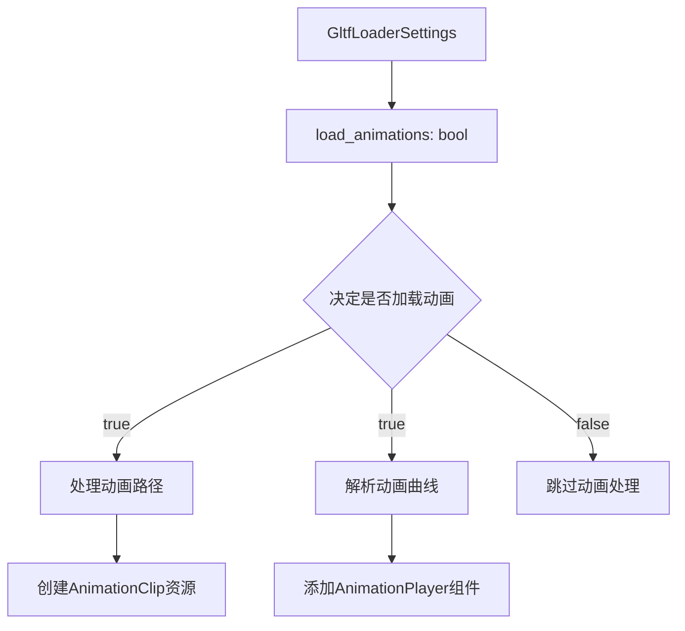

+++
title = "#20750 Make loading GLTF animations optional"
date = "2025-09-09T00:00:00"
draft = false
template = "pull_request_page.html"
in_search_index = false

[extra]
current_language = "zh-cn"
available_languages = {"en" = { name = "English", url = "/pull_request/bevy/2025-09/pr-20750-en-20250909" }, "zh-cn" = { name = "中文", url = "/pull_request/bevy/2025-09/pr-20750-zh-cn-20250909" }}
+++

# Make loading GLTF animations optional

## 基本信息
- **标题**: Make loading GLTF animations optional
- **PR 链接**: https://github.com/bevyengine/bevy/pull/20750
- **作者**: atlv24
- **状态**: 已合并
- **标签**: C-Usability, S-Ready-For-Final-Review, A-Animation, X-Contentious, A-glTF
- **创建时间**: 2025-08-25T13:57:00Z
- **合并时间**: 2025-09-09T20:56:49Z
- **合并者**: alice-i-cecile

## 描述翻译
# 目标

- 在 #20714 中存在一个误解，认为可以在不使用 bevy_animation 的情况下使用 bevy_gltf 加载 glTF 动画。实际上并非如此，动画加载是由 bevy_animation crate 的存在来控制的（我认为这是正确的设计）。
- 我们希望能够控制 glTF 动画的加载，并且认为应该在资产粒度上进行控制。您可能希望有些资产加载动画，有些不加载，甚至可能有时加载同一个资产时带动画，有时不带。

## 解决方案

- 只需在加载设置中添加一个标志位

## 测试

- many_foxes 示例正常工作，将标志设置为 false 会使狐狸停止动画

## 这个 PR 的故事

这个 PR 解决了一个实际的工程问题：在 Bevy 引擎中，glTF 动画加载之前是强制性的，用户无法选择是否加载动画资源。这个问题在之前的 PR #20714 中被误解，开发者最初认为已经可以通过条件编译来控制动画加载，但实际上动画加载是由 `bevy_animation` feature 的存在决定的，而不是运行时可配置的。

问题的核心在于资源使用效率。在某些场景中，用户可能只需要 glTF 模型的静态几何信息，而不需要其动画数据。强制加载所有动画会导致不必要的内存占用和性能开销，特别是对于包含复杂动画的大型模型。

解决方案采用了直接而有效的方法：在 `GltfLoaderSettings` 结构中添加一个 `load_animations` 布尔字段，默认为 `true` 以保持向后兼容性。这个标志控制在 glTF 加载过程中是否处理动画数据。

从技术实现角度看，这个改动涉及两个主要代码块的条件执行：

1. 动画路径收集（第 258-267 行）：只有当 `load_animations` 为 true 时才构建动画路径映射
2. 动画数据处理（第 277-578 行）：同样只在启用动画加载时执行复杂的动画曲线解析和资源创建

这种实现方式有几个优点：
- 保持了 API 的简洁性，只需设置一个布尔值
- 完全向后兼容，默认行为不变
- 在不需要动画时显著减少内存使用和加载时间
- 与现有的条件编译系统（`#[cfg(feature = "bevy_animation")]`）协同工作

工程决策方面，作者选择了资产级别的粒度控制，而不是全局设置。这样用户可以对不同的 glTF 资源应用不同的加载策略，提供了更大的灵活性。例如，同一个应用程序中可以同时加载带有动画的角色模型和不带动画的环境道具。

测试验证方面，使用 many_foxes 示例进行验证是明智的选择，因为这个示例包含大量动画实体，能够明显展示启用和禁用动画加载的效果差异。

从架构角度看，这个改动遵循了 Bevy 的 ECS 哲学：提供明确的控制选项，让开发者根据具体需求决定资源使用方式。它不是通过复杂的机制或魔法代码来实现功能，而是通过简单的条件检查来提供精细化的控制。

## 可视化表示



## 关键文件变更

### `crates/bevy_gltf/src/loader/mod.rs` (+11/-2)

这个文件包含了主要的逻辑变更，在 `GltfLoaderSettings` 结构中添加了 `load_animations` 字段，并在加载过程中添加了相应的条件判断。

**关键变更：**

```rust
// 在 GltfLoaderSettings 结构体中添加新字段
pub struct GltfLoaderSettings {
    // ... 其他字段保持不变
    /// If true, the loader will load `AnimationClip` assets, and also add
    /// `AnimationTarget` and `AnimationPlayer` components to hierarchies
    /// affected by animation. Requires the `bevy_animation` feature.
    pub load_animations: bool,
}

// 在 Default 实现中设置默认值
impl Default for GltfLoaderSettings {
    fn default() -> Self {
        Self {
            // ... 其他字段初始化
            load_animations: true,  // 默认为 true 保持向后兼容
        }
    }
}

// 在加载逻辑中添加条件判断
#[cfg(feature = "bevy_animation")]
let paths = if settings.load_animations {
    // 动画路径收集逻辑
} else {
    Default::default()
};

#[cfg(feature = "bevy_animation")]
let (animations, named_animations, animation_roots) = if settings.load_animations {
    // 动画数据处理逻辑
} else {
    Default::default()
};
```

### `release-content/migration-guides/gltf-animation-load-optional.md` (+6/-0)

这个新文件提供了迁移指南，告知用户关于 glTF 动画加载变为可选功能的变更。

```markdown
---
title: glTF animation loading is now optional
pull_requests: [20750]
---

`GltfLoaderSettings` now has a `load_animations` field which allows controlling whether animations should load.
```

## 进一步阅读

- [Bevy GLTF 加载器文档](https://docs.rs/bevy_gltf/latest/bevy_gltf/)
- [Bevy 动画系统指南](https://bevyengine.org/learn/books/introduction/animation/)
- [GLTF 2.0 规范](https://www.khronos.org/registry/glTF/specs/2.0/glTF-2.0.html)
- [条件编译在 Rust 中的使用](https://doc.rust-lang.org/reference/conditional-compilation.html)