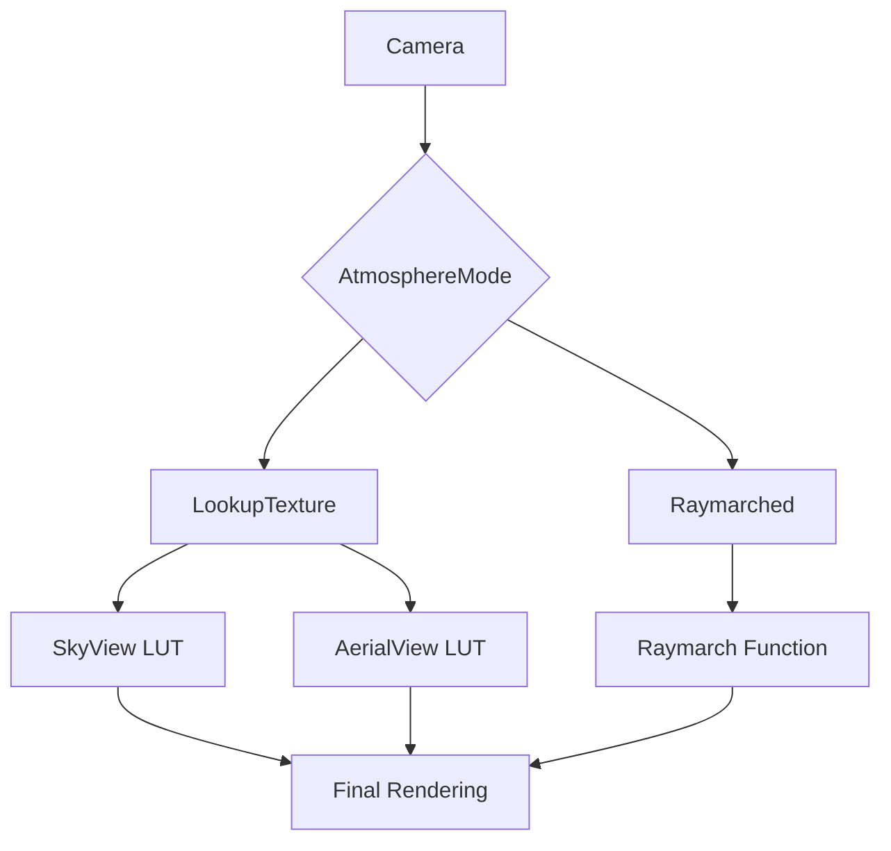

+++
title = "#20766 Raymarched rendering for atmosphere and spherical coordinates"
date = "2025-09-03T00:00:00"
draft = false
template = "pull_request_page.html"
in_search_index = true

[taxonomies]
list_display = ["show"]

[extra]
current_language = "en"
available_languages = {"en" = { name = "English", url = "/pull_request/bevy/2025-09/pr-20766-en-20250903" }, "zh-cn" = { name = "中文", url = "/pull_request/bevy/2025-09/pr-20766-zh-cn-20250903" }}
labels = ["C-Feature", "A-Rendering"]
+++

# Raymarched rendering for atmosphere and spherical coordinates

## Basic Information
- **Title**: Raymarched rendering for atmosphere and spherical coordinates
- **PR Link**: https://github.com/bevyengine/bevy/pull/20766
- **Author**: mate-h
- **Status**: MERGED
- **Labels**: C-Feature, A-Rendering, S-Ready-For-Final-Review, M-Needs-Release-Note
- **Created**: 2025-08-26T17:01:29Z
- **Merged**: 2025-09-03T21:30:19Z
- **Merged By**: alice-i-cecile

## Description Translation
# Objective

- Support space views for the atmosphere
- Add more accurate lighting to the atmosphere with ray marching
- Enable future support for sharp volumetric shadows through the atmosphere
- Tracking overall progress in #20374

## Solution

- Added spherical coordinate system alongside the sky-view lut parameterization
- Added ray-marched rendering method to support space views and accurate lighting
- This is setting the stage for PBR integration, volumetric shadows
- Could maybe re-use the ray-marching function in the aerial view LUT as well, but I didn't bother for this PR (future improvement)

## Testing

- Ran the atmosphere example to ensure it still works fine with both rendering methods
- Created a freecam version of the atmosphere example and put the camera in space, below ground.

---

## Showcase

https://github.com/user-attachments/assets/e9cf0d91-8e34-435c-834e-02602a9496a2

## The Story of This Pull Request

This PR addresses a fundamental limitation in Bevy's atmospheric rendering system. The original implementation used a lookup table (LUT) approach that worked well for ground-level views but broke down when the camera moved to space or extreme positions. The problem was that the LUT parameterization assumed a locally flat world, which became inaccurate at large distances from the planet surface.

The solution introduces a new ray marching rendering path alongside the existing LUT approach. The developer implemented a spherical coordinate system that properly handles space views and extreme camera positions. This required significant changes to the shader codebase, including:

1. A new `raymarch_atmosphere` function that numerically integrates light scattering through the atmosphere
2. Proper handling of camera position using spherical coordinates instead of assuming a flat world
3. A configurable rendering mode system that lets users choose between performance (LUT) and accuracy (ray marching)

The implementation follows sound computer graphics principles for volumetric rendering. The ray marching algorithm samples the atmosphere at multiple points along each view ray, accumulating inscattering and transmittance values. For each sample point, it calculates local atmospheric properties and evaluates light scattering contributions.

Key technical decisions included:
- Maintaining backward compatibility by keeping the LUT method as default
- Using a flexible sample count system that balances quality and performance
- Implementing proper ray-sphere intersection mathematics for accurate atmospheric boundaries
- Adding ground reflection support for realistic planetary surfaces

The changes affect multiple rendering passes and coordinate systems. The developer had to refactor several utility functions to work in both Cartesian and spherical coordinate systems, ensuring consistency across different rendering paths.

Performance considerations were important throughout. The ray marching approach is more computationally intensive but provides significantly better results for space views and enables future volumetric shadow effects. The implementation includes early termination optimizations to reduce unnecessary computations when transmittance becomes negligible.

This work sets the stage for future PBR integration and volumetric shadows by providing a more physically accurate foundation for atmospheric rendering. The spherical coordinate system and ray marching approach will enable more advanced effects that were previously impossible with the LUT-only implementation.

## Visual Representation



## Key Files Changed

1. **`crates/bevy_pbr/src/atmosphere/functions.wgsl`** (+160/-13):
   - Added comprehensive ray marching implementation with proper spherical coordinate handling
   - Implemented `raymarch_atmosphere` function with configurable sample count
   - Added `get_raymarch_segment` for calculating atmospheric intersection points
   - Updated coordinate transformation functions for spherical support

   Key additions:
   ```wgsl
   fn raymarch_atmosphere(
       pos: vec3<f32>,
       ray_dir: vec3<f32>,
       t_max: f32,
       max_samples: u32,
       uv: vec2<f32>,
       ground: bool
   ) -> RaymarchResult {
       // Implementation details...
   }
   ```

2. **`crates/bevy_pbr/src/atmosphere/mod.rs`** (+79/-6):
   - Added `AtmosphereMode` enum with `LookupTexture` and `Raymarched` variants
   - Created `GpuAtmosphereSettings` struct to handle GPU-bound settings
   - Added configuration options for sample counts and rendering method

   Key additions:
   ```rust
   pub enum AtmosphereMode {
       LookupTexture = 0,
       Raymarched = 1,
   }
   ```

3. **`release-content/release-notes/raymarched-atmosphere-space-views.md`** (+55/-0):
   - Comprehensive release notes explaining the new feature
   - Usage guidelines and performance considerations

4. **`crates/bevy_pbr/src/atmosphere/sky_view_lut.wgsl`** (+10/-38):
   - Simplified LUT generation using the new ray marching function
   - Replaced complex manual sampling with unified ray marching approach

   Key change:
   ```wgsl
   let result = raymarch_atmosphere(world_pos, ray_dir_ws, t_max, settings.sky_view_lut_samples, uv, true);
   textureStore(sky_view_lut_out, idx.xy, vec4(result.inscattering, 1.0));
   ```

5. **`crates/bevy_pbr/src/atmosphere/render_sky.wgsl`** (+23/-7):
   - Added conditional rendering path selection based on atmosphere mode
   - Integrated ray marching into the main sky rendering pipeline

   Key addition:
   ```wgsl
   if should_raymarch {
       let result = raymarch_atmosphere(world_pos, ray_dir_ws, t_max, max_samples, in.uv, true);
       inscattering = result.inscattering;
       transmittance = result.transmittance;
   }
   ```

## Further Reading

- [Physically Based Atmospheric Scattering](https://www.alexandre-pestana.com/physically-based-atmospheric-scattering/) - Comprehensive explanation of atmospheric rendering techniques
- [Ray Marching and Volume Rendering](https://iquilezles.org/articles/ray marching/) - In-depth technical discussion of ray marching algorithms
- [Bevy Rendering Documentation](https://bevyengine.org/learn/books/rendering/) - Official Bevy rendering guide for context on the existing system