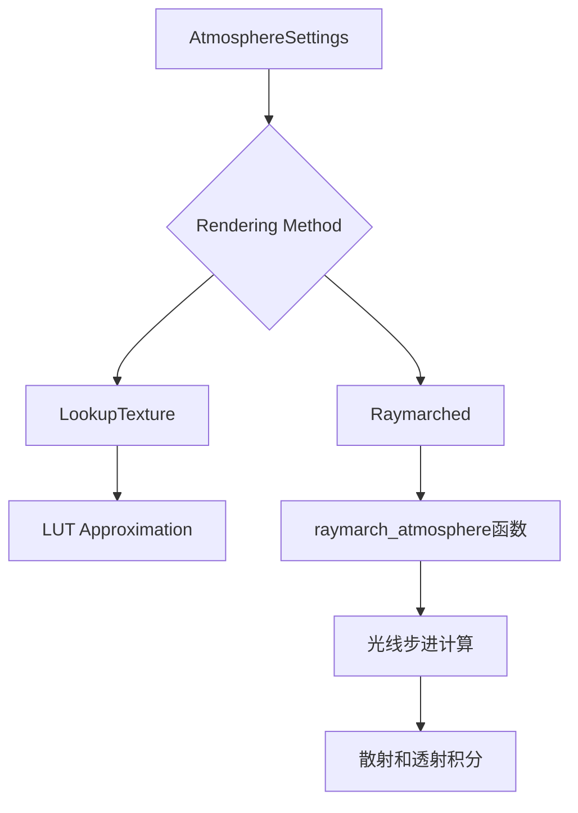

+++
title = "#20766 Raymarched rendering for atmosphere and spherical coordinates"
date = "2025-09-03T00:00:00"
draft = false
template = "pull_request_page.html"
in_search_index = false

[extra]
current_language = "zh-cn"
available_languages = {"en" = { name = "English", url = "/pull_request/bevy/2025-09/pr-20766-en-20250903" }, "zh-cn" = { name = "中文", url = "/pull_request/bevy/2025-09/pr-20766-zh-cn-20250903" }}
+++

# Raymarched rendering for atmosphere and spherical coordinates

## 基本信息
- **标题**: Raymarched rendering for atmosphere and spherical coordinates
- **PR 链接**: https://github.com/bevyengine/bevy/pull/20766
- **作者**: mate-h
- **状态**: MERGED
- **标签**: C-Feature, A-Rendering, S-Ready-For-Final-Review, M-Needs-Release-Note
- **创建时间**: 2025-08-26T17:01:29Z
- **合并时间**: 2025-09-03T21:30:19Z
- **合并者**: alice-i-cecile

## 描述翻译

### 目标
- 支持从太空视角观察大气
- 通过光线步进（ray marching）为大气添加更精确的光照
- 为未来通过大气实现锐利的体积阴影提供支持
- 在 #20374 中跟踪整体进展

### 解决方案
- 在天空视角LUT参数化的基础上增加了球面坐标系
- 添加了光线步进渲染方法，以支持太空视角和精确光照
- 这为PBR集成和体积阴影奠定了基础
- 也许可以在航空视角LUT中重用光线步进函数，但在这个PR中没有做（未来改进）

### 测试
- 运行大气示例以确保两种渲染方法仍然正常工作
- 创建了大气示例的自由相机版本，并将相机置于太空和地下。

---

### 展示

https://github.com/user-attachments/assets/e9cf0d91-8e34-435c-834e-02602a9496a2

---

## 这个PR的故事

这个PR主要解决了Bevy引擎中大气渲染系统的两个核心问题：太空视角的支持和光照精度的提升。原有的基于查找表（LUT）的方法在地面视角下表现良好，但在长距离和太空视角下存在精度不足的问题，且无法支持未来需要的锐利体积阴影。

开发者采用了光线步进（ray marching）技术来解决这些问题。光线步进通过数值积分方法逐段计算大气中的散射，提供了更精确的结果，特别是在长距离和复杂视角下。同时引入了球面坐标系来处理太空视角下的数值稳定性问题。

实现上，PR在`functions.wgsl`中添加了`raymarch_atmosphere`函数，负责沿着视线方向步进并计算散射和透射。在`mod.rs`中引入了`AtmosphereMode`枚举，允许用户选择使用传统的查找表方法或新的光线步进方法。还添加了`GpuAtmosphereSettings`结构体来将配置传递到GPU。

性能方面，通过动态调整步进数量来平衡精度和性能——在近距离时减少采样次数，远距离时增加采样以保证质量。坐标系转换函数也被重构，使用球面坐标来处理太空视角，避免数值精度问题。

这些改动为未来功能奠定了基础：
1. 锐利的体积阴影（如云层阴影）
2. PBR集成
3. 更精确的长距离光照计算

测试显示新方法在太空视角和地面视角下都能正常工作，且提供了展示视频证明实现效果。



## 关键文件更改

### `crates/bevy_pbr/src/atmosphere/functions.wgsl` (+160/-13)
这个文件添加了核心的光线步进功能：

```wgsl
// 新增的光线步进函数
fn raymarch_atmosphere(
    pos: vec3<f32>,
    ray_dir: vec3<f32>,
    t_max: f32,
    max_samples: u32,
    uv: vec2<f32>,
    ground: bool
) -> RaymarchResult {
    // 实现光线步进算法
    // 计算大气散射和透射
}

// 改进的坐标系转换
fn direction_world_to_atmosphere(dir_ws: vec3<f32>, up: vec3<f32>) -> vec3<f32> {
    // 使用球面坐标处理太空视角
}
```

### `crates/bevy_pbr/src/atmosphere/mod.rs` (+79/-6)
引入了渲染模式选择和对应的设置结构：

```rust
// 新增的渲染模式枚举
pub enum AtmosphereMode {
    LookupTexture,
    Raymarched,
}

// GPU专用的设置结构
pub struct GpuAtmosphereSettings {
    pub sky_max_samples: u32,
    pub rendering_method: u32,
    // 其他设置字段...
}
```

### `crates/bevy_pbr/src/atmosphere/render_sky.wgsl` (+23/-7)
在天空渲染中集成光线步进：

```wgsl
// 根据设置选择渲染方法
if should_raymarch {
    let result = raymarch_atmosphere(world_pos, ray_dir_ws, t_max, max_samples, in.uv, true);
    inscattering = result.inscattering;
    transmittance = result.transmittance;
}
```

### `crates/bevy_pbr/src/atmosphere/sky_view_lut.wgsl` (+10/-38)
简化了LUT计算，使用新的光线步进函数：

```wgsl
// 使用统一的光线步进函数替代原有实现
let result = raymarch_atmosphere(world_pos, ray_dir_ws, t_max, settings.sky_view_lut_samples, uv, true);
textureStore(sky_view_lut_out, idx.xy, vec4(result.inscattering, 1.0));
```

### `release-content/release-notes/raymarched-atmosphere-space-views.md` (+55/-0)
新增发布说明文档，解释新功能和用法：

```markdown
## Raymarched atmosphere and space views

Bevy's atmosphere now supports a raymarched rendering path that unlocks accurate views from above the atmosphere...
```

## 进一步阅读

- [Bevy引擎官方文档](https://bevyengine.org/)
- [大气散射原理](https://en.wikipedia.org/wiki/Atmospheric_scattering)
- [光线步进算法详解](https://www.shadertoy.com/view/XlBSRz)
- [体积渲染技术](https://developer.nvidia.com/gpugems/gpugems/part-vi-beyond-triangles/chapter-39-volume-rendering-techniques)