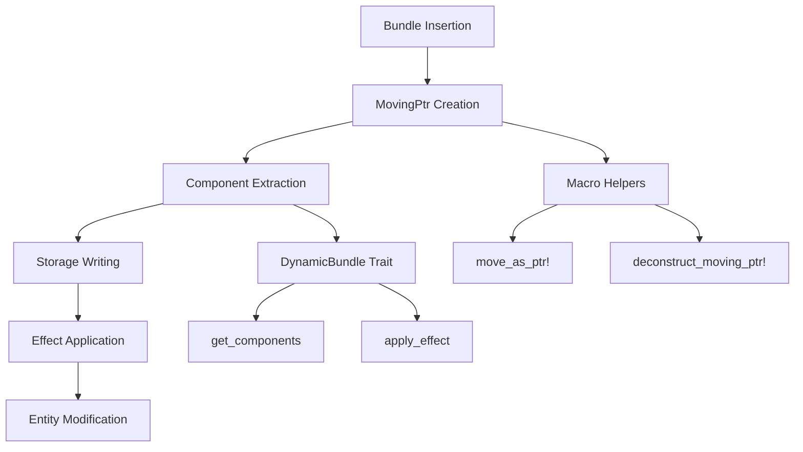

+++
title = "#20772 Mitigate stack overflow on large Bundle inserts"
date = "2025-09-12T00:00:00"
draft = false
template = "pull_request_page.html"
in_search_index = true

[taxonomies]
list_display = ["show"]

[extra]
current_language = "en"
available_languages = {"en" = { name = "English", url = "/pull_request/bevy/2025-09/pr-20772-en-20250912" }, "zh-cn" = { name = "中文", url = "/pull_request/bevy/2025-09/pr-20772-zh-cn-20250912" }}
labels = ["C-Bug", "A-ECS", "P-Crash", "C-Performance", "D-Complex", "D-Unsafe"]
+++

# Title: Mitigate stack overflow on large Bundle inserts

## Basic Information
- **Title**: Mitigate stack overflow on large Bundle inserts
- **PR Link**: https://github.com/bevyengine/bevy/pull/20772
- **Author**: james7132
- **Status**: MERGED
- **Labels**: C-Bug, A-ECS, P-Crash, C-Performance, S-Ready-For-Final-Review, D-Complex, D-Unsafe
- **Created**: 2025-08-27T05:38:08Z
- **Merged**: 2025-09-12T05:39:28Z
- **Merged By**: james7132

## Description Translation
# Objective
Fix #20571. 

## Solution
 
 * Avoid passing the bundle by value further than one layer deep, and pass a `MovingPtr<'_, T>` of the Bundle instead.
 * Pass `MovingPtr<'_, Self>` to `DynamicBundle::get_components` and its recursive children.
 * Instead of returning an `BundleEffect`, directly apply the effect from a `MovingPtr<'_, MaybeUninit<Self>>`.
 * Remove the now unused `BundleEffect` trait.

This should avoid most if not all extra stack copies of the bundle and its components. This won't 100% fix stack overflows via bundles, but it does mitigate them until much larger bundles are used.

This started as a subset of the changes made in #20593.

## Testing
Ran `cargo r --example feathers --features="experimental_bevy_feathers"` on Windows, no stack overflow.

Co-Authored By: janis <janis@nirgendwo.xyz>

## The Story of This Pull Request

The PR addresses a critical stack overflow issue that occurred when inserting large bundles into Bevy's ECS. The problem stemmed from how bundles were passed by value through multiple layers of function calls, causing excessive stack usage that could lead to crashes.

The core issue was in the `DynamicBundle` trait implementation, where the `get_components` method took ownership of the bundle and recursively processed its components. For large bundles with many components, this created multiple stack frames each containing copies of the bundle data, quickly exhausting available stack space.

The solution involved a fundamental redesign of how bundles are handled during insertion:

1. **Pointer-based bundle passing**: Instead of passing bundles by value, the implementation now uses `MovingPtr<'_, T>` to pass pointers to bundles through the call stack. This prevents deep copying of bundle data.

2. **Revised trait design**: The `DynamicBundle` trait was reworked with two unsafe methods:
   - `get_components`: Takes a `MovingPtr` and extracts components without consuming the entire bundle
   - `apply_effect`: Handles post-insertion effects using a `MovingPtr` to potentially uninitialized memory

3. **Macro enhancements**: New macros (`move_as_ptr!` and `deconstruct_moving_ptr!`) were introduced to safely handle the pointer-based bundle deconstruction while maintaining Rust's ownership guarantees.

The implementation maintains safety through careful use of unsafe code and static assertions. For example, the bundle derive macro now includes a compile-time check to prevent implementing `DynamicBundle` for types with `Drop` implementations, as their fields cannot be safely moved out.

```rust
// Before: Passed by value
fn get_components(self, func: &mut impl FnMut(StorageType, OwningPtr<'_>)) -> Self::Effect

// After: Passed via MovingPtr
unsafe fn get_components(
    ptr: MovingPtr<'_, Self>,
    func: &mut impl FnMut(StorageType, OwningPtr<'_>),
)
```

The changes affect multiple areas of the codebase including bundle insertion, spawning, and command execution. The solution significantly reduces stack usage while maintaining the same functionality and API surface area for most users.

## Visual Representation



## Key Files Changed

### `crates/bevy_ptr/src/lib.rs` (+216/-81)
Added new functionality for safely moving values without stack copying:
- Enhanced `MovingPtr` with methods for field access and partial moves
- Added `move_as_ptr!` macro for safe conversion of values to moving pointers
- Added `deconstruct_moving_ptr!` macro for safe field extraction

```rust
// New macro for safe pointer conversion
#[macro_export]
macro_rules! move_as_ptr {
    ($value: ident) => {
        let mut $value = core::mem::MaybeUninit::new($value);
        let $value = unsafe { bevy_ptr::MovingPtr::from_value(&mut $value) };
    };
}
```

### `crates/bevy_ecs/src/spawn.rs` (+136/-66)
Updated spawning mechanisms to use moving pointers:
- Modified `SpawnableList` trait to accept `MovingPtr`
- Updated tuple implementations to use pointer-based deconstruction
- Revised related entity spawning to avoid value copying

```rust
// Before: Value passing
fn spawn(self, world: &mut World, entity: Entity)

// After: Pointer passing
fn spawn(this: MovingPtr<'_, Self>, world: &mut World, entity: Entity)
```

### `crates/bevy_ecs/src/bundle/impls.rs` (+48/-47)
Updated bundle implementations for tuples and components:
- Replaced value-based component extraction with pointer-based approach
- Removed `BundleEffect` implementation in favor of integrated effect handling
- Added safety comments for the new pointer-based operations

```rust
// Updated tuple implementation
unsafe fn get_components(ptr: MovingPtr<'_, Self>, func: &mut impl FnMut(StorageType, OwningPtr<'_>)) {
    bevy_ptr::deconstruct_moving_ptr!(ptr => ($($index => $alias,)*));
    $( $name::get_components($alias.try_into().debug_checked_unwrap(), func); )*
}
```

### `crates/bevy_ecs/src/world/entity_ref.rs` (+51/-25)
Updated entity component insertion:
- Modified `insert_with_caller` to use `MovingPtr` instead of direct values
- Added proper effect application after component insertion
- Maintained safety through careful pointer management

```rust
// Updated insertion method
pub(crate) fn insert_with_caller<T: Bundle>(
    &mut self,
    bundle: MovingPtr<'_, T>,  // Changed from T to MovingPtr
    mode: InsertMode,
    caller: MaybeLocation,
    relationship_hook_mode: RelationshipHookMode,
) -> &mut Self
```

### `crates/bevy_ecs/src/bundle/mod.rs` (+50/-24)
Redesigned the `DynamicBundle` trait:
- Replaced `BundleEffect` system with integrated effect handling
- Added safety requirements for the new pointer-based interface
- Updated documentation to reflect the new design

```rust
// Revised trait definition
pub trait DynamicBundle: Sized {
    type Effect;
    
    unsafe fn get_components(
        ptr: MovingPtr<'_, Self>,
        func: &mut impl FnMut(StorageType, OwningPtr<'_>),
    );
    
    unsafe fn apply_effect(ptr: MovingPtr<'_, MaybeUninit<Self>>, entity: &mut EntityWorldMut);
}
```

## Further Reading

- [Rustonomicon](https://doc.rust-lang.org/nomicon/) - For understanding unsafe code and memory management
- [Bevy ECS Documentation](https://bevyengine.org/learn/books/ecs/) - For context on Bevy's entity component system
- [Stack Overflow Mitigation Techniques](https://en.wikipedia.org/wiki/Stack_overflow) - General background on stack overflow issues

This PR represents a significant improvement in Bevy's handling of large bundles, mitigating stack overflow issues while maintaining the existing API contract for most users. The solution demonstrates advanced Rust patterns for safe memory management and zero-cost abstractions.