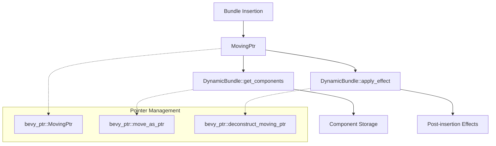

+++
title = "#20772 Mitigate stack overflow on large Bundle inserts"
date = "2025-09-12T00:00:00"
draft = false
template = "pull_request_page.html"
in_search_index = false

[extra]
current_language = "zh-cn"
available_languages = {"en" = { name = "English", url = "/pull_request/bevy/2025-09/pr-20772-en-20250912" }, "zh-cn" = { name = "中文", url = "/pull_request/bevy/2025-09/pr-20772-zh-cn-20250912" }}
labels = ["C-Bug", "A-ECS", "P-Crash", "C-Performance", "D-Complex", "D-Unsafe"]
+++

# Mitigate stack overflow on large Bundle inserts

## Basic Information
- **Title**: Mitigate stack overflow on large Bundle inserts
- **PR Link**: https://github.com/bevyengine/bevy/pull/20772
- **Author**: james7132
- **Status**: MERGED
- **Labels**: C-Bug, A-ECS, P-Crash, C-Performance, S-Ready-For-Review, D-Complex, D-Unsafe
- **Created**: 2025-08-27T05:38:08Z
- **Merged**: 2025-09-12T05:39:28Z
- **Merged By**: james7132

## Description Translation
# 目标 (Objective)
修复 #20571。

## 解决方案 (Solution)
 
 * 避免将 bundle 按值传递超过一层深度，改为传递 bundle 的 `MovingPtr<'_, T>`。
 * 向 `DynamicBundle::get_components` 及其递归子函数传递 `MovingPtr<'_, Self>`。
 * 不再返回 `BundleEffect`，而是直接从 `MovingPtr<'_, MaybeUninit<Self>>` 应用效果。
 * 移除现在已不再使用的 `BundleEffect` trait。

这应该能避免 bundle 及其组件的大部分（如果不是全部）额外栈拷贝。虽然不能 100% 解决通过 bundle 导致的栈溢出，但能缓解问题直到使用更大的 bundle。

这最初是 #20593 中所做更改的一个子集。

## 测试 (Testing)
在 Windows 上运行 `cargo r --example feathers --features="experimental_bevy_feathers"`，没有出现栈溢出。

合作者：janis <janis@nirgendwo.xyz>

## The Story of This Pull Request

### 问题与背景
在 Bevy ECS 中，当插入大型 bundle 时，由于递归调用和值传递，会导致栈溢出问题。具体来说，bundle 在插入过程中会被多次拷贝到栈上，当 bundle 包含大量组件时，栈空间很快就会被耗尽。这个问题在 #20571 中被报告，表现为在插入大型 bundle 时出现栈溢出崩溃。

### 解决方案
开发者采用了通过指针传递 bundle 的策略，而不是直接传递值。主要改动包括：

1. 引入 `MovingPtr` 类型来安全地管理部分移动的值
2. 修改 `DynamicBundle` trait 的方法签名，改为接受 `MovingPtr` 参数
3. 移除 `BundleEffect` trait，改为直接在 `apply_effect` 方法中处理后续效果
4. 使用 `move_as_ptr!` 宏来安全地将值转换为 `MovingPtr`

### 实现细节
核心改动是在 `bevy_ptr` crate 中增强了 `MovingPtr` 的功能，使其能够安全地处理部分移动的值。在 ECS 代码中，所有处理 bundle 插入的地方都改为使用 `MovingPtr` 来传递 bundle，避免了深层递归调用时的栈拷贝。

关键的技术点包括：
- 使用 `MaybeUninit` 来安全地处理部分初始化的值
- 通过 `deconstruct_moving_ptr!` 宏来解构 bundle 的各个字段
- 确保在组件插入过程中只进行必要的指针操作，而不是值拷贝

### 技术洞察
这个 PR 展示了如何在 Rust 中安全地处理部分移动和析构的问题。`MovingPtr` 的设计允许我们在不违反 Rust 所有权规则的前提下，对结构体的字段进行逐个移动。这种方法不仅解决了栈溢出问题，还为未来处理更复杂的 bundle 插入场景提供了基础。

### 影响
这些更改显著减少了插入大型 bundle 时的栈使用量，缓解了栈溢出问题。虽然不能完全消除栈溢出的可能性，但将触发门槛提高到了更大的 bundle 尺寸。此外，这些改动也为未来的性能优化提供了基础，因为减少了不必要的值拷贝。

## Visual Representation



## Key Files Changed

### 1. `crates/bevy_ptr/src/lib.rs` (+216/-81)
主要增强了 `MovingPtr` 的功能，添加了部分移动和安全解构的支持。

```rust
// 新增方法：部分移动
pub fn partial_move<R>(
    self,
    f: impl FnOnce(MovingPtr<'_, T, A>) -> R,
) -> (MovingPtr<'a, MaybeUninit<T>, A>, R) {
    let partial_ptr = self.0;
    let ret = f(self);
    (
        MovingPtr(partial_ptr.cast::<MaybeUninit<T>>(), PhantomData),
        ret,
    )
}

// 新增宏：安全转换为 MovingPtr
#[macro_export]
macro_rules! move_as_ptr {
    ($value: ident) => {
        let mut $value = core::mem::MaybeUninit::new($value);
        let $value = unsafe { bevy_ptr::MovingPtr::from_value(&mut $value) };
    };
}
```

### 2. `crates/bevy_ecs/src/spawn.rs` (+136/-66)
修改了 spawn 相关代码，使用 `MovingPtr` 来传递 bundle。

```rust
// 之前：
fn spawn(self, world: &mut World, entity: Entity) {
    world.spawn((R::from(entity), self.0));
}

// 之后：
fn spawn(this: MovingPtr<'_, Self>, world: &mut World, entity: Entity) {
    // 使用 MovingPtr 进行处理
    let bundle = unsafe {
        bevy_ptr::deconstruct_moving_ptr!(this => (0 => bundle,));
        bundle.try_into().debug_checked_unwrap()
    };
    // ... 其余代码
}
```

### 3. `crates/bevy_ecs/src/bundle/impls.rs` (+48/-47)
更新了 bundle 的实现，使用新的 `MovingPtr` API。

```rust
// 之前：
fn get_components(self, func: &mut impl FnMut(StorageType, OwningPtr<'_>)) -> Self::Effect {
    OwningPtr::make(self, |ptr| func(C::STORAGE_TYPE, ptr));
}

// 之后：
unsafe fn get_components(
    ptr: MovingPtr<'_, Self>,
    func: &mut impl FnMut(StorageType, OwningPtr<'_>),
) -> Self::Effect {
    func(C::STORAGE_TYPE, OwningPtr::from(ptr));
}
```

### 4. `crates/bevy_ecs/src/world/entity_ref.rs` (+51/-25)
修改了实体引用中的 bundle 插入方法。

```rust
// 使用新的插入方式
pub(crate) fn insert_with_caller<T: Bundle>(
    &mut self,
    bundle: MovingPtr<'_, T>,  // 改为 MovingPtr
    mode: InsertMode,
    caller: MaybeLocation,
    relationship_hook_mode: RelationshipHookMode,
) -> &mut Self {
    // ... 使用 MovingPtr 进行处理
}
```

### 5. `crates/bevy_ecs/src/bundle/mod.rs` (+50/-24)
更新了 bundle 模块的核心定义。

```rust
// 修改 DynamicBundle trait
pub trait DynamicBundle: Sized {
    type Effect;
    
    unsafe fn get_components(
        ptr: MovingPtr<'_, Self>,
        func: &mut impl FnMut(StorageType, OwningPtr<'_>),
    );
    
    unsafe fn apply_effect(ptr: MovingPtr<'_, MaybeUninit<Self>>, entity: &mut EntityWorldMut);
}
```

## Further Reading

1. [Rustonomicon - Working with Uninitialized Memory](https://doc.rust-lang.org/nomicon/uninitialized.html)
2. [Rust Reference - Place Expressions and Value Expressions](https://doc.rust-lang.org/reference/expressions.html)
3. [Bevy Engine - ECS Documentation](https://bevyengine.org/learn/book/getting-started/ecs/)
4. [Issue #20571 - Stack overflow on large Bundle inserts](https://github.com/bevyengine/bevy/issues/20571)