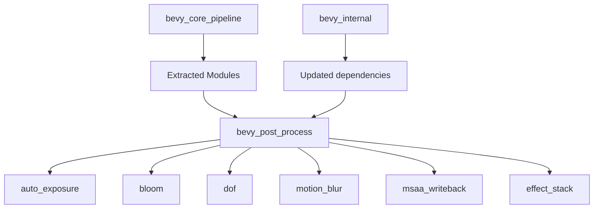

+++
title = "#20778 bevy_post_process"
date = "2025-09-05T00:00:00"
draft = false
template = "pull_request_page.html"
in_search_index = true

[taxonomies]
list_display = ["show"]

[extra]
current_language = "en"
available_languages = {"en" = { name = "English", url = "/pull_request/bevy/2025-09/pr-20778-en-20250905" }, "zh-cn" = { name = "中文", url = "/pull_request/bevy/2025-09/pr-20778-zh-cn-20250905" }}
labels = ["A-Rendering"]
+++

# Title
## bevy_post_process

## Basic Information
- **Title**: bevy_post_process
- **PR Link**: https://github.com/bevyengine/bevy/pull/20778
- **Author**: atlv24
- **Status**: MERGED
- **Labels**: A-Rendering, S-Ready-For-Final-Review, M-Needs-Migration-Guide
- **Created**: 2025-08-27T20:28:12Z
- **Merged**: 2025-09-05T04:47:58Z
- **Merged By**: alice-i-cecile

## Description Translation
# Objective

Split out post process effects from bevy_core_pipeline because they are not core pipelines.

## Solution

@IceSentry proposed something like this, not sure if the split is exactly as he envisioned but this seems reasonable to me.

The goal is to move absolutely everything possible out of bevy_core_pipelines to unblock bevy_pbr/bevy_sprite_render compilation.

Future PRs may attempt to move more little bits out.

## Testing

## The Story of This Pull Request

This PR addresses a structural issue in Bevy's rendering pipeline organization. The core problem was that `bevy_core_pipeline` had become bloated with non-essential post-processing effects, which was causing compilation bottlenecks for other critical rendering components like `bevy_pbr` and `bevy_sprite_render`.

The solution was straightforward but impactful: extract all post-processing functionality into a new dedicated crate called `bevy_post_process`. This follows the pattern established by the recent extraction of anti-aliasing features into `bevy_anti_alias`.

The implementation involved moving several modules from `bevy_core_pipeline` to the new crate:
- `auto_exposure` - Automatic exposure adjustment
- `bloom` - Bloom lighting effects
- `dof` - Depth of field effects
- `motion_blur` - Motion blur rendering
- `msaa_writeback` - MSAA resolution handling
- `post_process` (renamed to `effect_stack`) - General post-processing framework including chromatic aberration

Each module was moved with minimal code changes, primarily updating import paths and ensuring proper plugin registration. The key architectural change was creating a new `PostProcessPlugin` that aggregates all the individual effect plugins:

```rust
// New plugin structure in bevy_post_process
pub struct PostProcessPlugin;

impl Plugin for PostProcessPlugin {
    fn build(&self, app: &mut App) {
        app.add_plugins((
            MsaaWritebackPlugin,
            BloomPlugin,
            MotionBlurPlugin,
            DepthOfFieldPlugin,
            EffectStackPlugin,
        ));
    }
}
```

The extraction required significant updates to import statements throughout the codebase. All examples and tests that used post-processing effects needed to be updated to import from the new `bevy_post_process` crate instead of `bevy_core_pipeline`. For instance:

```rust
// Before:
use bevy::core_pipeline::bloom::Bloom;

// After:
use bevy::post_process::bloom::Bloom;
```

A notable technical detail is that several plugins gained `Default` derives during the extraction, improving consistency across the codebase. The migration was designed to be as non-breaking as possible, maintaining the same API surface but from a different module location.

The impact of this change is significant for Bevy's compilation times and modular architecture. By separating core pipeline functionality from optional post-processing effects, the engine can now compile more efficiently, and users can choose to include only the post-processing features they need. This also sets the stage for future modularization efforts and makes the codebase more maintainable.

## Visual Representation



## Key Files Changed

1. **`crates/bevy_post_process/Cargo.toml`** (+50/-0)
   - New crate definition with dependencies on bevy rendering components
   - Sets up the new post-processing crate structure

2. **`crates/bevy_post_process/src/lib.rs`** (+36/-0)
   - Main entry point for the new crate
   - Defines the module structure and plugin aggregation

```rust
pub mod auto_exposure;
pub mod bloom;
pub mod dof;
pub mod effect_stack;
pub mod motion_blur;
pub mod msaa_writeback;

// Plugin that aggregates all post-processing features
#[derive(Default)]
pub struct PostProcessPlugin;
```

3. **`crates/bevy_core_pipeline/src/lib.rs`** (+4/-16)
   - Removed post-processing modules from core pipeline
   - Updated plugin registration to exclude extracted features

```rust
// Before:
pub mod auto_exposure;
pub mod bloom;
pub mod dof;
pub mod motion_blur;
pub mod msaa_writeback;
pub mod post_process;

// After:
// These modules have been moved to bevy_post_process
```

4. **`crates/bevy_internal/Cargo.toml`** (multiple changes)
   - Added bevy_post_process as a dependency feature
   - Updated feature flags to include the new crate

5. **`crates/bevy_internal/src/default_plugins.rs`** 
   - Added PostProcessPlugin to default plugin group

```rust
#[cfg(feature = "bevy_post_process")]
bevy_post_process:::PostProcessPlugin,
```

6. **Multiple example files** (16 files modified)
   - Updated import statements to use new post_process module
   - Ensured examples continue to work with the extracted functionality

## Further Reading

- [Bevy Plugin System Documentation](https://bevyengine.org/learn/book/getting-started/plugins/)
- [Rendering Pipeline Architecture](https://bevyengine.org/learn/book/getting-started/rendering/)
- [Modular Programming in Rust](https://doc.rust-lang.org/book/ch07-00-managing-growing-projects-with-packages-crates-and-modules.html)