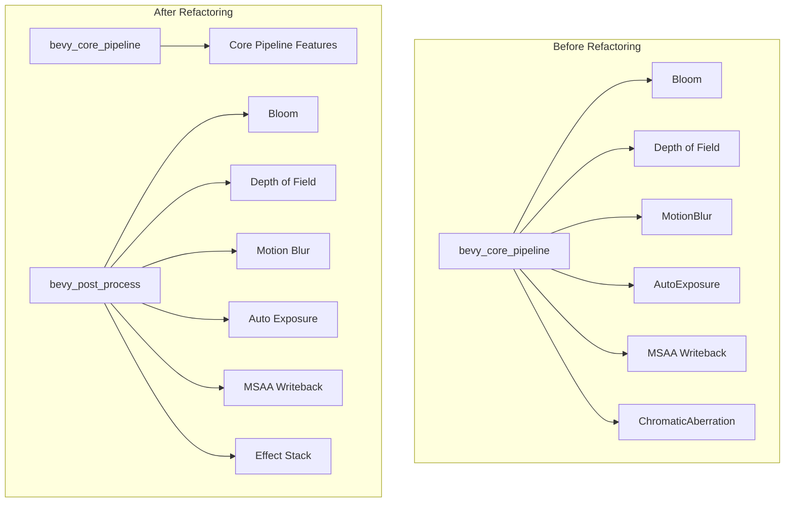

+++
title = "#20778 bevy_post_process"
date = "2025-09-05T00:00:00"
draft = false
template = "pull_request_page.html"
in_search_index = false

[extra]
current_language = "zh-cn"
available_languages = {"en" = { name = "English", url = "/pull_request/bevy/2025-09/pr-20778-en-20250905" }, "zh-cn" = { name = "中文", url = "/pull_request/bevy/2025-09/pr-20778-zh-cn-20250905" }}
labels = ["A-Rendering"]
+++

# Title

## Basic Information
- **Title**: bevy_post_process
- **PR Link**: https://github.com/bevyengine/bevy/pull/20778
- **Author**: atlv24
- **Status**: MERGED
- **Labels**: A-Rendering, S-Ready-For-Final-Review, M-Needs-Migration-Guide
- **Created**: 2025-08-27T20:28:12Z
- **Merged**: 2025-09-05T04:47:58Z
- **Merged By**: alice-i-cecile

## Description Translation
# Objective

将后处理效果从 bevy_core_pipeline 中拆分出来，因为它们不是核心流水线。

## Solution

@IceSentry 提出了类似的方案，不确定拆分是否完全符合他的设想，但对我来说这似乎是合理的。

目标是尽可能将一切从 bevy_core_pipelines 中移出，以解除 bevy_pbr/bevy_sprite_render 的编译阻塞。

未来的 PR 可能会尝试移出更多的小部分。

## Testing

## The Story of This Pull Request

这个 PR 的核心目标是解决 Bevy 引擎中模块化程度不足的问题。bevy_core_pipeline 模块原本包含了过多的功能，不仅包括核心渲染流水线，还包含了各种后处理效果，这导致了编译依赖问题，特别是阻塞了 bevy_pbr 和 bevy_sprite_render 的独立编译。

开发者面临的主要问题是代码组织不够清晰，核心模块承担了过多非核心职责。这种设计限制了引擎的模块化发展，使得其他渲染相关的crate无法独立编译和使用。

解决方案采用了模块拆分的方法，将所有后处理相关功能从 bevy_core_pipeline 中提取出来，创建了一个新的 bevy_post_process crate。这个方案是由社区成员 @IceSentry 提议的，虽然具体实现可能有所不同，但遵循了相同的设计理念。

从技术实现角度来看，这个重构涉及多个层面：

1. **创建新crate**：新建了 bevy_post_process crate，包含完整的项目结构（Cargo.toml、LICENSE文件、README等）

2. **代码迁移**：将以下后处理模块从 bevy_core_pipeline 迁移到新crate：
   - auto_exposure（自动曝光）
   - bloom（泛光效果）
   - dof（景深效果）
   - motion_blur（运动模糊）
   - msaa_writeback（MSAA回写）
   - post_process（重命名为effect_stack，包含色差效果）

3. **架构调整**：更新了渲染图配置，从 Core3d 中移除了 DepthOfFieldNode，因为现在它属于后处理模块

4. **依赖管理**：在新crate的Cargo.toml中正确定义了所有依赖关系，特别是对 bevy_core_pipeline 的依赖

5. **示例更新**：更新了所有使用后处理效果的示例代码，将import路径从 bevy::core_pipeline 改为 bevy::post_process

关键的技术决策包括保持所有API不变，只改变模块结构。这样确保了向后兼容性，同时提供了更好的代码组织。

```rust
// 迁移前的import
use bevy::core_pipeline::bloom::Bloom;

// 迁移后的import  
use bevy::post_process::bloom::Bloom;
```

从性能角度来看，这个变化是中性的，没有改变任何渲染逻辑，只是重新组织了代码结构。但从架构角度来看，这是一个重要的改进，它：

1. 减少了 bevy_core_pipeline 的编译时间和二进制大小
2. 允许用户选择性启用后处理功能
3. 为未来的扩展提供了更好的基础
4. 解决了 bevy_pbr 和 bevy_sprite_render 的编译阻塞问题

这个重构也体现了良好的软件工程实践：单一职责原则、关注点分离、模块化设计。通过将后处理效果分离到独立的crate中，每个模块都有了更清晰的职责边界。

## Visual Representation



## Key Files Changed

### 1. `crates/bevy_post_process/Cargo.toml` (+50/-0)
新建的后处理crate的配置文件，定义了所有必要的依赖关系。

```toml
[package]
name = "bevy_post_process"
version = "0.17.0-dev"
edition = "2024"
description = "Provides post process effects for Bevy Engine."

[dependencies]
# bevy
bevy_app = { path = "../bevy_app", version = "0.17.0-dev" }
bevy_asset = { path = "../bevy_asset", version = "0.17.0-dev" }
bevy_core_pipeline = { path = "../bevy_core_pipeline", version = "0.17.0-dev" }
# ... 其他依赖
```

### 2. `crates/bevy_post_process/src/lib.rs` (+36/-0)
新crate的主入口文件，定义了模块结构和插件集成。

```rust
pub mod auto_exposure;
pub mod bloom;
pub mod dof;
pub mod effect_stack;
pub mod motion_blur;
pub mod msaa_writeback;

use crate::{
    bloom::BloomPlugin, dof::DepthOfFieldPlugin, effect_stack::EffectStackPlugin,
    motion_blur::MotionBlurPlugin, msaa_writeback::MsaaWritebackPlugin,
};
use bevy_app::{App, Plugin};

#[derive(Default)]
pub struct PostProcessPlugin;

impl Plugin for PostProcessPlugin {
    fn build(&self, app: &mut App) {
        app.add_plugins((
            MsaaWritebackPlugin,
            BloomPlugin,
            MotionBlurPlugin,
            DepthOfFieldPlugin,
            EffectStackPlugin,
        ));
    }
}
```

### 3. `crates/bevy_core_pipeline/src/lib.rs` (+4/-16)
移除了后处理相关的模块导出和插件注册。

```rust
// Before:
pub mod auto_exposure;
pub mod bloom;
pub mod dof;
pub mod motion_blur;
pub mod msaa_writeback;
pub mod post_process;

// After:
// 这些模块已移动到 bevy_post_process
```

### 4. `crates/bevy_internal/Cargo.toml`
添加了新crate的特性标志和依赖配置。

```toml
bevy_post_process = ["dep:bevy_post_process", "bevy_core_pipeline"]
```

### 5. `crates/bevy_internal/src/default_plugins.rs`
在新的默认插件列表中注册了后处理插件。

```rust
#[cfg(feature = "bevy_post_process")]
bevy_post_process:::PostProcessPlugin,
```

## Further Reading

1. [Bevy Engine Documentation](https://bevyengine.org/learn/)
2. [Rust Module System](https://doc.rust-lang.org/book/ch07-02-defining-modules-to-control-scope-and-privacy.html)
3. [ECS Architecture Pattern](https://en.wikipedia.org/wiki/Entity_component_system)
4. [Post-processing Effects in Computer Graphics](https://en.wikipedia.org/wiki/Post-processing_(video_games))