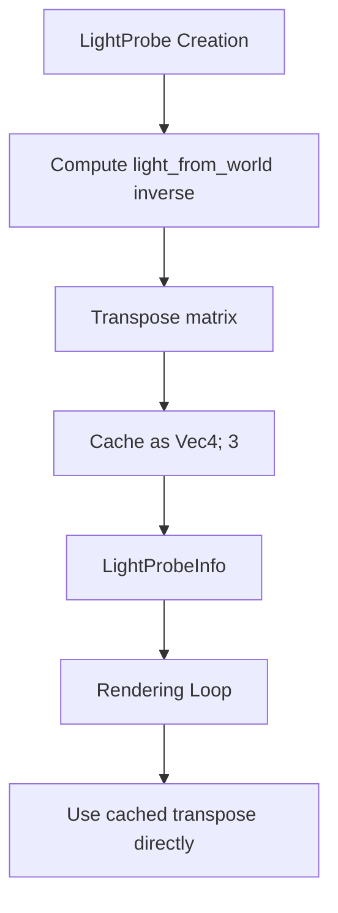

+++
title = "#20782 Compute light probe matrix earlier and cache in LightProbeInfo #20738"
date = "2025-09-11T00:00:00"
draft = false
template = "pull_request_page.html"
in_search_index = false

[extra]
current_language = "zh-cn"
available_languages = {"en" = { name = "English", url = "/pull_request/bevy/2025-09/pr-20782-en-20250911" }, "zh-cn" = { name = "中文", url = "/pull_request/bevy/2025-09/pr-20782-zh-cn-20250911" }}
labels = ["A-Rendering", "C-Performance"]
+++

# Title

## Basic Information
- **Title**: Compute light probe matrix earlier and cache in LightProbeInfo #20738
- **PR Link**: https://github.com/bevyengine/bevy/pull/20782
- **Author**: jz009
- **Status**: MERGED
- **Labels**: A-Rendering, C-Performance, S-Ready-For-Final-Review
- **Created**: 2025-08-28T02:54:36Z
- **Merged**: 2025-09-11T19:40:28Z
- **Merged By**: alice-i-cecile

## Description Translation
# 目标 (Objective)
- 关闭 #20738
- 避免多次计算相同的矩阵转置

## 解决方案 (Solution)
- 在创建 LightProbeInfo 时计算转置矩阵，并从中引用它

## 测试 (Testing)
cargo run -p ci

## The Story of This Pull Request

这个PR解决了一个在Bevy渲染系统中存在的性能问题，具体涉及光照探针(light probe)的矩阵计算。问题的核心是在每帧渲染过程中，相同的光照探针变换矩阵被重复计算多次，造成了不必要的性能开销。

在原有的实现中，`LightProbeInfo`结构体存储了两个变换矩阵：`light_from_world`（从世界空间到光照探针空间的变换）和`world_from_light`（从光照探针空间到世界空间的变换）。问题出现在渲染阶段，当需要将光照探针数据写入uniform buffer时，系统需要对`light_from_world`矩阵进行转置操作，以便在GPU上进行更高效的存储。

原来的实现方式是在每次渲染时实时计算这个转置：

```rust
// 原来的实现 - 在渲染循环中计算转置
let light_from_world_transposed = Mat4::from(light_probe.light_from_world).transpose();
```

这种实现方式导致了性能问题，因为对于每个光照探针，这个相同的转置计算在每一帧都会被重复执行，即使光照探针的位置和方向没有发生变化。

解决方案相当直接：将转置矩阵的计算提前到`LightProbeInfo`创建阶段，并将其缓存起来。这样在渲染循环中就可以直接使用预先计算好的转置矩阵，避免了重复计算。

具体实现包括两个主要修改：

1. 修改`LightProbeInfo`结构体的`light_from_world`字段类型，从`Affine3A`改为`[Vec4; 3]`，直接存储转置后的矩阵数据：

```rust
// 修改后的结构体定义
struct LightProbeInfo<C> {
    // 存储为逆变换的转置，以在GPU上压缩结构
    // (从4个`Vec4`压缩到3个`Vec4`)。着色器会将其转置
    // 以恢复原始的逆变换。
    light_from_world: [Vec4; 3],
    world_from_light: Affine3A,
    // ... 其他字段
}
```

2. 在`LightProbeInfo::new`方法中提前计算并存储转置矩阵：

```rust
// 在创建时计算转置
let light_from_world_transposed = 
    Mat4::from(light_probe_transform.affine().inverse()).transpose();

LightProbeInfo {
    world_from_light: light_probe_transform.affine(),
    light_from_world: [
        light_from_world_transposed.x_axis,
        light_from_world_transposed.y_axis,
        light_from_world_transposed.z_axis,
    ],
    // ... 其他字段
}
```

3. 在渲染阶段直接使用缓存的转置矩阵：

```rust
// 渲染时直接使用预先计算的转置矩阵
self.render_light_probes.push(RenderLightProbe {
    light_from_world_transposed: light_probe.light_from_world, // 直接使用缓存
    texture_index: cubemap_index as i32,
    // ... 其他字段
});
```

这个优化体现了几个重要的软件工程原则：

1. **计算与存储的权衡**：通过增加少量的存储开销（缓存转置矩阵）来换取显著的计算性能提升，这是一个典型的空间换时间优化。

2. **数据局部性**：将相关的计算数据提前准备好，避免了在热点代码路径（渲染循环）中进行昂贵的矩阵运算。

3. **API设计的一致性**：修改后的接口更加清晰，`light_from_world`字段现在直接存储GPU所需的格式，减少了使用时的转换开销。

从性能角度看，这个优化的收益与场景中光照探针的数量成正比。在包含大量光照探针的复杂场景中，这种优化可以避免大量的重复矩阵运算，特别是在每帧都需要处理多个光照探针的情况下。

这个修改也保持了向后兼容性，没有改变任何公共API，只是优化了内部实现。测试通过`cargo run -p ci`验证了修改的正确性，确保没有引入回归问题。

## Visual Representation



## Key Files Changed

### `crates/bevy_pbr/src/light_probe/mod.rs` (+12/-13)

这个文件包含了所有的核心修改，主要涉及LightProbeInfo结构体的定义和相关的矩阵计算逻辑。

**主要修改：**

1. **LightProbeInfo结构体字段类型变更**：
```rust
// 修改前：
light_from_world: Affine3A,

// 修改后：
light_from_world: [Vec4; 3],
```

2. **new方法中的矩阵计算优化**：
```rust
// 修改前：
light_from_world: light_probe_transform.affine().inverse(),

// 修改后：
let light_from_world_transposed = Mat4::from(light_probe_transform.affine().inverse()).transpose();
light_from_world: [
    light_from_world_transposed.x_axis,
    light_from_world_transposed.y_axis,
    light_from_world_transposed.z_axis,
],
```

3. **渲染循环中的性能优化**：
```rust
// 修改前：
let light_from_world_transposed = Mat4::from(light_probe.light_from_world).transpose();
self.render_light_probes.push(RenderLightProbe {
    light_from_world_transposed: [
        light_from_world_transposed.x_axis,
        light_from_world_transposed.y_axis,
        light_from_world_transposed.z_axis,
    ],
    // ...
});

// 修改后：
self.render_light_probes.push(RenderLightProbe {
    light_from_world_transposed: light_probe.light_from_world, // 直接使用缓存
    // ...
});
```

这些修改共同实现了矩阵转置计算的缓存机制，避免了在渲染循环中的重复计算。

## Further Reading

对于想深入了解相关概念的开发者，建议阅读以下资源：

1. **计算机图形学中的变换矩阵**：
   - 《Real-Time Rendering》第4章 - 变换相关数学
   - OpenGL变换矩阵指南

2. **性能优化模式**：
   - 缓存模式(Cache Pattern)
   - 预先计算(Precomputation)优化技术
   - 空间换时间权衡

3. **Bevy渲染系统**：
   - Bevy官方文档中的渲染管线说明
   - ECS(Entity Component System)在图形渲染中的应用

4. **GPU数据格式优化**：
   - Uniform Buffer Object最佳实践
   - GPU内存布局优化技术

这个PR展示了在游戏引擎开发中常见的性能优化模式，特别是在处理实时渲染中的矩阵运算时，如何通过合理的缓存策略来提升性能。