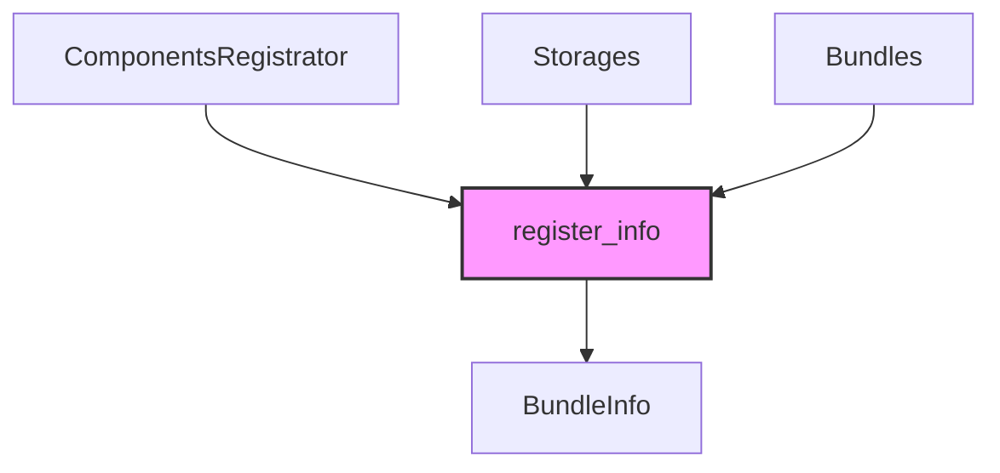

+++
title = "#20790 mark `register_info`, `register_contributed_bundle_info` unsafe"
date = "2025-09-01T00:00:00"
draft = false
template = "pull_request_page.html"
in_search_index = true

[taxonomies]
list_display = ["show"]

[extra]
current_language = "en"
available_languages = {"en" = { name = "English", url = "/pull_request/bevy/2025-09/pr-20790-en-20250901" }, "zh-cn" = { name = "中文", url = "/pull_request/bevy/2025-09/pr-20790-zh-cn-20250901" }}
labels = ["A-ECS", "C-Code-Quality"]
+++

# Title: mark `register_info`, `register_contributed_bundle_info` unsafe

## Basic Information
- **Title**: mark `register_info`, `register_contributed_bundle_info` unsafe
- **PR Link**: https://github.com/bevyengine/bevy/pull/20790
- **Author**: janis-bhm
- **Status**: MERGED
- **Labels**: A-ECS, C-Code-Quality, S-Ready-For-Final-Review
- **Created**: 2025-08-29T22:59:06Z
- **Merged**: 2025-09-01T22:21:07Z
- **Merged By**: alice-i-cecile

## Description Translation
# Objective
calling `register_info` and `register_contributed_bundle_info` with incorrect arguments results in panics in 100% safe code
part of breaking up #20739 

## Solution

Mark `register_info` and `register_contributed_bundle_info` as unsafe.

## Testing

cargo test in crates/bevy_ecs

---

It's pretty obvious why this is unsafe, but the function doesn't explicitly forbid it:
```rust
fn safe_bundle_register_world_unsafety() {
    #![forbid(unsafe_code)]
    let mut world = World::new();
    let mut antiworld = World::new();

    #[derive(crate::prelude::Component, Debug, PartialEq, Eq)]
    struct A(u32);

    let mut world_components = world.components_registrator();

    let _ = antiworld
        .bundles
        .register_info::<(A,)>(&mut world_components, &mut antiworld.storages);
    // unsound beyond this point

    let e = antiworld.spawn((A(3),));
    let a = e.get::<A>().unwrap();
    assert_eq!(a, &A(3));
}
```

## The Story of This Pull Request

This PR addresses a critical safety issue in Bevy's ECS system where two bundle registration methods could be misused to create unsound behavior in what appeared to be safe code. The core problem was that `register_info` and `register_contributed_bundle_info` required specific invariants to be maintained, but these requirements weren't enforced by the type system.

The issue occurred when these methods were called with components and storages from different `World` instances. While the functions expected all parameters to come from the same world, nothing in the API prevented mixing components from one world with storages from another. This mismatch could lead to memory unsafety and panics, as demonstrated in the test case where components from one world were registered with another world's storage.

The solution was straightforward but important: mark both methods as `unsafe` and add comprehensive safety documentation. This change forces callers to explicitly acknowledge the safety requirements and verify that they're passing components and storages from the same world instance.

The implementation required changes across multiple files where these methods were called. Each callsite needed to be updated with appropriate safety comments explaining why the usage was valid. The key insight was that in all these cases, the components registrator, bundles, and storages were indeed from the same world instance, making the usage safe.

This change is part of a larger effort to improve ECS safety and follows Rust's principle of using the type system to enforce invariants. By marking these methods unsafe, the Bevy team prevents future developers from accidentally introducing memory safety issues while maintaining the flexibility needed for the ECS system's internal operations.

## Visual Representation



## Key Files Changed

### `crates/bevy_ecs/src/bundle/info.rs` (+20/-3)
This file contains the core changes where the two methods were marked as unsafe with proper safety documentation.

**Before:**
```rust
pub(crate) fn register_info<T: Bundle>(
    &mut self,
    components: &mut ComponentsRegistrator,
    storages: &mut Storages,
) -> BundleId {
```

**After:**
```rust
#[deny(unsafe_op_in_unsafe_fn)]
pub(crate) unsafe fn register_info<T: Bundle>(
    &mut self,
    components: &mut ComponentsRegistrator,
    storages: &mut Storages,
) -> BundleId {
```

### `crates/bevy_ecs/src/world/mod.rs` (+19/-9)
Multiple callsites in the World implementation needed to be updated with safety comments and unsafe blocks.

**Example change:**
```rust
// Before:
let bundle_id = self
    .bundles
    .register_info::<B>(&mut registrator, &mut self.storages);

// After:
let bundle_id = unsafe {
    self.bundles
        .register_info::<B>(&mut registrator, &mut self.storages)
};
```

### `crates/bevy_ecs/src/bundle/insert.rs` (+7/-3), `remove.rs` (+8/-3), `spawner.rs` (+7/-3)
These files handle bundle operations and needed similar updates to their callsites.

### `crates/bevy_ecs/src/world/entity_ref.rs` (+11/-5)
Entity world operations needed safety verification for bundle registration.

## Further Reading

- [Rustonomicon: Working with Unsafe](https://doc.rust-lang.org/nomicon/working-with-unsafe.html)
- [Bevy ECS Documentation](https://bevyengine.org/learn/books/the-bevy-book/ecs/)
- [Rust Unsafe Code Guidelines](https://rust-lang.github.io/unsafe-code-guidelines/)