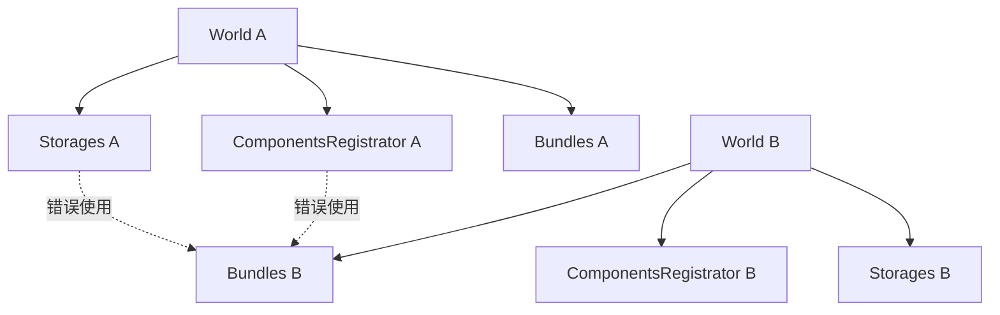

+++
title = "#20790 mark `register_info`, `register_contributed_bundle_info` unsafe"
date = "2025-09-01T00:00:00"
draft = false
template = "pull_request_page.html"
in_search_index = false

[extra]
current_language = "zh-cn"
available_languages = {"en" = { name = "English", url = "/pull_request/bevy/2025-09/pr-20790-en-20250901" }, "zh-cn" = { name = "中文", url = "/pull_request/bevy/2025-09/pr-20790-zh-cn-20250901" }}
labels = ["A-ECS", "C-Code-Quality"]
+++

# Title

## Basic Information
- **Title**: mark `register_info`, `register_contributed_bundle_info` unsafe
- **PR Link**: https://github.com/bevyengine/bevy/pull/20790
- **Author**: janis-bhm
- **Status**: MERGED
- **Labels**: A-ECS, C-Code-Quality, S-Ready-For-Final-Review
- **Created**: 2025-08-29T22:59:06Z
- **Merged**: 2025-09-01T22:21:07Z
- **Merged By**: alice-i-cecile

## Description Translation
该PR的目标是将`register_info`和`register_contributed_bundle_info`标记为unsafe，因为使用不正确的参数调用这些函数会导致100%安全的代码中出现panic。这是拆分#20739的一部分。

解决方案是将`register_info`和`register_contributed_bundle_info`标记为unsafe。

测试方法是在crates/bevy_ecs中运行cargo test。

虽然很明显为什么这是不安全的，但函数没有明确禁止以下行为：
```rust
fn safe_bundle_register_world_unsafety() {
    #![forbid(unsafe_code)]
    let mut world = World::new();
    let mut antiworld = World::new();

    #[derive(crate::prelude::Component, Debug, PartialEq, Eq)]
    struct A(u32);

    let mut world_components = world.components_registrator();

    let _ = antiworld
        .bundles
        .register_info::<(A,)>(&mut world_components, &mut antiworld.storages);
    // 从此处开始出现内存安全问题

    let e = antiworld.spawn((A(3),));
    let a = e.get::<A>().unwrap();
    assert_eq!(a, &A(3));
}
```

## The Story of This Pull Request

这个PR解决了一个重要的内存安全问题。在Bevy的ECS系统中，`register_info`和`register_contributed_bundle_info`这两个函数原本被标记为安全函数，但它们实际上有严格的前提条件：传入的`components`和`storages`参数必须来自同一个World实例。

问题在于，如果开发者在调用这些函数时传入了来自不同World的参数，会导致程序panic，而且这一切都可以在完全安全的代码中发生。这违反了Rust的安全保证，因为安全代码不应该引起内存错误。

开发者通过一个简单的测试案例展示了这个问题：创建两个不同的World实例，然后尝试用一个World的components注册器去注册另一个World的bundle信息。这会导致不一致的状态，最终引发panic。

解决方案很直接：将这些函数标记为`unsafe`，并在文档中明确说明安全调用的条件。这样就将保证参数正确性的责任转移给了调用者，符合Rust的unsafe代码规范。

在实现方面，这个PR做了两件主要事情：
1. 将两个函数的签名改为`unsafe fn`并添加了安全要求文档
2. 更新所有调用这些函数的地方，添加适当的unsafe块和安全注释

这种修改是防御性编程的典型例子，通过显式标记潜在危险的操作，防止了误用导致的运行时错误。虽然这增加了调用这些函数时的复杂性（需要unsafe块），但这是必要的代价，以确保系统的内存安全。

## Visual Representation



## Key Files Changed

### `crates/bevy_ecs/src/bundle/info.rs` (+20/-3)
这个文件包含了主要的函数签名修改。将两个注册函数标记为unsafe并添加了安全文档。

```rust
// 修改前:
pub(crate) fn register_info<T: Bundle>(

// 修改后:
#[deny(unsafe_op_in_unsafe_fn)]
pub(crate) unsafe fn register_info<T: Bundle>(
```

### `crates/bevy_ecs/src/world/mod.rs` (+19/-9)
更新了World中间接调用register_info的多个地方，添加了unsafe块和安全注释。

```rust
// 修改前:
let bundle_id = self
    .bundles
    .register_info::<B>(&mut registrator, &mut self.storages);

// 修改后:
let bundle_id = unsafe {
    self.bundles
        .register_info::<B>(&mut registrator, &mut self.storages)
};
```

### `crates/bevy_ecs/src/bundle/insert.rs` (+7/-3)
### `crates/bevy_ecs/src/bundle/remove.rs` (+8/-3)
### `crates/bevy_ecs/src/bundle/spawner.rs` (+7/-3)
### `crates/bevy_ecs/src/world/entity_ref.rs` (+11/-5)
这些文件中的修改模式类似，都是将直接的函数调用包装在unsafe块中，并添加安全注释说明参数来自同一个World。

## Further Reading

- [Rustonomicon - The Unsafe Code Guidelines](https://doc.rust-lang.org/nomicon/)
- [Bevy ECS Documentation](https://docs.rs/bevy_ecs/latest/bevy_ecs/)
- [Rust Safety Documentation](https://rust-lang.github.io/unsafe-code-guidelines/)