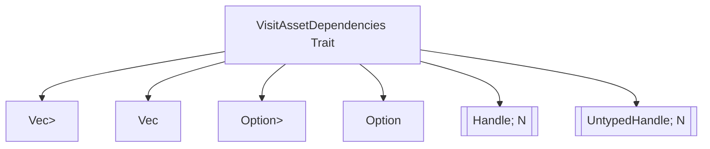

+++
title = "#20805 Implement `VisitAssetDependencies` for Arrays"
date = "2025-09-02T00:00:00"
draft = false
template = "pull_request_page.html"
in_search_index = true

[taxonomies]
list_display = ["show"]

[extra]
current_language = "en"
available_languages = {"en" = { name = "English", url = "/pull_request/bevy/2025-09/pr-20805-en-20250902" }, "zh-cn" = { name = "中文", url = "/pull_request/bevy/2025-09/pr-20805-zh-cn-20250902" }}
labels = ["A-Assets", "D-Straightforward"]
+++

# Implement `VisitAssetDependencies` for Arrays

## Basic Information
- **Title**: Implement `VisitAssetDependencies` for Arrays
- **PR Link**: https://github.com/bevyengine/bevy/pull/20805
- **Author**: Glory2Antares
- **Status**: MERGED
- **Labels**: A-Assets, S-Ready-For-Final-Review, X-Uncontroversial, D-Straightforward
- **Created**: 2025-08-31T00:05:31Z
- **Merged**: 2025-09-02T22:43:46Z
- **Merged By**: alice-i-cecile

## Description Translation
# Objective

- Since `Vec<Handle<A>>` and `Vec<UntypedHandle>` implement `VisitAssetDependencies` users might expect `[Handle<A>; N]` and `[UntypedHandle; N]` to also implement `VisitAssetDependencies`, but this is currently not the case.
- The `#[dependency]` attribute from the `Asset` derive macro should work with an implementation.

## Solution

Implement `VisitAssetDependencies` for `[Handle<A>; N]` and `[UntypedHandle; N]`. The implementations are based on the corresponding ones for Vec. 

## Testing

A test for compatibility with the derive macros was added for `[Handle<A>; N]` and `[UntypedHandle; N]`.

---

## Showcase

Before:
```rust
// Can't use the Asset macro with a custom VisitAssetDependencies impl 
#[derive(TypePath)]
struct MyAsset {
    images: [Handle<Image>; 5],
}

impl VisitAssetDependencies for MyAsset {
    fn visit_dependencies(&self, visit: &mut impl FnMut(UntypedAssetId)) {
        for image in &self.images {
            visit(image.id().untyped());
        }
    }
}

impl Asset for MyAsset {}
```
After:
```rust
#[derive(Asset, TypePath)]
struct MyAsset {
    #[dependency]
    images: [Handle<Image>; 5],
}
```

## The Story of This Pull Request

This PR addresses a consistency gap in Bevy's asset dependency tracking system. The core issue was that while `Vec<Handle<A>>` and `Vec<UntypedHandle>` implemented the `VisitAssetDependencies` trait, fixed-size arrays (`[Handle<A>; N]` and `[UntypedHandle; N]`) did not. This created an inconsistency where developers couldn't use the `#[dependency]` attribute with array fields in their asset structs, forcing them to write manual implementations.

The solution was straightforward: implement `VisitAssetDependencies` for both typed and untyped handle arrays, following the same pattern already established for vectors. The implementation simply iterates through each element in the array and calls the visitor function with the appropriate asset ID.

The changes maintain consistency with existing patterns while extending functionality to cover array types. This is particularly useful for assets that need a fixed number of dependencies, such as texture atlases with predetermined sprite counts or materials with a set number of texture slots.

Testing was added to ensure the derive macro works correctly with array types, verifying that the `#[dependency]` attribute properly handles both `[Handle<A>; N]` and `[UntypedHandle; N]` fields.

## Visual Representation



## Key Files Changed

### `crates/bevy_asset/src/lib.rs` (+21/-0)

This file received two new trait implementations and corresponding test coverage:

1. Added `VisitAssetDependencies` implementation for typed handle arrays:
```rust
impl<A: Asset, const N: usize> VisitAssetDependencies for [Handle<A>; N] {
    fn visit_dependencies(&self, visit: &mut impl FnMut(UntypedAssetId)) {
        for dependency in self {
            visit(dependency.id().untyped());
        }
    }
}
```

2. Added `VisitAssetDependencies` implementation for untyped handle arrays:
```rust
impl<const N: usize> VisitAssetDependencies for [UntypedHandle; N] {
    fn visit_dependencies(&self, visit: &mut impl FnMut(UntypedAssetId)) {
        for dependency in self {
            visit(dependency.id());
        }
    }
}
```

3. Added test coverage with a new struct that includes array dependencies:
```rust
struct TestAssetWithArrays {
    // ... other fields
    #[dependency]
    array_handles: [Handle<TestAsset>; 5],
    #[dependency]
    untyped_array_handles: [UntypedHandle; 5],
}
```

## Further Reading

- [Bevy Assets Documentation](https://bevyengine.org/learn/books/the-assets-system/)
- [Rust Arrays vs Vectors](https://doc.rust-lang.org/book/ch03-02-data-types.html#the-array-type)
- [Bevy Dependency Tracking](https://github.com/bevyengine/bevy/blob/main/crates/bevy_asset/src/dependency.rs)