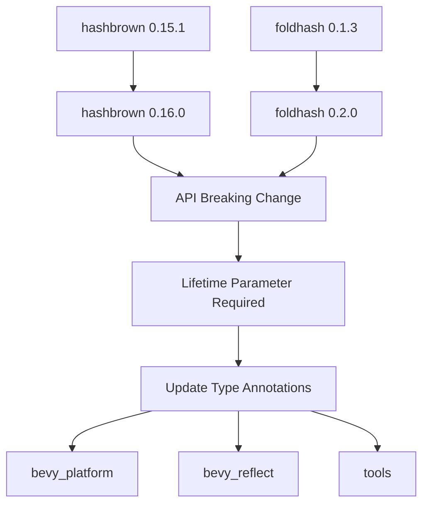

+++
title = "#20807 Bump hashbrown to 0.16.0"
date = "2025-09-02T00:00:00"
draft = false
template = "pull_request_page.html"
in_search_index = true

[taxonomies]
list_display = ["show"]

[extra]
current_language = "en"
available_languages = {"en" = { name = "English", url = "/pull_request/bevy/2025-09/pr-20807-en-20250902" }, "zh-cn" = { name = "中文", url = "/pull_request/bevy/2025-09/pr-20807-zh-cn-20250902" }}
labels = ["C-Dependencies", "A-Cross-Cutting", "D-Straightforward"]
+++

# Bump hashbrown to 0.16.0

## Basic Information
- **Title**: Bump hashbrown to 0.16.0
- **PR Link**: https://github.com/bevyengine/bevy/pull/20807
- **Author**: mirsella
- **Status**: MERGED
- **Labels**: C-Dependencies, A-Cross-Cutting, X-Uncontroversial, D-Straightforward, S-Needs-Review
- **Created**: 2025-08-31T12:41:59Z
- **Merged**: 2025-09-02T09:06:52Z
- **Merged By**: james7132

## Description Translation
# Objective

use the latest hashbrown, and foldhash version (foldhash went from 0.1.5 to 0.2.0)
small performance improvement in foldhash.

# Notes

`FoldHasher` now takes a lifetime, had to specify it.

## The Story of This Pull Request

This PR addresses a routine but important maintenance task: updating two key dependencies in the Bevy engine. The primary goal was to upgrade hashbrown from version 0.15.1 to 0.16.0 and foldhash from 0.1.3 to 0.2.0. These updates provide performance improvements and bug fixes from the upstream crates.

The challenge emerged when the foldhash update introduced a breaking API change. The `FoldHasher` type now requires a lifetime parameter, which necessitated updates throughout the codebase. This is a common pattern in dependency updates where minor version changes can introduce breaking API modifications that must be propagated through the consuming code.

The implementation involved straightforward but widespread changes across multiple Cargo.toml files to update the version numbers. More significantly, several type annotations needed to be updated to include the new lifetime parameter on `FoldHasher` and related types.

In `bevy_platform/src/hash.rs`, the `FixedHasher` implementation had to be updated to specify the `'static` lifetime for its associated `DefaultHasher` type:

```rust
// Before:
type Hasher = DefaultHasher;

// After:
type Hasher = DefaultHasher<'static>;
```

Similarly, in `bevy_reflect/src/impls/foldhash.rs`, all instances of `FoldHasher` in the `impl_type_path!` macros needed to include the lifetime parameter:

```rust
// Before:
impl_type_path!(::foldhash::fast::FoldHasher);

// After:
impl_type_path!(::foldhash::fast::FoldHasher<'a>);
```

The `reflect_hasher()` function in `bevy_reflect/src/utility.rs` also required the same lifetime annotation update to maintain compatibility with the new API.

These changes demonstrate a common pattern in Rust dependency management: when upstream crates introduce lifetime parameters, consumers must propagate these changes through their type annotations. The PR successfully handles this breaking change while maintaining all existing functionality.

The impact of this update is primarily performance-oriented, leveraging the improvements in the newer versions of hashbrown and foldhash. Since these crates are fundamental to Bevy's hashing operations, even small performance gains can have meaningful effects across the engine.

## Visual Representation



## Key Files Changed

1. **`crates/bevy_platform/Cargo.toml`** (+2/-2)
   - Updated hashbrown and foldhash version dependencies
   - Essential for accessing the latest performance improvements

2. **`crates/bevy_reflect/Cargo.toml`** (+2/-2)
   - Mirror update of dependencies to maintain consistency

3. **`crates/bevy_reflect/src/impls/foldhash.rs`** (+2/-2)
   - Added lifetime parameter to FoldHasher type references
   - Required due to breaking API change in foldhash

```rust
// Before:
impl_type_path!(::foldhash::fast::FoldHasher);

// After:
impl_type_path!(::foldhash::fast::FoldHasher<'a>);
```

4. **`crates/bevy_platform/src/hash.rs`** (+1/-1)
   - Updated associated type to include lifetime parameter
   - Maintains compatibility with updated foldhash API

```rust
// Before:
type Hasher = DefaultHasher;

// After:
type Hasher = DefaultHasher<'static>;
```

5. **`crates/bevy_reflect/src/utility.rs`** (+1/-1)
   - Updated return type to include lifetime parameter
   - Ensures type consistency throughout the codebase

```rust
// Before:
pub fn reflect_hasher() -> DefaultHasher

// After:
pub fn reflect_hasher() -> DefaultHasher<'static>
```

6. **`tools/build-templated-pages/Cargo.toml`** (+1/-1)
   - Updated hashbrown dependency for tooling consistency
   - Maintains uniform dependency versions across the project

## Further Reading

- [hashbrown crate documentation](https://docs.rs/hashbrown/0.16.0/hashbrown/)
- [foldhash crate documentation](https://docs.rs/foldhash/0.2.0/foldhash/)
- [Rust lifetimes explained](https://doc.rust-lang.org/book/ch10-03-lifetime-syntax.html)
- [Semantic Versioning in Rust](https://doc.rust-lang.org/cargo/reference/semver.html)