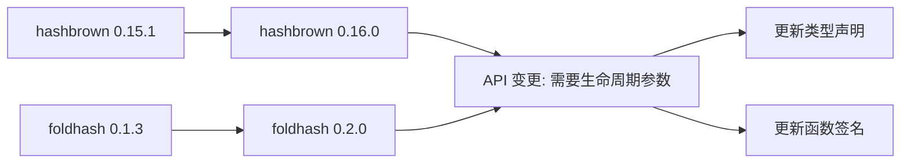

+++
title = "#20807 Bump hashbrown to 0.16.0"
date = "2025-09-02T00:00:00"
draft = false
template = "pull_request_page.html"
in_search_index = false

[extra]
current_language = "zh-cn"
available_languages = {"en" = { name = "English", url = "/pull_request/bevy/2025-09/pr-20807-en-20250902" }, "zh-cn" = { name = "中文", url = "/pull_request/bevy/2025-09/pr-20807-zh-cn-20250902" }}
+++

# Bump hashbrown to 0.16.0

## 基本信息
- **标题**: Bump hashbrown to 0.16.0
- **PR 链接**: https://github.com/bevyengine/bevy/pull/20807
- **作者**: mirsella
- **状态**: 已合并
- **标签**: C-Dependencies, A-Cross-Cutting, X-Uncontroversial, D-Straightforward, S-Needs-Review
- **创建时间**: 2025-08-31T12:41:59Z
- **合并时间**: 2025-09-02T09:06:52Z
- **合并者**: james7132

## 描述翻译
# Objective

使用最新的 hashbrown 和 foldhash 版本（foldhash 从 0.1.5 升级到 0.2.0）
foldhash 的小幅性能改进。

# Notes

`FoldHasher` 现在需要一个生命周期参数，需要明确指定。

## 这个 Pull Request 的故事

这个 PR 的核心是一个直接的依赖项升级任务。开发者 mirsella 注意到 hashbrown 和 foldhash 都有了新版本发布，决定将 Bevy 代码库中的这些依赖项更新到最新版本。

从技术角度来看，这类依赖更新通常很直接，但有时会带来 API 变化需要处理。在这个案例中，hashbrown 从 0.15.1 升级到 0.16.0，而 foldhash 从 0.1.3 升级到 0.2.0。虽然版本号变化不大，但 foldhash 的更新带来了一个重要的 API 变更：`FoldHasher` 类型现在需要一个生命周期参数。

这个变化影响了代码库中的多个地方。首先是在 `bevy_platform/src/hash.rs` 中，`FixedHasher` 的实现需要更新其关联类型 `Hasher` 来包含静态生命周期：

```rust
// 更新前:
type Hasher = DefaultHasher;

// 更新后:
type Hasher = DefaultHasher<'static>;
```

类似的更新也出现在 `bevy_reflect/src/utility.rs` 中的 `reflect_hasher()` 函数：

```rust
// 更新前:
pub fn reflect_hasher() -> DefaultHasher {

// 更新后:
pub fn reflect_hasher() -> DefaultHasher<'static> {
```

此外，在 `bevy_reflect/src/impls/foldhash.rs` 中，类型路径的实现也需要更新以包含生命周期参数：

```rust
// 更新前:
impl_type_path!(::foldhash::fast::FoldHasher);

// 更新后:
impl_type_path!(::foldhash::fast::FoldHasher<'a>);
```

这些变更虽然看起来简单，但体现了依赖管理的一个重要方面：即使看似简单的版本升级也可能需要代码调整。开发者需要仔细检查变更日志并测试兼容性。

从工程角度来看，这个 PR 展示了良好的依赖管理实践。定期更新依赖项可以带来性能改进、安全修复和新功能。在这个特定案例中，PR 描述提到 foldhash 的新版本带来了"小幅性能改进"，这是版本升级的典型好处。

整个变更过程很直接，没有复杂的架构决策或重大重构。标签中的 "X-Uncontroversial" 和 "D-Straightforward" 准确反映了这个 PR 的性质：这是一个无争议的、直接的依赖项更新。

## 可视化表示



## 关键文件变更

**crates/bevy_platform/Cargo.toml** (+2/-2)
- 更新 hashbrown 和 foldhash 的版本号
- hashbrown 从 0.15.1 升级到 0.16.0
- foldhash 从 0.1.3 升级到 0.2.0

```toml
# 更新前:
foldhash = { version = "0.1.3", default-features = false }
hashbrown = { version = "0.15.1", features = [

# 更新后:
foldhash = { version = "0.2.0", default-features = false }
hashbrown = { version = "0.16.0", features = [
```

**crates/bevy_platform/src/hash.rs** (+1/-1)
- 更新 FixedHasher 的关联类型以包含静态生命周期

```rust
// 更新前:
type Hasher = DefaultHasher;

// 更新后:
type Hasher = DefaultHasher<'static>;
```

**crates/bevy_reflect/Cargo.toml** (+2/-2)
- 更新 reflect 模块中的依赖版本，与 platform 模块保持一致

```toml
# 更新前:
foldhash = { version = "0.1.3", default-features = false }
hashbrown = { version = "0.15.1", optional = true, default-features = false }

# 更新后:
foldhash = { version = "0.2.0", default-features = false }
hashbrown = { version = "0.16.0", optional = true, default-features = false }
```

**crates/bevy_reflect/src/impls/foldhash.rs** (+2/-2)
- 更新类型路径实现以包含生命周期参数

```rust
// 更新前:
impl_type_path!(::foldhash::fast::FoldHasher);
impl_type_path!(::foldhash::quality::FoldHasher);

// 更新后:
impl_type_path!(::foldhash::fast::FoldHasher<'a>);
impl_type_path!(::foldhash::quality::FoldHasher<'a>);
```

**crates/bevy_reflect/src/utility.rs** (+1/-1)
- 更新 reflect_hasher 函数返回类型以包含静态生命周期

```rust
// 更新前:
pub fn reflect_hasher() -> DefaultHasher {

// 更新后:
pub fn reflect_hasher() -> DefaultHasher<'static> {
```

**tools/build-templated-pages/Cargo.toml** (+1/-1)
- 更新工具项目中的 hashbrown 版本以保持一致性

```toml
# 更新前:
hashbrown = { version = "0.15", features = ["serde"] }

# 更新后:
hashbrown = { version = "0.16.0", features = ["serde"] }
```

## 延伸阅读

- [hashbrown 0.16.0 发布说明](https://github.com/rust-lang/hashbrown/releases/tag/v0.16.0)
- [foldhash 0.2.0 发布说明](https://github.com/jonhoo/foldhash/releases/tag/v0.2.0)
- [Rust 生命周期指南](https://doc.rust-lang.org/book/ch10-03-lifetime-syntax.html)
- [Cargo 依赖管理最佳实践](https://doc.rust-lang.org/cargo/guide/dependencies.html)

# 完整代码差异
<details>
<summary>展开查看完整差异</summary>

```diff
diff --git a/crates/bevy_platform/Cargo.toml b/crates/bevy_platform/Cargo.toml
index 5f95af866794d..f173c896248b0 100644
--- a/crates/bevy_platform/Cargo.toml
+++ b/crates/bevy_platform/Cargo.toml
@@ -66,8 +66,8 @@ spin = { version = "0.10.0", default-features = false, features = [
   "lazy",
   "barrier",
 ] }
-foldhash = { version = "0.1.3", default-features = false }
-hashbrown = { version = "0.15.1", features = [
+foldhash = { version = "0.2.0", default-features = false }
+hashbrown = { version = "0.16.0", features = [
   "equivalent",
   "raw-entry",
 ], optional = true, default-features = false }
diff --git a/crates/bevy_platform/src/hash.rs b/crates/bevy_platform/src/hash.rs
index 3b1a836ecf83d..66814bc583623 100644
--- a/crates/bevy_platform/src/hash.rs
+++ b/crates/bevy_platform/src/hash.rs
@@ -22,7 +22,7 @@ const FIXED_HASHER: FixedState =
 #[derive(Copy, Clone, Default, Debug)]
 pub struct FixedHasher;
 impl BuildHasher for FixedHasher {
-    type Hasher = DefaultHasher;
+    type Hasher = DefaultHasher<'static>;
 
     #[inline]
     fn build_hasher(&self) -> Self::Hasher {
diff --git a/crates/bevy_reflect/Cargo.toml b/crates/bevy_reflect/Cargo.toml
index d40fbbf962481..e74b3c782fd4d 100644
--- a/crates/bevy_reflect/Cargo.toml
+++ b/crates/bevy_reflect/Cargo.toml
@@ -99,8 +99,8 @@ bevy_platform = { path = "../bevy_platform", version = "0.17.0-dev", default-fea
 ] }
 
 # used by bevy-utils, but it also needs reflect impls
-foldhash = { version = "0.1.3", default-features = false }
-hashbrown = { version = "0.15.1", optional = true, default-features = false }
+foldhash = { version = "0.2.0", default-features = false }
+hashbrown = { version = "0.16.0", optional = true, default-features = false }
 
 # other
 erased-serde = { version = "0.4", default-features = false, features = [
diff --git a/crates/bevy_reflect/src/impls/foldhash.rs b/crates/bevy_reflect/src/impls/foldhash.rs
index 1b0452d433603..e51fd1267064b 100644
--- a/crates/bevy_reflect/src/impls/foldhash.rs
+++ b/crates/bevy_reflect/src/impls/foldhash.rs
@@ -1,8 +1,8 @@
 use crate::impl_type_path;
 
-impl_type_path!(::foldhash::fast::FoldHasher);
+impl_type_path!(::foldhash::fast::FoldHasher<'a>);
 impl_type_path!(::foldhash::fast::FixedState);
 impl_type_path!(::foldhash::fast::RandomState);
-impl_type_path!(::foldhash::quality::FoldHasher);
+impl_type_path!(::foldhash::quality::FoldHasher<'a>);
 impl_type_path!(::foldhash::quality::FixedState);
 impl_type_path!(::foldhash::quality::RandomState);
diff --git a/crates/bevy_reflect/src/utility.rs b/crates/bevy_reflect/src/utility.rs
index cb0bf0f097121..42d8d8be79fb7 100644
--- a/crates/bevy_reflect/src/utility.rs
+++ b/crates/bevy_reflect/src/utility.rs
@@ -303,6 +303,6 @@ impl<T: TypedProperty> Default for GenericTypeCell<T> {
 ///
 /// [`Reflect::reflect_hash`]: crate::Reflect
 #[inline]
-pub fn reflect_hasher() -> DefaultHasher {
+pub fn reflect_hasher() -> DefaultHasher<'static> {
     FixedHasher.build_hasher()
 }
diff --git a/tools/build-templated-pages/Cargo.toml b/tools/build-templated-pages/Cargo.toml
index 6fa774af63fc9..726207e611271 100644
--- a/tools/build-templated-pages/Cargo.toml
+++ b/tools/build-templated-pages/Cargo.toml
@@ -12,7 +12,7 @@ toml_edit = { version = "0.23.2", default-features = false, features = [
 tera = "1.15"
 serde = { version = "1.0", features = ["derive"] }
 bitflags = "2.3"
-hashbrown = { version = "0.15", features = ["serde"] }
+hashbrown = { version = "0.16.0", features = ["serde"] }
 
 [lints]
 workspace = true
```
</details>