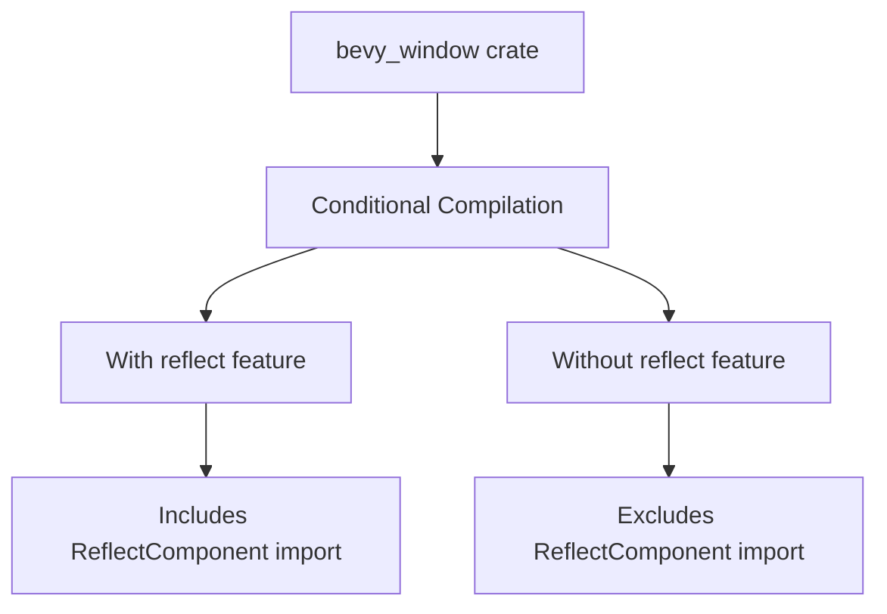

+++
title = "#20811 fix reflect feature gate"
date = "2025-09-01T00:00:00"
draft = false
template = "pull_request_page.html"
in_search_index = true

[taxonomies]
list_display = ["show"]

[extra]
current_language = "en"
available_languages = {"en" = { name = "English", url = "/pull_request/bevy/2025-09/pr-20811-en-20250901" }, "zh-cn" = { name = "中文", url = "/pull_request/bevy/2025-09/pr-20811-zh-cn-20250901" }}
labels = ["C-Bug", "A-Windowing", "A-Reflection", "D-Straightforward"]
+++

# fix reflect feature gate

## Basic Information
- **Title**: fix reflect feature gate
- **PR Link**: https://github.com/bevyengine/bevy/pull/20811
- **Author**: mockersf
- **Status**: MERGED
- **Labels**: C-Bug, A-Windowing, S-Ready-For-Final-Review, A-Reflection, D-Straightforward
- **Created**: 2025-08-31T20:28:32Z
- **Merged**: 2025-09-01T19:57:15Z
- **Merged By**: mockersf

## Description Translation
# Objective

- fix building bevy_window with reflect disabled

## Solution

- I missed one last thing to gate last time I tried to fix it

## Testing

`cargo build -p bevy_window --no-default-features --features bevy_math/libm`

## The Story of This Pull Request

This PR addresses a conditional compilation issue in the Bevy windowing system where reflection-related code wasn't properly gated behind the appropriate feature flag. The problem occurred when building the `bevy_window` crate with the `reflect` feature disabled, causing compilation failures due to missing reflection components.

The core issue was straightforward - an import statement for `ReflectComponent` from `bevy_ecs` wasn't properly guarded by the `bevy_reflect` feature flag. This meant that when reflection was disabled, the compiler would encounter an import that shouldn't exist, causing the build to fail.

The solution implemented was minimal and surgical: adding the appropriate `#[cfg(feature = "bevy_reflect")]` attribute to the problematic import. This approach maintains the existing architecture while ensuring proper conditional compilation behavior. The fix follows the same pattern already established in the codebase for other reflection-related imports in the same file.

This type of issue is common in Rust projects using feature flags extensively, where it's easy to miss conditional compilation guards on individual imports. The testing approach described in the PR - using `cargo build -p bevy_window --no-default-features --features bevy_math/libm` - verifies that the windowing system can now compile without reflection support, confirming the fix works as intended.

The change demonstrates good Rust practices for feature gating: keeping conditional compilation as close to the usage as possible and maintaining consistency with existing patterns in the codebase.

## Visual Representation



## Key Files Changed

### `crates/bevy_window/src/cursor/mod.rs` (+3/-1)

This file handles cursor-related functionality for the windowing system. The change ensures proper conditional compilation when the reflection feature is disabled.

**Key modifications:**
```rust
// Before:
use bevy_ecs::{component::Component, reflect::ReflectComponent};

// After:
use bevy_ecs::component::Component;
#[cfg(feature = "bevy_reflect")]
use bevy_ecs::reflect::ReflectComponent;
```

The change splits the import statement and adds the feature guard to the reflection-specific import, ensuring it's only included when the `bevy_reflect` feature is enabled.

## Further Reading

- [Rust Conditional Compilation](https://doc.rust-lang.org/reference/conditional-compilation.html) - Official Rust documentation on feature flags and conditional compilation
- [Bevy Reflection System](https://bevyengine.org/learn/books/introduction/4-resources/4.4-reflection) - Bevy's reflection system documentation
- [Cargo Features Guide](https://doc.rust-lang.org/cargo/reference/features.html) - How to work with features in Cargo

## Full Code Diff
```diff
diff --git a/crates/bevy_window/src/cursor/mod.rs b/crates/bevy_window/src/cursor/mod.rs
index 3f297a574f108..257950d7f645f 100644
--- a/crates/bevy_window/src/cursor/mod.rs
+++ b/crates/bevy_window/src/cursor/mod.rs
@@ -8,7 +8,9 @@ mod system_cursor;
 pub use custom_cursor::*;
 pub use system_cursor::*;
 
-use bevy_ecs::{component::Component, reflect::ReflectComponent};
+use bevy_ecs::component::Component;
+#[cfg(feature = "bevy_reflect")]
+use bevy_ecs::reflect::ReflectComponent;
 #[cfg(feature = "bevy_reflect")]
 use bevy_reflect::{std_traits::ReflectDefault, Reflect};
```