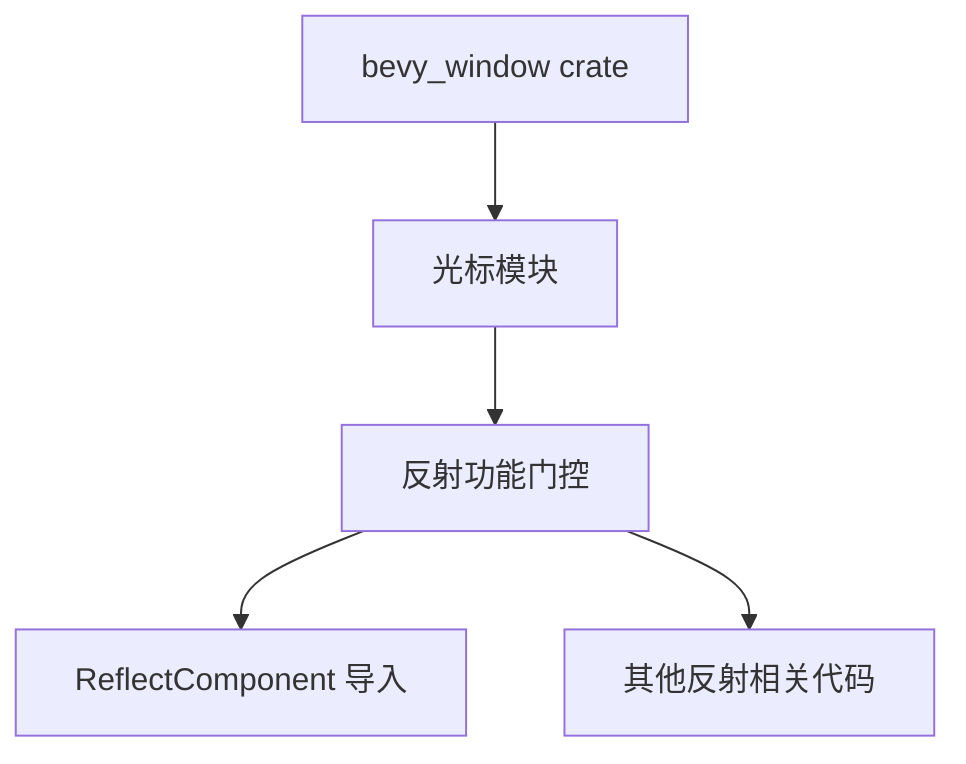

+++
title = "#20811 fix reflect feature gate"
date = "2025-09-01T00:00:00"
draft = false
template = "pull_request_page.html"
in_search_index = false

[extra]
current_language = "zh-cn"
available_languages = {"en" = { name = "English", url = "/pull_request/bevy/2025-09/pr-20811-en-20250901" }, "zh-cn" = { name = "中文", url = "/pull_request/bevy/2025-09/pr-20811-zh-cn-20250901" }}
labels = ["C-Bug", "A-Windowing", "A-Reflection", "D-Straightforward"]
+++

# Title
修复 reflect 功能门控条件

## Basic Information
- **Title**: fix reflect feature gate
- **PR Link**: https://github.com/bevyengine/bevy/pull/20811
- **Author**: mockersf
- **Status**: MERGED
- **Labels**: C-Bug, A-Windowing, S-Ready-For-Final-Review, A-Reflection, D-Straightforward
- **Created**: 2025-08-31T20:28:32Z
- **Merged**: 2025-09-01T19:57:15Z
- **Merged By**: mockersf

## Description Translation
**目标**
- 修复在禁用 reflect 功能时构建 bevy_window 的问题

**解决方案**
- 上次尝试修复时遗漏了一个需要门控的条件

**测试**
`cargo build -p bevy_window --no-default-features --features bevy_math/libm`

## The Story of This Pull Request

这个 PR 解决了一个条件编译的问题。在 Bevy 引擎中，`bevy_reflect` 是一个可选功能，当开发者选择不启用该功能时，代码中所有依赖反射的功能都应该被正确禁用。

问题出现在 `bevy_window` crate 的光标模块中。虽然之前已经对大部分反射相关的代码添加了 `#[cfg(feature = "bevy_reflect")]` 条件编译属性，但有一处 `ReflectComponent` 的导入语句被遗漏了。这导致当 `bevy_reflect` 功能被禁用时，编译器仍然会尝试导入不存在的 `ReflectComponent` 类型，从而造成构建失败。

解决方案很简单但很重要：为这个遗漏的导入语句添加相同的条件编译属性。这样当 `bevy_reflect` 功能被禁用时，整个反射相关的代码路径都会被正确排除在编译之外。

这种问题在条件编译中很常见，特别是当代码库中有多个功能门控相互交织时。即使大部分代码都已正确门控，只要遗漏一个导入语句，就会导致整个构建失败。这也是为什么条件编译需要特别仔细的检查。

从工程角度看，这个修复确保了代码库的模块化和功能可选性。开发者现在可以自由选择是否包含反射功能，而不会遇到意外的构建错误。这种灵活性对于游戏引擎特别重要，因为不同的项目可能有不同的需求和约束。

## Visual Representation



## Key Files Changed

### `crates/bevy_window/src/cursor/mod.rs` (+3/-1)

这个文件是本次 PR 唯一修改的文件。修改内容涉及条件编译属性的添加，确保当 `bevy_reflect` 功能被禁用时，相关的导入语句不会被编译。

**修改前：**
```rust
use bevy_ecs::{component::Component, reflect::ReflectComponent};
#[cfg(feature = "bevy_reflect")]
use bevy_reflect::{std_traits::ReflectDefault, Reflect};
```

**修改后：**
```rust
use bevy_ecs::component::Component;
#[cfg(feature = "bevy_reflect")]
use bevy_ecs::reflect::ReflectComponent;
#[cfg(feature = "bevy_reflect")]
use bevy_reflect::{std_traits::ReflectDefault, Reflect};
```

关键变化是将 `ReflectComponent` 的导入移到了条件编译块内，确保只有当 `bevy_reflect` 功能启用时才会被导入。这个修改解决了在禁用反射功能时的构建失败问题。

## Further Reading

- [Rust 条件编译文档](https://doc.rust-lang.org/reference/conditional-compilation.html)
- [Bevy 反射系统介绍](https://bevy-cheatbook.github.io/programming/reflection.html)
- [Cargo 功能门控指南](https://doc.rust-lang.org/cargo/reference/features.html)

# Full Code Diff
```diff
diff --git a/crates/bevy_window/src/cursor/mod.rs b/crates/bevy_window/src/cursor/mod.rs
index 3f297a574f108..257950d7f645f 100644
--- a/crates/bevy_window/src/cursor/mod.rs
+++ b/crates/bevy_window/src/cursor/mod.rs
@@ -8,7 +8,9 @@ mod system_cursor;
 pub use custom_cursor::*;
 pub use system_cursor::*;
 
-use bevy_ecs::{component::Component, reflect::ReflectComponent};
+use bevy_ecs::component::Component;
+#[cfg(feature = "bevy_reflect")]
+use bevy_ecs::reflect::ReflectComponent;
 #[cfg(feature = "bevy_reflect")]
 use bevy_reflect::{std_traits::ReflectDefault, Reflect};
```