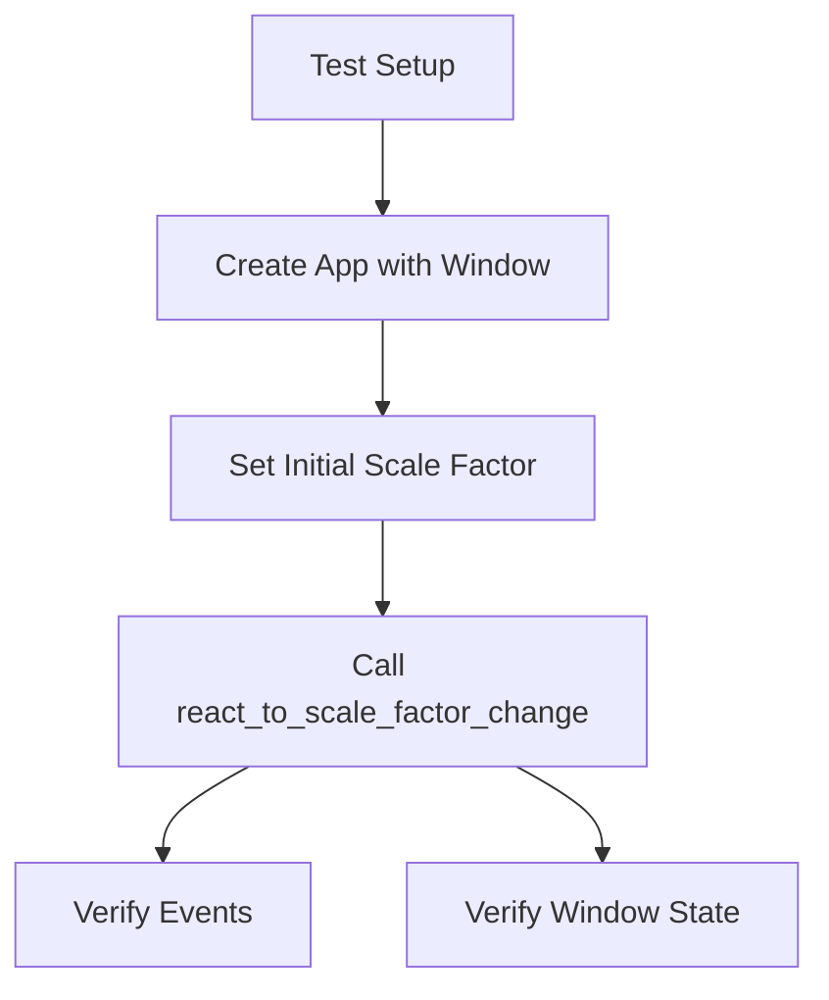

+++
title = "#20814 Add tests for react_to_scale_factor_change"
date = "2025-09-03T00:00:00"
draft = false
template = "pull_request_page.html"
in_search_index = true

[taxonomies]
list_display = ["show"]

[extra]
current_language = "en"
available_languages = {"en" = { name = "English", url = "/pull_request/bevy/2025-09/pr-20814-en-20250903" }, "zh-cn" = { name = "中文", url = "/pull_request/bevy/2025-09/pr-20814-zh-cn-20250903" }}
labels = ["A-Windowing", "C-Testing", "D-Straightforward"]
+++

# Add tests for react_to_scale_factor_change

## Basic Information
- **Title**: Add tests for react_to_scale_factor_change
- **PR Link**: https://github.com/bevyengine/bevy/pull/20814
- **Author**: dloukadakis
- **Status**: MERGED
- **Labels**: A-Windowing, S-Ready-For-Final-Review, C-Testing, D-Straightforward
- **Created**: 2025-09-01T02:20:51Z
- **Merged**: 2025-09-03T17:12:43Z
- **Merged By**: alice-i-cecile

## Description Translation
# Objective

I wrote these tests for fixing #20670 but #20698 got to it first.

## The Story of This Pull Request

This PR addresses a gap in test coverage for the `react_to_scale_factor_change` function in Bevy's windowing system. The author originally developed these tests while working on issue #20670, but another developer (#20698) implemented the fix first. Rather than discarding the valuable test work, this PR adds comprehensive tests to ensure the scale factor change handling behaves correctly.

The core issue being tested relates to how Bevy handles changes to a window's scale factor, which affects how UI elements and other content are rendered at different display densities. Without proper tests, regressions could occur in this critical windowing functionality.

The implementation follows standard Bevy testing patterns. Two main test cases were added:

1. **Scale factor change detection**: Verifies that when the scale factor actually changes, both `WindowBackendScaleFactorChanged` and `WindowScaleFactorChanged` events are properly emitted
2. **No change handling**: Ensures that when the scale factor doesn't change, only the backend scale factor event is emitted (not the general scale factor changed event)

The tests use Bevy's event system to verify the correct events are fired and examine the window component to confirm the scale factor was updated properly. A helper function `setup_react_to_scale_factor_change_test_app` was created to reduce test duplication and provide consistent test setup.

Notably, the PR also includes a minor refactor to the function signatures of both `react_to_resize` and `react_to_scale_factor_change`, changing the window parameter from `&mut Mut<'_, Window>` to `&mut Window`. This simplifies the function signatures since the `Mut` wrapper (which provides change detection) wasn't necessary for these internal functions.

## Visual Representation



## Key Files Changed

### `crates/bevy_winit/src/state.rs` (+109/-2)

This file contains the window state management logic for Bevy's winit integration. The changes include:

1. **Function signature updates**: Simplified parameter types for better testability
2. **Test module addition**: Comprehensive tests for scale factor change handling

**Key changes:**

```rust
// Before:
pub(crate) fn react_to_scale_factor_change(
    window_entity: Entity,
    window: &mut Mut<'_, Window>,
    scale_factor: f64,
    // ...
)

// After:
pub(crate) fn react_to_scale_factor_change(
    window_entity: Entity,
    window: &mut Window,
    scale_factor: f64,
    // ...
)
```

**Test examples:**

```rust
#[test]
fn test_react_to_scale_factor_change_with_changed_scale_factor() {
    // Tests that both events are emitted when scale factor changes
    // ...
}

#[test]
fn test_react_to_scale_factor_change_with_same_scale_factor() {
    // Tests that only backend event is emitted when scale factor doesn't change
    // ...
}
```

## Further Reading

- [Bevy Testing Guide](https://bevy-cheatbook.github.io/programming/testing.html)
- [Winit Window Handling](https://docs.rs/winit/latest/winit/window/struct.Window.html)
- [Bevy Events Documentation](https://bevyengine.org/learn/books/introduction/features/events)