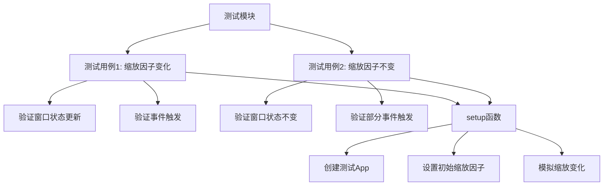

+++
title = "#20814 Add tests for react_to_scale_factor_change"
date = "2025-09-03T00:00:00"
draft = false
template = "pull_request_page.html"
in_search_index = false

[extra]
current_language = "zh-cn"
available_languages = {"en" = { name = "English", url = "/pull_request/bevy/2025-09/pr-20814-en-20250903" }, "zh-cn" = { name = "中文", url = "/pull_request/bevy/2025-09/pr-20814-zh-cn-20250903" }}
+++

# Add tests for react_to_scale_factor_change

## 基本信息
- **标题**: Add tests for react_to_scale_factor_change
- **PR链接**: https://github.com/bevyengine/bevy/pull/20814
- **作者**: dloukadakis
- **状态**: 已合并
- **标签**: A-Windowing, S-Ready-For-Final-Review, C-Testing, D-Straightforward
- **创建时间**: 2025-09-01T02:20:51Z
- **合并时间**: 2025-09-03T17:12:43Z
- **合并人**: alice-i-cecile

## 描述翻译
# Objective

我为修复 #20670 编写了这些测试，但 #20698 先解决了这个问题。

## 这个Pull Request的故事

这个PR的故事始于一个未被充分利用的测试场景。开发者dloukadakis原本计划修复issue #20670，但在实施修复之前，另一个PR #20698 已经解决了该问题。然而，开发者已经为修复准备了相应的测试代码，于是决定将这些测试单独提交，以增强代码库的测试覆盖率。

从技术角度来看，这个PR主要关注`react_to_scale_factor_change`函数的测试验证。这个函数负责处理窗口缩放因子变化时的响应逻辑，是窗口管理系统中的关键组成部分。在Bevy引擎中，缩放因子变化会影响渲染分辨率和UI布局，因此确保其正确处理至关重要。

PR的核心改动是在`crates/bevy_winit/src/state.rs`文件中添加了一个完整的测试模块。测试设计考虑了两种主要场景：缩放因子发生变化和缩放因子保持不变的情况。这种全面的测试策略确保了函数在各种边界条件下的正确行为。

值得注意的是，在实现测试之前，开发者还对函数签名进行了小幅调整，将参数类型从`&mut Mut<'_, Window>`改为`&mut Window`。这个改动简化了函数接口，使其更易于测试和使用，同时保持了原有的功能特性。

测试实现采用了Bevy标准的测试模式，包括：
- 创建测试用的App实例
- 设置初始窗口状态和缩放因子
- 模拟缩放因子变化事件
- 验证窗口状态更新和事件触发

```rust
// 测试缩放因子变化的情况
#[test]
fn test_react_to_scale_factor_change_with_changed_scale_factor() {
    let (mut app, window_entity) = setup_react_to_scale_factor_change_test_app(1.0, 2.0);
    app.update();
    
    // 验证缩放因子已更新
    let window = app.world().get::<Window>(window_entity);
    assert_eq!(window.unwrap().resolution.scale_factor(), 2.0);
    
    // 验证相关事件已触发
    let window_backend_scale_factor_changed_events = app
        .world()
        .resource::<Events<WindowBackendScaleFactorChanged>>();
    assert_eq!(window_backend_scale_factor_changed_events.len(), 1);
}
```

测试代码还验证了事件系统的正确性，确保在缩放因子变化时正确发送`WindowBackendScaleFactorChanged`和`WindowScaleFactorChanged`事件，而在缩放因子未变化时只发送前者。这种细粒度的验证保证了窗口系统与其他组件的正确交互。

从工程实践的角度看，这个PR展示了良好的测试驱动开发理念：即使主要功能修复已被其他开发者实现，预先编写的测试仍然具有价值，可以作为独立的测试补充提交。这种做法提高了代码库的健壮性和可维护性。

## 可视化表示



## 关键文件变更

**文件**: `crates/bevy_winit/src/state.rs` (+109/-2)

这个文件是Bevy窗口系统状态管理的核心文件，主要变更包括：

1. **函数签名简化**: 将`react_to_scale_factor_change`和`react_to_resize`函数的参数类型从`&mut Mut<'_, Window>`改为`&mut Window`，使接口更简洁。

```rust
// 变更前:
pub(crate) fn react_to_scale_factor_change(
    window_entity: Entity,
    window: &mut Mut<'_, Window>,  // 使用Mut包装器
    // ... 其他参数
)

// 变更后:
pub(crate) fn react_to_scale_factor_change(
    window_entity: Entity,
    window: &mut Window,  // 直接使用Window引用
    // ... 其他参数
)
```

2. **添加完整测试模块**: 新增了包含两个测试用例和setup函数的测试模块。

```rust
#[cfg(test)]
mod tests {
    use bevy_app::Update;
    use super::*;

    #[test]
    fn test_react_to_scale_factor_change_with_changed_scale_factor() {
        // 测试缩放因子变化的场景
    }

    #[test]
    fn test_react_to_scale_factor_change_with_same_scale_factor() {
        // 测试缩放因子不变的场景
    }

    fn setup_react_to_scale_factor_change_test_app(
        initial_scale_factor: f32,
        changed_scale_factor: f64,
    ) -> (App, Entity) {
        // 创建测试环境的setup函数
    }
}
```

这些变更确保了窗口缩放因子变化处理逻辑的可靠性，为后续的功能开发和重构提供了测试保障。

## 扩展阅读

建议阅读以下资源来深入了解相关概念：

1. [Bevy官方测试指南](https://bevyengine.org/learn/advanced-topics/testing/) - Bevy引擎的测试最佳实践
2. [窗口系统文档](https://docs.rs/bevy_winit/latest/bevy_winit/) - Bevy窗口管理系统的详细说明
3. [事件系统工作原理](https://bevyengine.org/learn/advanced-topics/events/) - Bevy事件系统的内部机制
4. [Rust测试框架](https://doc.rust-lang.org/book/ch11-00-testing.html) - Rust标准测试框架的官方文档

# 完整代码差异

```diff
diff --git a/crates/bevy_winit/src/state.rs b/crates/bevy_winit/src/state.rs
index a5b949f0e7cab..250480facad0e 100644
--- a/crates/bevy_winit/src/state.rs
+++ b/crates/bevy_winit/src/state.rs
@@ -873,7 +873,7 @@ pub fn winit_runner<T: BufferedEvent>(mut app: App, event_loop: EventLoop<T>) ->
 
 pub(crate) fn react_to_resize(
     window_entity: Entity,
-    window: &mut Mut<'_, Window>,
+    window: &mut Window,
     size: PhysicalSize<u32>,
     window_resized: &mut EventWriter<WindowResized>,
 ) {
@@ -890,7 +890,7 @@ pub(crate) fn react_to_resize(
 
 pub(crate) fn react_to_scale_factor_change(
     window_entity: Entity,
-    window: &mut Mut<'_, Window>,
+    window: &mut Window,
     scale_factor: f64,
     window_backend_scale_factor_changed: &mut EventWriter<WindowBackendScaleFactorChanged>,
     window_scale_factor_changed: &mut EventWriter<WindowScaleFactorChanged>,
@@ -912,3 +912,110 @@ pub(crate) fn react_to_scale_factor_change(
         });
     }
 }
+
+#[cfg(test)]
+mod tests {
+    use bevy_app::Update;
+
+    use super::*;
+
+    #[test]
+    fn test_react_to_scale_factor_change_with_changed_scale_factor() {
+        let (mut app, window_entity) = setup_react_to_scale_factor_change_test_app(1.0, 2.0);
+        app.update();
+
+        let window = app.world().get::<Window>(window_entity);
+        assert_eq!(window.unwrap().resolution.scale_factor(), 2.0);
+
+        let window_backend_scale_factor_changed_events = app
+            .world()
+            .resource::<Events<WindowBackendScaleFactorChanged>>();
+        assert_eq!(window_backend_scale_factor_changed_events.len(), 1);
+
+        let mut window_backend_scale_factor_changed_events_iter =
+            window_backend_scale_factor_changed_events.iter_current_update_events();
+        assert_eq!(
+            window_backend_scale_factor_changed_events_iter.next(),
+            Some(&WindowBackendScaleFactorChanged {
+                window: window_entity,
+                scale_factor: 2.0,
+            })
+        );
+        assert_eq!(window_backend_scale_factor_changed_events_iter.next(), None);
+
+        let window_scale_factor_changed_events =
+            app.world().resource::<Events<WindowScaleFactorChanged>>();
+        assert_eq!(window_scale_factor_changed_events.len(), 1);
+
+        let mut window_scale_factor_changed_events_iter =
+            window_scale_factor_changed_events.iter_current_update_events();
+        assert_eq!(
+            window_scale_factor_changed_events_iter.next(),
+            Some(&WindowScaleFactorChanged {
+                window: window_entity,
+                scale_factor: 2.0,
+            })
+        );
+        assert_eq!(window_scale_factor_changed_events_iter.next(), None);
+    }
+
+    #[test]
+    fn test_react_to_scale_factor_change_with_same_scale_factor() {
+        let (mut app, window_entity) = setup_react_to_scale_factor_change_test_app(1.0, 1.0);
+        app.update();
+
+        let window = app.world().get::<Window>(window_entity);
+        assert_eq!(window.unwrap().resolution.scale_factor(), 1.0);
+
+        let window_backend_scale_factor_changed_events = app
+            .world()
+            .resource::<Events<WindowBackendScaleFactorChanged>>();
+        assert_eq!(window_backend_scale_factor_changed_events.len(), 1);
+
+        let mut window_backend_scale_factor_changed_events_iter =
+            window_backend_scale_factor_changed_events.iter_current_update_events();
+        assert_eq!(
+            window_backend_scale_factor_changed_events_iter.next(),
+            Some(&WindowBackendScaleFactorChanged {
+                window: window_entity,
+                scale_factor: 1.0,
+            })
+        );
+        assert_eq!(window_backend_scale_factor_changed_events_iter.next(), None);
+
+        let window_scale_factor_changed_events =
+            app.world().resource::<Events<WindowScaleFactorChanged>>();
+        assert!(window_scale_factor_changed_events.is_empty());
+    }
+
+    fn setup_react_to_scale_factor_change_test_app(
+        initial_scale_factor: f32,
+        changed_scale_factor: f64,
+    ) -> (App, Entity) {
+        let mut app = App::new();
+        app.add_event::<WindowBackendScaleFactorChanged>();
+        app.add_event::<WindowScaleFactorChanged>();
+        app.add_systems(
+            Update,
+            move |mut window: Single<(Entity, &mut Window)>,
+             mut window_backend_scale_factor_changed: EventWriter<
+                WindowBackendScaleFactorChanged,
+            >,
+             mut window_scale_factor_changed: EventWriter<WindowScaleFactorChanged>| {
+                react_to_scale_factor_change(
+                    window.0,
+                    &mut window.1,
+                    changed_scale_factor,
+                    &mut window_backend_scale_factor_changed,
+                    &mut window_scale_factor_changed,
+                );
+            },
+        );
+
+        let mut window = Window::default();
+        window.resolution.set_scale_factor(initial_scale_factor);
+        let window_entity = app.world_mut().spawn(window).id();
+
+        (app, window_entity)
+    }
+}
```