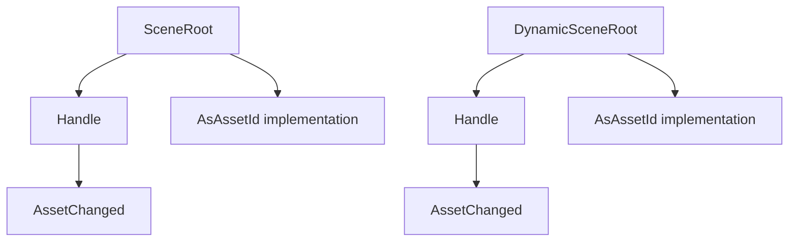

+++
title = "#20822 Impl `AsAssetId` for `SceneRoot` and `DynamicSceneRoot`"
date = "2025-09-14T00:00:00"
draft = false
template = "pull_request_page.html"
in_search_index = true

[taxonomies]
list_display = ["show"]

[extra]
current_language = "en"
available_languages = {"en" = { name = "English", url = "/pull_request/bevy/2025-09/pr-20822-en-20250914" }, "zh-cn" = { name = "中文", url = "/pull_request/bevy/2025-09/pr-20822-zh-cn-20250914" }}
labels = ["C-Feature", "A-Assets", "A-Scenes", "D-Straightforward"]
+++

# Impl `AsAssetId` for `SceneRoot` and `DynamicSceneRoot`

## Basic Information
- **Title**: Impl `AsAssetId` for `SceneRoot` and `DynamicSceneRoot`
- **PR Link**: https://github.com/bevyengine/bevy/pull/20822
- **Author**: Glory2Antares
- **Status**: MERGED
- **Labels**: C-Feature, A-Assets, S-Ready-For-Final-Review, A-Scenes, D-Straightforward
- **Created**: 2025-09-02T00:56:40Z
- **Merged**: 2025-09-14T20:22:02Z
- **Merged By**: alice-i-cecile

## Description Translation
# Objective

- Although `SceneRoot` and `DynamicSceneRoot` are simply wrappers around a `Handle<Scene>`, neither implement `AsAssetId`. Hence they do not work with the `AssetChanged<A>` filter.

## Solution

- Implement `AsAssetId` for `SceneRoot` and `DynamicSceneRoot`. `Asset = Scene` for both.

---

## Showcase
Now users can filter for `SceneRoot` whose underlying `Scene` asset has changed.

```rust
fn query_scene_roots_with_changed_scenes(query: Query<&SceneRoot, AssetChanged<SceneRoot>>) {
    for scene_root in &query {
        println!("some logic");
    }
}
```

## The Story of This Pull Request

The problem was straightforward but impactful: `SceneRoot` and `DynamicSceneRoot` components, despite being simple wrappers around scene handles, lacked `AsAssetId` implementations. This prevented developers from using the `AssetChanged<A>` filter to detect when the underlying scene assets were modified, limiting reactive capabilities in scene management.

The solution approach was direct - implement the `AsAssetId` trait for both components. The implementation required specifying the associated asset type (`Scene` for `SceneRoot` and `DynamicScene` for `DynamicSceneRoot`) and providing an implementation that delegates to the underlying handle's `id()` method.

The implementation adds two trait implementations in `crates/bevy_scene/src/components.rs`:

```rust
impl AsAssetId for SceneRoot {
    type Asset = Scene;

    fn as_asset_id(&self) -> AssetId<Self::Asset> {
        self.id()
    }
}

impl AsAssetId for DynamicSceneRoot {
    type Asset = DynamicScene;

    fn as_asset_id(&self) -> AssetId<Self::Asset> {
        self.id()
    }
}
```

These implementations are technically straightforward but important for consistency. Both `SceneRoot` and `DynamicSceneRoot` already had `Deref` and `DerefMut` implementations that exposed the underlying handle methods, including `id()`. The `AsAssetId` implementations leverage this existing functionality rather than duplicating logic.

The impact is significant for developers working with dynamic scene loading and asset changes. Previously, detecting scene asset changes required manual tracking or workarounds. Now, developers can use the standard `AssetChanged` filter directly with scene root components, enabling cleaner and more maintainable reactive systems.

This change follows the principle of making common patterns easy and consistent across the engine. It aligns scene components with other asset-handling components in Bevy's ECS architecture, maintaining consistency with how other asset types work with the `AssetChanged` system.

## Visual Representation



## Key Files Changed

### `crates/bevy_scene/src/components.rs` (+17/-1)

This file contains the component definitions for scene-related components. The changes add `AsAssetId` trait implementations for both `SceneRoot` and `DynamicSceneRoot` components.

**Before:**
```rust
use bevy_asset::Handle;
// ... other imports

#[derive(Component, Clone, Debug, Default, Deref, DerefMut, Reflect, PartialEq, Eq, From)]
#[reflect(Component, Default, PartialEq)]
#[require(Transform)]
#[require(Visibility)]
pub struct SceneRoot(pub Handle<Scene>);

// ... DynamicSceneRoot definition without AsAssetId
```

**After:**
```rust
use bevy_asset::{AsAssetId, AssetId, Handle};
// ... other imports

#[derive(Component, Clone, Debug, Default, Deref, DerefMut, Reflect, PartialEq, Eq, From)]
#[reflect(Component, Default, PartialEq)]
#[require(Transform)]
#[require(Visibility)]
pub struct SceneRoot(pub Handle<Scene>);

impl AsAssetId for SceneRoot {
    type Asset = Scene;

    fn as_asset_id(&self) -> AssetId<Self::Asset> {
        self.id()
    }
}

// ... DynamicSceneRoot definition with AsAssetId implementation
```

The changes include:
1. Adding the necessary imports for `AsAssetId` and `AssetId`
2. Implementing `AsAssetId` for `SceneRoot` with `Scene` as the associated asset type
3. Implementing `AsAssetId` for `DynamicSceneRoot` with `DynamicScene` as the associated asset type

## Further Reading

- [Bevy Assets Documentation](https://bevyengine.org/learn/books/the-assets-chapter/) - Comprehensive guide to Bevy's asset system
- [Bevy ECS Query Filters](https://bevyengine.org/learn/books/the-ecs-chapter/query-filters/) - Documentation on query filters including `AssetChanged`
- [Rust Traits Documentation](https://doc.rust-lang.org/book/ch10-02-traits.html) - Understanding trait implementations in Rust