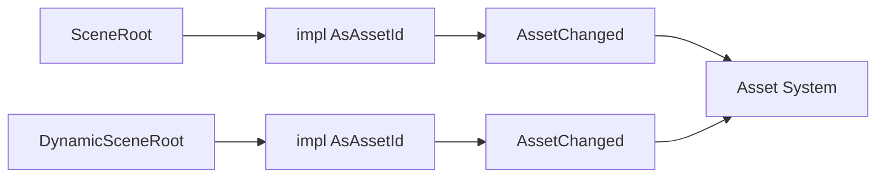

+++
title = "#20822 Impl `AsAssetId` for `SceneRoot` and `DynamicSceneRoot"
date = "2025-09-14T00:00:00"
draft = false
template = "pull_request_page.html"
in_search_index = false

[extra]
current_language = "zh-cn"
available_languages = {"en" = { name = "English", url = "/pull_request/bevy/2025-09/pr-20822-en-20250914" }, "zh-cn" = { name = "中文", url = "/pull_request/bevy/2025-09/pr-20822-zh-cn-20250914" }}
+++

# Impl `AsAssetId` for `SceneRoot` and `DynamicSceneRoot`

## 基本信息
- **标题**: Impl `AsAssetId` for `SceneRoot` and `DynamicSceneRoot`
- **PR 链接**: https://github.com/bevyengine/bevy/pull/20822
- **作者**: Glory2Antares
- **状态**: 已合并
- **标签**: C-Feature, A-Assets, S-Ready-For-Final-Review, A-Scenes, D-Straightforward
- **创建时间**: 2025-09-02T00:56:40Z
- **合并时间**: 2025-09-14T20:22:02Z
- **合并者**: alice-i-cecile

## 描述翻译
# Objective

- Although `SceneRoot` and `DynamicSceneRoot` are simply wrappers around a `Handle<Scene>`, neither implement `AsAssetId`. Hence they do not work with the `AssetChanged<A>` filter.

## Solution

- Implement `AsAssetId` for `SceneRoot` and `DynamicSceneRoot`. `Asset = Scene` for both.

---

## Showcase
Now users can filter for `SceneRoot` whose underlying `Scene` asset has changed.

```rust
fn query_scene_roots_with_changed_scenes(query: Query<&SceneRoot, AssetChanged<SceneRoot>>) {
    for scene_root in &query {
        println!("some logic");
    }
}
```

## 这个PR的故事

这个PR解决了一个在Bevy引擎中使用场景（Scene）资产时的API一致性问题。`SceneRoot`和`DynamicSceneRoot`是两个组件类型，它们本质上是对`Handle<Scene>`和`Handle<DynamicScene>`的简单包装，用于在ECS中标记和管理场景实例。

问题出现在当开发者想要监听这些场景资产的变化时。Bevy提供了`AssetChanged<A>`查询过滤器，可以用来检测特定类型资产的变化。但是，由于`SceneRoot`和`DynamicSceneRoot`没有实现`AsAssetId` trait，无法与这个过滤器配合使用。

这个问题的技术背景是：Bevy的资产系统需要一个统一的方式来识别和追踪资产。`AsAssetId` trait定义了如何从任何类型获取对应的`AssetId`，这是资产系统中用于唯一标识资产的核心类型。没有这个实现，即使`SceneRoot`内部包含了一个`Handle<Scene>`（它本身已经实现了`AsAssetId`），外部系统也无法直接将其作为资产标识符使用。

解决方案很直接：为这两个类型实现`AsAssetId` trait。实现方式利用了它们内部的`Handle`类型已经提供的功能：

```rust
impl AsAssetId for SceneRoot {
    type Asset = Scene;

    fn as_asset_id(&self) -> AssetId<Self::Asset> {
        self.id()
    }
}
```

这里的`self.id()`调用实际上委托给了内部的`Handle<Scene>`，因为`SceneRoot`通过`Deref` trait自动解引用到`Handle<Scene>`。

这个改动虽然很小，但意义重大。它使得开发者能够编写这样的系统：

```rust
fn query_scene_roots_with_changed_scenes(query: Query<&SceneRoot, AssetChanged<SceneRoot>>) {
    for scene_root in &query {
        println!("some logic");
    }
}
```

这个系统现在能够正确过滤出那些底层场景资产发生了变化的所有`SceneRoot`组件。

从架构角度看，这个PR保持了Bevy代码库的一致性原则。它遵循了已有的模式，没有引入新的抽象或复杂性。实现方式也是最简化的，充分利用了现有基础设施（`Handle`的`AsAssetId`实现和`Deref`特性）。

性能方面，这个实现是零成本的——它只是暴露了已有的功能，没有增加任何运行时开销。类型安全也得到了保持，因为每个包装类型都指定了正确的关联资产类型。

这个改动的影响范围很集中，只涉及到场景相关的组件，不会影响代码库的其他部分。它是一个典型的质量改进PR，修复了API的不一致性，提升了开发者体验。

## 可视化表示



## 关键文件变更

**文件**: `crates/bevy_scene/src/components.rs` (+17/-1)

这个文件包含了场景相关组件的定义。主要变更是为`SceneRoot`和`DynamicSceneRoot`添加了`AsAssetId` trait的实现。

变更前：
```rust
use bevy_asset::Handle;
// ... 其他导入

#[derive(Component, Clone, Debug, Default, Deref, DerefMut, Reflect, PartialEq, Eq, From)]
#[reflect(Component, Default, PartialEq)]
#[require(Transform)]
#[require(Visibility)]
pub struct SceneRoot(pub Handle<Scene>);

// ... DynamicSceneRoot 类似定义
```

变更后：
```rust
use bevy_asset::{AsAssetId, AssetId, Handle};
// ... 其他导入

#[derive(Component, Clone, Debug, Default, Deref, DerefMut, Reflect, PartialEq, Eq, From)]
#[reflect(Component, Default, PartialEq)]
#[require(Transform)]
#[require(Visibility)]
pub struct SceneRoot(pub Handle<Scene>);

impl AsAssetId for SceneRoot {
    type Asset = Scene;

    fn as_asset_id(&self) -> AssetId<Self::Asset> {
        self.id()
    }
}

// ... DynamicSceneRoot 的类似实现
```

这些变更直接实现了PR的目标，使得这两个组件类型能够与`AssetChanged`过滤器配合使用。

## 扩展阅读

- [Bevy Assets Documentation](https://docs.rs/bevy_asset/latest/bevy_asset/) - Bevy资产系统的官方文档
- [Bevy ECS Query Filters](https://bevyengine.org/learn/books/introduction/ecs/query-filters/) - 关于查询过滤器的使用指南
- [Rust Deref Trait](https://doc.rust-lang.org/std/ops/trait.Deref.html) - Deref trait的官方文档，解释了自动解引用的机制