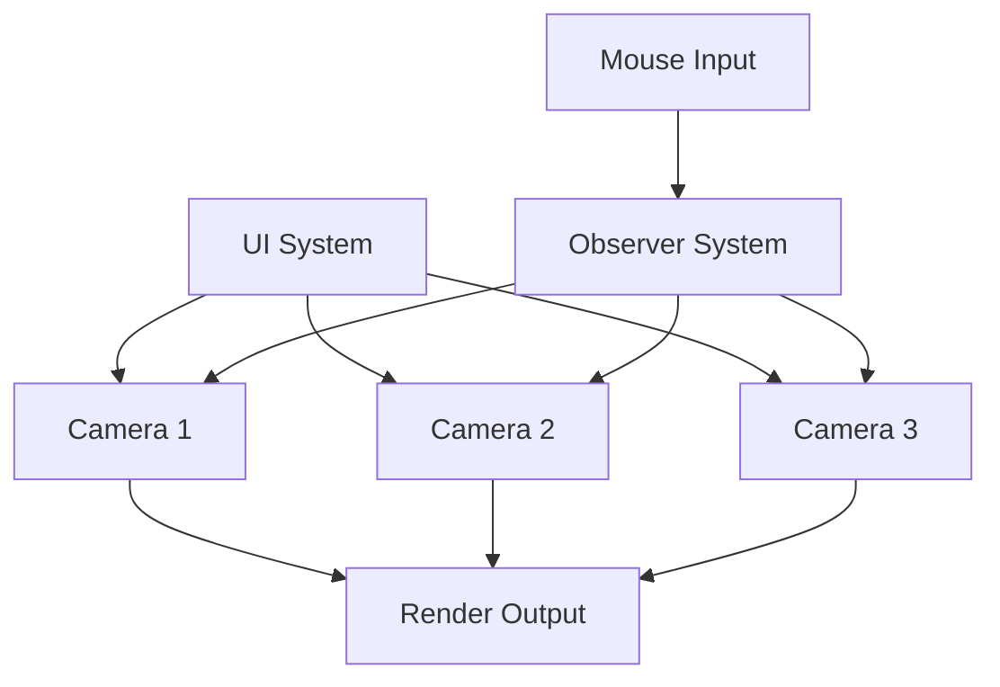

+++
title = "#20827 `ui_target_camera` example"
date = "2025-09-02T00:00:00"
draft = false
template = "pull_request_page.html"
in_search_index = true

[taxonomies]
list_display = ["show"]

[extra]
current_language = "en"
available_languages = {"en" = { name = "English", url = "/pull_request/bevy/2025-09/pr-20827-en-20250902" }, "zh-cn" = { name = "中文", url = "/pull_request/bevy/2025-09/pr-20827-zh-cn-20250902" }}
labels = ["C-Examples", "A-UI", "D-Straightforward"]
+++

# Title
`ui_target_camera` Example

## Basic Information
- **Title**: `ui_target_camera` example
- **PR Link**: https://github.com/bevyengine/bevy/pull/20827
- **Author**: ickshonpe
- **Status**: MERGED
- **Labels**: C-Examples, A-UI, S-Ready-For-Final-Review, D-Straightforward
- **Created**: 2025-09-02T13:03:48Z
- **Merged**: 2025-09-02T21:39:32Z
- **Merged By**: alice-i-cecile

## Description Translation
# Objective

Add a basic example demonstrating `UiTargetCamera` and camera ordering.

## Showcase


## The Story of This Pull Request

This PR addresses a gap in Bevy's example suite by providing a practical demonstration of the `UiTargetCamera` component and camera ordering system. The need arose from developers requiring clear, working examples to understand how to properly use these camera features in UI contexts.

The implementation creates a straightforward but effective example that shows three colored boxes, each rendered by a different camera with distinct clear colors. The example demonstrates camera ordering behavior and allows interactive manipulation of camera order through mouse clicks. Key technical decisions included:

1. Using three cameras with different clear colors (red, green, blue) to visually distinguish their rendering outputs
2. Implementing interactive order manipulation through mouse input handling
3. Adding text labels that update in real-time to show current camera order values
4. Suppressing camera order ambiguity warnings through log filter configuration

The example showcases several important Bevy UI and camera concepts:
- How `UiTargetCamera` associates UI elements with specific camera entities
- Camera ordering and its effect on rendering priority
- Clear color configuration and how it interacts with camera order
- Interactive UI elements with mouse event handling

The implementation uses Bevy's ECS pattern effectively, with systems for setup and observers for handling mouse interactions. The camera ordering is manipulated directly through component mutation, demonstrating real-time updates to the rendering system.

```rust
// Camera configuration with custom clear color and order
Camera {
    clear_color: ClearColorConfig::Custom(color.into()),
    order: i as isize,
    ..Default::default()
}
```

The observer pattern handles mouse interactions, updating both the camera order and the corresponding text label:

```rust
.observe(
    move |on_pressed: On<Pointer<Press>>,
            mut label_query: Query<&mut Text>,
            mut camera_query: Query<&mut Camera>| {
        // Handle mouse clicks and update camera order
    }
)
```

This example provides immediate value to developers working with multiple cameras in UI contexts, demonstrating both the configuration and interactive manipulation of camera ordering in a clear, visual manner.

## Visual Representation



## Key Files Changed

- `examples/ui/ui_target_camera.rs` (+102/-0)
  - New example file demonstrating UiTargetCamera and camera ordering
  - Creates three cameras with different clear colors and orders
  - Implements interactive order manipulation via mouse clicks

- `Cargo.toml` (+11/-0)
  - Added new example to the workspace configuration
  - Configured example metadata including name, description, and category

```rust
// File: examples/ui/ui_target_camera.rs
// Key code snippet showing camera setup
for (i, color) in [RED, GREEN, BLUE].into_iter().enumerate() {
    let camera_entity = commands
        .spawn((
            Camera2d,
            Camera {
                clear_color: ClearColorConfig::Custom(color.into()),
                order: i as isize,
                ..Default::default()
            },
        ))
        .id();
```

- `examples/README.md` (+1/-0)
  - Added documentation entry for the new example
  - Maintains consistency with other example listings

## Further Reading

- [Bevy UI Documentation](https://bevyengine.org/learn/books/introduction/10-ui/)
- [Bevy Camera Systems](https://bevyengine.org/learn/books/introduction/9-camera/)
- [Bevy Observers Pattern](https://bevyengine.org/learn/books/introduction/6-ecs/#observers)