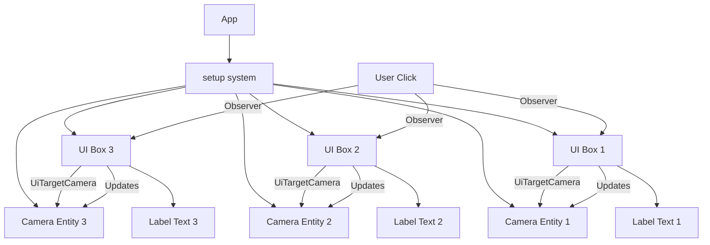

+++
title = "#20827 `ui_target_camera` example"
date = "2025-09-02T00:00:00"
draft = false
template = "pull_request_page.html"
in_search_index = false

[extra]
current_language = "zh-cn"
available_languages = {"en" = { name = "English", url = "/pull_request/bevy/2025-09/pr-20827-en-20250902" }, "zh-cn" = { name = "中文", url = "/pull_request/bevy/2025-09/pr-20827-zh-cn-20250902" }}
labels = ["C-Examples", "A-UI", "D-Straightforward"]
+++

# Title
`ui_target_camera` example

## Basic Information
- **Title**: `ui_target_camera` example
- **PR Link**: https://github.com/bevyengine/bevy/pull/20827
- **Author**: ickshonpe
- **Status**: MERGED
- **Labels**: C-Examples, A-UI, S-Ready-For-Final-Review, D-Straightforward
- **Created**: 2025-09-02T13:03:48Z
- **Merged**: 2025-09-02T21:39:32Z
- **Merged By**: alice-i-cecile

## Description Translation
# 目标

添加一个基础示例，演示 `UiTargetCamera` 和相机排序功能。

## 展示


## The Story of This Pull Request

这个PR解决了一个教学需求：为Bevy引擎的用户提供一个清晰易懂的示例，展示如何使用`UiTargetCamera`组件和相机排序功能。在UI渲染场景中，开发者经常需要控制不同UI元素由不同的相机渲染，并理解相机排序对渲染结果的影响。

开发者采用了直接实用的方法：创建一个交互式示例，通过三个不同颜色的方框来直观展示相机排序的工作原理。每个方框都关联一个独立的相机，用户可以通过点击来调整相机的渲染顺序。

实现的核心在于理解Bevy的相机系统和UI渲染机制。示例中创建了三个相机实体，每个相机配置了不同的`order`值和`clear_color`：

```rust
Camera {
    clear_color: ClearColorConfig::Custom(color.into()),
    order: i as isize,
    ..Default::default()
}
```

每个彩色方框通过`UiTargetCamera`组件明确指定使用哪个相机进行渲染：

```rust
UiTargetCamera(camera_entity)
```

交互功能通过观察者模式实现，当用户点击方框时，相应相机的order值会增减：

```rust
camera.order += match on_pressed.button {
    PointerButton::Primary => 1,
    _ => -1,
};
```

技术上的关键点包括：
- 相机排序决定了渲染顺序和清屏行为
- `UiTargetCamera`允许UI元素选择特定的渲染目标
- 最低order的相机决定视口的清屏颜色

这个示例对Bevy生态系统有重要意义，因为它填补了UI与相机系统交互的教学空白。开发者现在可以通过这个示例快速理解如何控制多个相机的渲染顺序，以及如何将特定UI元素绑定到特定相机。

## Visual Representation



## Key Files Changed

### `examples/ui/ui_target_camera.rs` (+102/-0)
新增的示例文件，演示了如何使用`UiTargetCamera`和相机排序功能。

关键代码：
```rust
// 创建三个相机，每个有不同的order和clear_color
for (i, color) in [RED, GREEN, BLUE].into_iter().enumerate() {
    let camera_entity = commands.spawn((
        Camera2d,
        Camera {
            clear_color: ClearColorConfig::Custom(color.into()),
            order: i as isize,
            ..Default::default()
        },
    )).id();
    
    // 创建UI方框并指定目标相机
    commands.spawn((
        Node {
            // ... 布局属性
        },
        UiTargetCamera(camera_entity), // 关键：指定渲染此UI的相机
        BackgroundColor(Color::BLACK),
        BorderColor::all(YELLOW),
    ));
}
```

### `Cargo.toml` (+11/-0)
添加了新示例的配置信息，使其能够被Cargo识别和运行。

关键更改：
```toml
[[example]]
name = "ui_target_camera"
path = "examples/ui/ui_target_camera.rs"
doc-scrape-examples = true

[package.metadata.example.ui_target_camera]
name = "UI Target Camera"
description = "Demonstrates how to use `UiTargetCamera` and camera ordering."
category = "UI (User Interface)"
wasm = true
```

### `examples/README.md` (+1/-0)
在示例列表中新增了`UI Target Camera`示例的条目。

关键更改：
```markdown
[UI Target Camera](../examples/ui/ui_target_camera.rs) | Demonstrates how to use `UiTargetCamera` and camera ordering.
```

## Further Reading

- [Bevy UI官方文档](https://bevyengine.org/learn/books/introduction/ui)
- [Bevy相机系统](https://bevyengine.org/learn/books/introduction/camera)
- [RenderLayers与多相机渲染](https://bevyengine.org/examples/3d/render-to-texture/)
- [Bevy观察者模式](https://bevyengine.org/learn/books/introduction/ecs#observers)

# Full Code Diff
由于代码差异已在前面详细分析，此处不再重复完整diff内容。