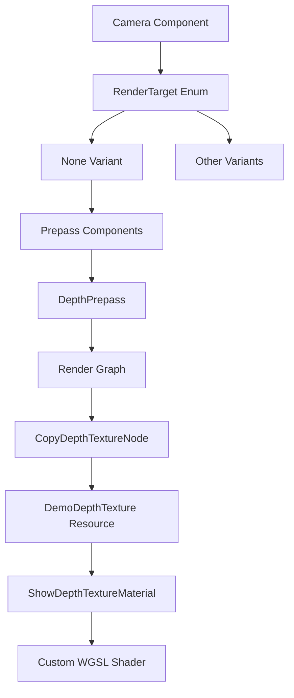

+++
title = "#20830 Don't require cameras to have color render targets."
date = "2025-09-03T00:00:00"
draft = false
template = "pull_request_page.html"
in_search_index = true

[taxonomies]
list_display = ["show"]

[extra]
current_language = "en"
available_languages = {"en" = { name = "English", url = "/pull_request/bevy/2025-09/pr-20830-en-20250903" }, "zh-cn" = { name = "中文", url = "/pull_request/bevy/2025-09/pr-20830-zh-cn-20250903" }}
labels = ["C-Feature", "A-Rendering", "C-Examples", "D-Straightforward"]
+++

# Title
Don't require cameras to have color render targets.

## Basic Information
- **Title**: Don't require cameras to have color render targets.
- **PR Link**: https://github.com/bevyengine/bevy/pull/20830
- **Author**: pcwalton
- **Status**: MERGED
- **Labels**: C-Feature, A-Rendering, C-Examples, S-Ready-For-Final-Review, D-Straightforward
- **Created**: 2025-09-02T15:07:05Z
- **Merged**: 2025-09-03T03:42:52Z
- **Merged By**: alice-i-cecile

## Description Translation
It can occasionally be useful to have cameras that *only* render prepasses such as depth. Other game engines such as Unity support this feature by allowing a depth-only render target to be assigned to a camera. Bevy, however, has no easy mechanism for this. (Creating an `ShadowView` in the render app doesn't work, because various places in rendering assume that shadow views are associated with lights.)

This patch fixes the problem by introducing a new type of `RenderTarget`, `RenderTarget::None`. Cameras with no render target will skip the main opaque and transparent render passes, but any prepasses on such cameras will still occur. Adding a `DepthPrepass` to such a camera enables depth-only cameras, with maximum efficiency as the fragment shader won't exist and no color buffer will be bound.

Note that, when no render target is specified, the physical size of the viewport must be explicitly specified, as Bevy has no other mechanism to determine it.

A new example, `render_depth_to_texture`, has been added, containing a rotating cube and a depth-only camera orbiting it. The depth texture that the camera produces is rendered onto a plane using a custom shader. (NB: In such scenarios, the depth texture must be copied from the camera to a custom image due to (a) the `wgpu` limitation that a depth texture can't be both a render target and bindable as a texture and (b) the fact that Bevy depth textures are managed by Bevy itself and exposed only to the render world. The example uses a custom render node to perform the copy.) The depth-only camera can be moved using the WASD keys.


## The Story of This Pull Request

### The Problem and Context
Bevy's rendering system historically required all cameras to have a color render target, which limited flexibility for specialized rendering scenarios. In game development, there are common use cases where only depth information is needed - for shadow mapping, screen-space ambient occlusion, or other post-processing effects. Other engines like Unity support depth-only cameras, but Bevy lacked this capability.

The existing workaround of creating `ShadowView` components wasn't viable because Bevy's rendering system assumes shadow views are exclusively associated with lights, not general-purpose cameras. This created a gap in Bevy's rendering capabilities that prevented efficient depth-only rendering setups.

### The Solution Approach
The solution introduces a new `RenderTarget::None` variant that allows cameras to operate without color targets. When a camera uses this target type, it skips the main opaque and transparent render passes but still executes any configured prepasses. This approach provides maximum efficiency by eliminating unnecessary fragment shader execution and color buffer operations.

The implementation required careful consideration of several technical constraints:
1. Without a render target, Bevy needs an explicit viewport size specification
2. The rendering pipeline needed modifications to handle cameras without color targets
3. Depth texture access required special handling due to wgpu limitations

### The Implementation
The core change adds a new `RenderTarget::None` variant with explicit size specification:

```rust
// In crates/bevy_camera/src/camera.rs
pub enum RenderTarget {
    // ... existing variants ...
    None {
        size: UVec2,
    },
}
```

This required corresponding changes in the normalized render target representation:

```rust
// In crates/bevy_camera/src/camera.rs
pub enum NormalizedRenderTarget {
    // ... existing variants ...
    None {
        width: u32,
        height: u32,
    },
}
```

The rendering system was updated to handle this new target type throughout the pipeline:

```rust
// In crates/bevy_render/src/camera.rs
impl NormalizedRenderTargetExt for NormalizedRenderTarget {
    fn get_texture_view(&self, /* ... */) -> Option<&TextureView> {
        match self {
            // ... other cases ...
            NormalizedRenderTarget::None { .. } => None,
        }
    }
    
    fn get_render_target_info(&self, /* ... */) -> Result<RenderTargetInfo, /* ... */> {
        match self {
            // ... other cases ...
            NormalizedRenderTarget::None { width, height } => Ok(RenderTargetInfo {
                physical_size: uvec2(*width, *height),
                scale_factor: 1.0,
            }),
        }
    }
}
```

Screenshot functionality was also updated to handle the case where no color target exists:

```rust
// In crates/bevy_render/src/view/window/screenshot.rs
match normalized_render_target {
    // ... other cases ...
    NormalizedRenderTarget::None { .. } => {
        // Nothing to screenshot!
    }
}
```

### Technical Insights
The implementation demonstrates several important Bevy rendering concepts:

1. **Render Target Abstraction**: The changes maintain Bevy's flexible render target system while extending it to support specialized use cases
2. **Prepass Integration**: Depth-only cameras leverage Bevy's existing prepass system, showing how core rendering components can be composed
3. **Render Graph Flexibility**: The example demonstrates custom render node creation for specialized texture operations

The depth texture copying requirement highlights a fundamental wgpu constraint: depth textures cannot simultaneously serve as render targets and sampled textures. This necessitated the custom render node approach in the example.

### The Impact
This PR significantly enhances Bevy's rendering capabilities by:

1. **Performance Optimization**: Depth-only cameras eliminate unnecessary color buffer operations and fragment shader execution
2. **Extended Flexibility**: Developers can now create specialized cameras for shadow mapping, depth pre-passes, and other effects
3. **Engine Parity**: Brings Bevy closer to feature parity with other game engines in the rendering domain
4. **Educational Value**: The comprehensive example demonstrates advanced rendering techniques and custom render graph manipulation

The changes are backward compatible and don't affect existing camera setups, making them safe to integrate without breaking existing projects.

## Visual Representation



## Key Files Changed

### `crates/bevy_camera/src/camera.rs` (+22/-0)
Added new `RenderTarget::None` and `NormalizedRenderTarget::None` variants to support cameras without color targets.

```rust
// Key addition:
pub enum RenderTarget {
    // ... existing variants ...
    None {
        size: UVec2,
    },
}

pub enum NormalizedRenderTarget {
    // ... existing variants ...
    None {
        width: u32,
        height: u32,
    },
}
```

### `crates/bevy_render/src/camera.rs` (+8/-1)
Updated render target handling to support the new None variant throughout the rendering pipeline.

```rust
// Key changes in NormalizedRenderTargetExt implementation:
match self {
    // ... other cases ...
    NormalizedRenderTarget::None { .. } => None, // For texture view
    NormalizedRenderTarget::None { width, height } => Ok(RenderTargetInfo {
        physical_size: uvec2(*width, *height),
        scale_factor: 1.0,
    }), // For target info
}
```

### `examples/shader_advanced/render_depth_to_texture.rs` (+483/-0)
Comprehensive example demonstrating depth-only camera usage, including custom render graph node for depth texture copying.

```rust
// Camera setup with None render target:
Camera {
    target: RenderTarget::None {
        size: UVec2::splat(DEPTH_TEXTURE_SIZE),
    },
    order: -1,
    ..Camera::default()
}
```

### `assets/shaders/show_depth_texture_material.wgsl` (+11/-0)
Custom shader for displaying depth texture content on a material.

```wgsl
@group(#{MATERIAL_BIND_GROUP}) @binding(0) var depth_texture: texture_depth_2d;
@group(#{MATERIAL_BIND_GROUP}) @binding(1) var depth_sampler: sampler_comparison;

@fragment
fn fragment(input: VertexOutput) -> @location(0) vec4<f32> {
    let st = vec2<i32>(input.uv * vec2<f32>(textureDimensions(depth_texture).xy));
    return vec4(vec3(textureLoad(depth_texture, st, 0)), 1.0);
}
```

### `Cargo.toml` (+11/-0)
Added the new example to the project configuration.

```toml
[[example]]
name = "render_depth_to_texture"
path = "examples/shader_advanced/render_depth_to_texture.rs"
doc-scrape-examples = true
```

## Further Reading

1. [Bevy Render Pipeline Documentation](https://bevyengine.org/learn/books/render-pipeline/) - Comprehensive guide to Bevy's rendering system
2. [WGPU Depth Texture Limitations](https://wgpu.rs/explainer/limits.html) - Understanding texture usage constraints in wgpu
3. [Depth Prepass Techniques](https://learnopengl.com/Advanced-Lighting/SSAO) - Common uses of depth information in rendering
4. [Bevy Render Graph Guide](https://bevyengine.org/learn/books/render-pipeline/render-graph/) - How to create custom render nodes in Bevy