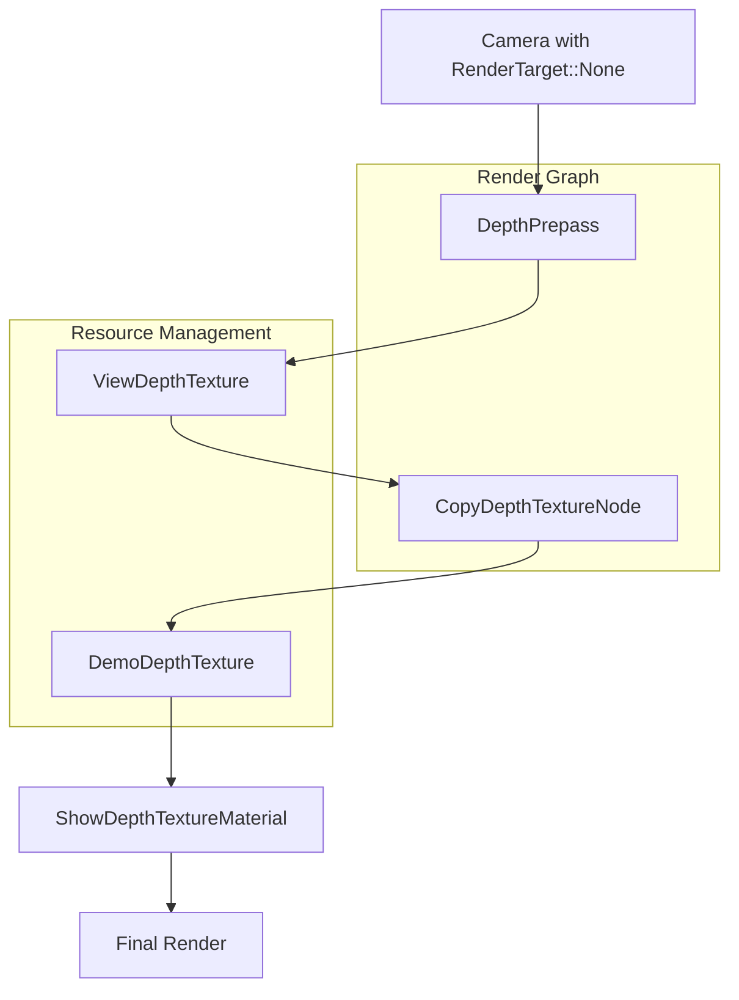

+++
title = "#20830 Don't require cameras to have color render targets."
date = "2025-09-03T00:00:00"
draft = false
template = "pull_request_page.html"
in_search_index = false

[extra]
current_language = "zh-cn"
available_languages = {"en" = { name = "English", url = "/pull_request/bevy/2025-09/pr-20830-en-20250903" }, "zh-cn" = { name = "中文", url = "/pull_request/bevy/2025-09/pr-20830-zh-cn-20250903" }}
labels = ["C-Feature", "A-Rendering", "C-Examples", "D-Straightforward"]
+++

# Title

## Basic Information
- **Title**: Don't require cameras to have color render targets.
- **PR Link**: https://github.com/bevyengine/bevy/pull/20830
- **Author**: pcwalton
- **Status**: MERGED
- **Labels**: C-Feature, A-Rendering, C-Examples, S-Ready-For-Review, D-Straightforward
- **Created**: 2025-09-02T15:07:05Z
- **Merged**: 2025-09-03T03:42:52Z
- **Merged By**: alice-i-cecile

## Description Translation
有时候需要只渲染prepass（如深度）的相机。其他游戏引擎（如Unity）通过允许将仅深度渲染目标分配给相机来支持此功能。然而，Bevy没有简单的机制来实现这一点。（在渲染应用中创建`ShadowView`不起作用，因为渲染中的各个地方都假设阴影视图与灯光相关联。）

此补丁通过引入一种新类型的`RenderTarget`，`RenderTarget::None`，来修复此问题。没有渲染目标的相机将跳过主要的不透明和透明渲染通道，但此类相机上的任何prepass仍将发生。向此类相机添加`DepthPrepass`可实现仅深度相机，具有最高效率，因为片段着色器不存在且不会绑定颜色缓冲区。

注意，当未指定渲染目标时，必须显式指定视口的物理尺寸，因为Bevy没有其他机制来确定它。

添加了一个新示例`render_depth_to_texture`，包含一个旋转立方体和一个围绕其运行的仅深度相机。相机产生的深度纹理使用自定义着色器渲染到平面上。（注意：在此类场景中，深度纹理必须从相机复制到自定义图像，原因是（a）`wgpu`限制深度纹理不能同时作为渲染目标和可绑定纹理，以及（b）Bevy深度纹理由Bevy自身管理且仅暴露给渲染世界。该示例使用自定义渲染节点执行复制。）可以使用WASD键移动仅深度相机。


## The Story of This Pull Request

### 问题背景
在游戏开发中，有时需要只生成深度信息而不渲染颜色输出的相机。这种深度专用相机(depth-only camera)对于实现某些特效（如屏幕空间环境光遮蔽、软阴影、景深效果等）非常有用。Unity等引擎原生支持此功能，但Bevy缺乏直接机制来实现。

开发者尝试过使用`ShadowView`，但由于Bevy渲染系统的假设（阴影视图必须与灯光关联），这种方法不可行。这限制了开发者实现某些高级渲染效果的能力。

### 解决方案
PR作者引入了新的`RenderTarget::None`枚举变体，允许相机不绑定任何颜色渲染目标。当相机配置为此模式时：

1. 跳过主要的不透明和透明渲染通道，提高性能
2. 仍然执行配置的prepass（如深度prepass）
3. 需要显式指定视口尺寸，因为无法从渲染目标推断

```rust
// 新增的RenderTarget变体
RenderTarget::None {
    /// The physical size of the viewport.
    size: UVec2,
}
```

### 技术实现细节
实现涉及多个层面的修改：

**核心相机系统** (`crates/bevy_camera/src/camera.rs`)：
- 添加`RenderTarget::None`变体及其对应的`NormalizedRenderTarget::None`
- 确保新类型能正确转换为标准化格式

```rust
// 修改后的RenderTarget枚举
pub enum RenderTarget {
    // ... 其他变体
    None {
        size: UVec2,
    },
}

// 对应的NormalizedRenderTarget
pub enum NormalizedRenderTarget {
    // ... 其他变体
    None {
        width: u32,
        height: u32,
    },
}
```

**渲染系统适配** (`crates/bevy_render/src/camera.rs`)：
- 扩展`NormalizedRenderTargetExt` trait来处理无渲染目标的情况
- 为无目标相机提供适当的视口信息和格式处理

```rust
impl NormalizedRenderTargetExt for NormalizedRenderTarget {
    fn get_texture_view(&self, /* ... */) -> Option<&TextureView> {
        match self {
            // ... 其他匹配分支
            NormalizedRenderTarget::None { .. } => None,  // 无纹理视图
        }
    }
    
    fn get_render_target_info(&self, /* ... */) -> Result<RenderTargetInfo, /* ... */> {
        match self {
            // ... 其他匹配分支
            NormalizedRenderTarget::None { width, height } => Ok(RenderTargetInfo {
                physical_size: uvec2(*width, *height),  // 使用显式指定的尺寸
                scale_factor: 1.0,
            }),
        }
    }
}
```

**截图系统处理** (`crates/bevy_render/src/view/window/screenshot.rs`)：
- 确保无渲染目标的相机不会参与截图操作
- 添加适当的空操作处理分支

### 示例实现
为了演示此功能，PR添加了完整的`render_depth_to_texture`示例：

1. **深度纹理复制机制**：由于wgpu限制（深度纹理不能同时作为渲染目标和采样器），需要将相机深度缓冲区复制到独立纹理
2. **自定义渲染节点**：添加`CopyDepthTextureNode`在prepass之后、主渲染之前执行复制操作
3. **材质系统集成**：创建`ShowDepthTextureMaterial`来显示深度纹理

```rust
// 深度复制渲染节点
impl ViewNode for CopyDepthTextureNode {
    type ViewQuery = (Read<ExtractedCamera>, Read<ViewDepthTexture>);
    
    fn run<'w>(&self, context: &mut RenderGraphContext, /* ... */) -> Result<(), NodeRunError> {
        // 只处理深度专用相机（order < 0）
        if camera.order >= 0 {
            return Ok(());
        }
        
        // 执行深度纹理复制操作
        render_context.add_command_buffer_generation_task(|render_device| {
            let mut command_encoder = render_device.create_command_encoder(/* ... */);
            command_encoder.copy_texture_to_texture(
                // 从相机深度纹理复制
                TexelCopyTextureInfo {
                    texture: &depth_texture.texture,
                    aspect: TextureAspect::DepthOnly,
                    // ...
                },
                // 复制到可采样纹理
                TexelCopyTextureInfo {
                    texture: &demo_depth_image.texture,
                    aspect: TextureAspect::DepthOnly,
                    // ...
                },
                Extent3d {
                    width: DEPTH_TEXTURE_SIZE,
                    height: DEPTH_TEXTURE_SIZE,
                    depth_or_array_layers: 1,
                },
            );
            command_encoder.finish()
        });
        Ok(())
    }
}
```

### 性能考虑
这种实现提供了最佳性能：
- 无颜色缓冲区分配和绑定
- 无片段着色器执行（只运行顶点着色器和深度测试）
- 只在需要时才进行深度纹理复制

### 技术限制和注意事项
1. **显式尺寸要求**：无渲染目标的相机必须手动指定视口尺寸
2. **深度纹理访问**：需要通过自定义渲染节点复制深度数据才能在其他材质中使用
3. **多采样处理**：示例中禁用了多采样以简化实现，但实际应用中可能需要处理多采样深度纹理

### 影响和价值
这个PR为Bevy渲染系统添加了重要的新功能：
- 启用了深度专用渲染通道
- 为高级渲染效果（如自定义阴影映射、深度预处理等）奠定了基础
- 展示了如何扩展Bevy渲染图和集成自定义渲染节点

这种实现方式保持了Bevy架构的一致性，同时提供了灵活且高效的解决方案。

## Visual Representation



## Key Files Changed

### `crates/bevy_camera/src/camera.rs` (+22/-0)
**修改目的**：扩展RenderTarget枚举以支持无颜色目标的相机

```rust
// 新增的RenderTarget变体
RenderTarget::None {
    /// The physical size of the viewport.
    size: UVec2,
}

// 对应的NormalizedRenderTarget变体
NormalizedRenderTarget::None {
    /// The physical width of the viewport.
    width: u32,
    /// The physical height of the viewport.
    height: u32,
}
```

### `crates/bevy_render/src/camera.rs` (+8/-1)
**修改目的**：为无渲染目标相机提供适当的渲染信息处理

```rust
// 在NormalizedRenderTargetExt实现中添加处理分支
match self {
    // ... 其他分支
    NormalizedRenderTarget::None { width, height } => Ok(RenderTargetInfo {
        physical_size: uvec2(*width, *height),
        scale_factor: 1.0,
    }),
}
```

### `examples/shader_advanced/render_depth_to_texture.rs` (+483/-0)
**修改目的**：创建展示深度专用相机用法的完整示例

```rust
// 深度专用相机配置
Camera {
    target: RenderTarget::None {
        size: UVec2::splat(DEPTH_TEXTURE_SIZE),
    },
    order: -1,  // 确保先渲染
    ..default()
}
DepthPrepass,  // 启用深度prepass
Msaa::Off,     // 禁用多采样简化实现
```

### `assets/shaders/show_depth_texture_material.wgsl` (+11/-0)
**修改目的**：创建显示深度纹理的自定义着色器

```wgsl
#import bevy_pbr::forward_io::VertexOutput

@group(#{MATERIAL_BIND_GROUP}) @binding(0) var depth_texture: texture_depth_2d;
@group(#{MATERIAL_BIND_GROUP}) @binding(1) var depth_sampler: sampler_comparison;

@fragment
fn fragment(input: VertexOutput) -> @location(0) vec4<f32> {
    let st = vec2<i32>(input.uv * vec2<f32>(textureDimensions(depth_texture).xy));
    return vec4(vec3(textureLoad(depth_texture, st, 0)), 1.0);
}
```

### `Cargo.toml` (+11/-0)
**修改目的**：注册新的示例到项目配置中

```toml
[[example]]
name = "render_depth_to_texture"
path = "examples/shader_advanced/render_depth_to_texture.rs"
doc-scrape-examples = true

[package.metadata.example.render_depth_to_texture]
name = "Render Depth to Texture"
description = "Demonstrates how to use depth-only cameras"
category = "Shaders"
wasm = true
```

## Further Reading

1. **Bevy渲染图文档**: https://bevyengine.org/learn/books/render-graph/
2. **WGSL深度纹理规范**: https://gpuweb.github.io/gpuweb/#depth-formats
3. **Prepass技术介绍**: https://learnopengl.com/Advanced-Lighting/SSAO
4. **Bevy材质系统**: https://bevyengine.org/learn/books/introduction/materials
5. **渲染目标最佳实践**: https://github.com/bevyengine/bevy/blob/main/examples/3d/render_to_texture.rs