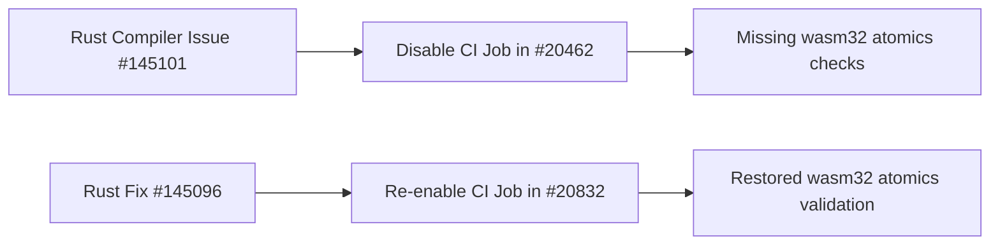

+++
title = "#20832 re-enable wasm32 atomics CI check"
date = "2025-09-02T00:00:00"
draft = false
template = "pull_request_page.html"
in_search_index = true

[taxonomies]
list_display = ["show"]

[extra]
current_language = "en"
available_languages = {"en" = { name = "English", url = "/pull_request/bevy/2025-09/pr-20832-en-20250902" }, "zh-cn" = { name = "中文", url = "/pull_request/bevy/2025-09/pr-20832-zh-cn-20250902" }}
labels = ["A-Build-System"]
+++

# re-enable wasm32 atomics CI check

## Basic Information
- **Title**: re-enable wasm32 atomics CI check
- **PR Link**: https://github.com/bevyengine/bevy/pull/20832
- **Author**: mockersf
- **Status**: MERGED
- **Labels**: A-Build-System, S-Ready-For-Final-Review
- **Created**: 2025-09-02T17:14:56Z
- **Merged**: 2025-09-02T19:51:16Z
- **Merged By**: alice-i-cecile

## Description Translation
# Objective

- It was disabled in #20462 due to https://github.com/rust-lang/rust/issues/145101
- Rust issue was fixed by https://github.com/rust-lang/rust/pull/145096

## Solution

- Re-enable the job in CI

## The Story of This Pull Request

This PR addresses a temporary workaround that was implemented in the Bevy CI pipeline. The `build-wasm-atomics` job had been disabled in PR #20462 due to a compiler issue in Rust (specifically issue #145101) that prevented successful compilation of WebAssembly with atomics support.

The Rust compiler team resolved the underlying issue through PR #145096, which fixed the wasm32 atomics compilation problem. With the root cause addressed, this PR simply re-enables the previously disabled CI job by removing the conditional skip that was forcing the job to always be skipped.

The change is minimal but important for maintaining code quality - the wasm32 atomics build check ensures that Bevy continues to properly support WebAssembly platforms that require atomic operations, which is critical for multi-threaded WebAssembly applications. By re-enabling this check, the Bevy team can once again catch compilation issues related to wasm32 atomics early in the development process.

## Visual Representation



## Key Files Changed

### `.github/workflows/ci.yml`
This file contains the GitHub Actions workflow configuration for Bevy's continuous integration pipeline. The change removes the conditional skip that was temporarily disabling the wasm32 atomics build job.

**Before:**
```yaml
build-wasm-atomics:
  if: ${{ false }} # Disabled temporarily due to https://github.com/rust-lang/rust/issues/145101
  runs-on: ubuntu-latest
  timeout-minutes: 30
  needs: build
```

**After:**
```yaml
build-wasm-atomics:
  runs-on: ubuntu-latest
  timeout-minutes: 30
  needs: build
```

The removal of the `if: ${{ false }}` line restores the job to its normal operating state, allowing it to run on every CI execution and verify that wasm32 atomics compilation continues to work correctly.

## Further Reading

- [Rust Issue #145101](https://github.com/rust-lang/rust/issues/145101) - The original compiler issue that caused wasm32 atomics compilation to fail
- [Rust PR #145096](https://github.com/rust-lang/rust/pull/145096) - The fix that resolved the wasm32 atomics compilation problem
- [WebAssembly Atomics](https://github.com/WebAssembly/threads/blob/master/proposals/threads/Overview.md) - Overview of atomics support in WebAssembly
- [Bevy PR #20462](https://github.com/bevyengine/bevy/pull/20462) - The original PR that temporarily disabled the wasm32 atomics CI job

# Full Code Diff
```diff
diff --git a/.github/workflows/ci.yml b/.github/workflows/ci.yml
index 95b8e75ed0bb1..80775fc5c7fca 100644
--- a/.github/workflows/ci.yml
+++ b/.github/workflows/ci.yml
@@ -265,7 +265,6 @@ jobs:
         run: cargo check --target wasm32-unknown-unknown
 
   build-wasm-atomics:
-    if: ${{ false }} # Disabled temporarily due to https://github.com/rust-lang/rust/issues/145101
     runs-on: ubuntu-latest
     timeout-minutes: 30
     needs: build
```