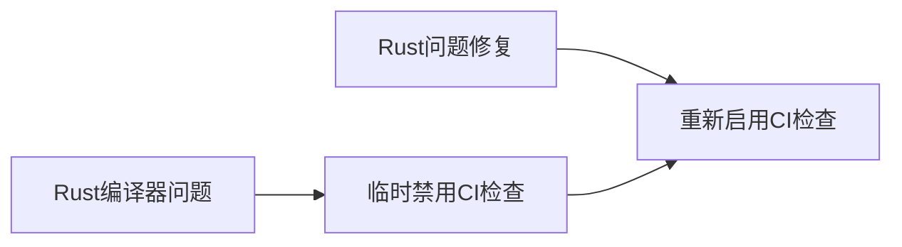

+++
title = "#20832 re-enable wasm32 atomics CI check"
date = "2025-09-02T00:00:00"
draft = false
template = "pull_request_page.html"
in_search_index = false

[extra]
current_language = "zh-cn"
available_languages = {"en" = { name = "English", url = "/pull_request/bevy/2025-09/pr-20832-en-20250902" }, "zh-cn" = { name = "中文", url = "/pull_request/bevy/2025-09/pr-20832-zh-cn-20250902" }}
+++

# re-enable wasm32 atomics CI check

## 基本信息
- **标题**: re-enable wasm32 atomics CI check
- **PR链接**: https://github.com/bevyengine/bevy/pull/20832
- **作者**: mockersf
- **状态**: 已合并
- **标签**: A-Build-System, S-Ready-For-Final-Review
- **创建时间**: 2025-09-02T17:14:56Z
- **合并时间**: 2025-09-02T19:51:16Z
- **合并者**: alice-i-cecile

## 描述翻译
### Objective
- 由于 https://github.com/rust-lang/rust/issues/145101，在 #20462 中被禁用
- Rust 问题已通过 https://github.com/rust-lang/rust/pull/145096 修复

### Solution
- 在 CI 中重新启用该作业

## 本次PR的故事

这个PR的故事很简单但很重要：修复一个临时性的CI配置问题。故事开始于PR #20462，当时由于Rust编译器的一个已知问题（rust-lang/rust#145101），开发团队不得不临时禁用wasm32原子操作的CI检查作业。

wasm32原子操作检查是Bevy引擎CI流水线中的重要组成部分，它确保WebAssembly目标平台的原子操作功能正常工作。原子操作在多线程WebAssembly应用中至关重要，因此这个检查不能长期禁用。

当Rust团队在PR #145096中修复了相关编译器问题后，Bevy团队需要及时恢复这个CI检查。这就是本次PR的目的——移除之前添加的临时禁用条件，让wasm32原子操作检查重新在CI流水线中运行。

从工程实践角度看，这个PR展示了良好的CI/CD维护习惯：
1. 当遇到上游依赖问题时，采用临时禁用而非完全移除的解决方案
2. 在上游问题修复后及时恢复功能检查
3. 保持CI配置的简洁性和可维护性

这种处理方式确保了代码质量保障体系的完整性，同时避免了不必要的技术债积累。

## 可视化表示



## 关键文件变更

### `.github/workflows/ci.yml`
**变更描述**：移除了wasm32原子构建作业的临时禁用条件

**代码变更**：
```yaml
# 变更前：
build-wasm-atomics:
    if: ${{ false }} # Disabled temporarily due to https://github.com/rust-lang/rust/issues/145101
    runs-on: ubuntu-latest
    timeout-minutes: 30
    needs: build

# 变更后：
build-wasm-atomics:
    runs-on: ubuntu-latest
    timeout-minutes: 30
    needs: build
```

**关联性**：这个变更直接实现了PR的目标——重新启用wasm32原子操作的CI检查。移除了条件判断语句`if: ${{ false }}`后，该作业将再次在每次CI运行时执行。

## 延伸阅读

- [Rust WebAssembly原子操作指南](https://rustwasm.github.io/docs/wasm-bindgen/reference/atomics.html)
- [GitHub Actions条件表达式语法](https://docs.github.com/en/actions/learn-github-actions/expressions)
- [Rust问题#145101](https://github.com/rust-lang/rust/issues/145101)
- [Rust修复PR#145096](https://github.com/rust-lang/rust/pull/145096)

## 完整代码差异

```diff
diff --git a/.github/workflows/ci.yml b/.github/workflows/ci.yml
index 95b8e75ed0bb1..80775fc5c7fca 100644
--- a/.github/workflows/ci.yml
+++ b/.github/workflows/ci.yml
@@ -265,7 +265,6 @@ jobs:
         run: cargo check --target wasm32-unknown-unknown
 
   build-wasm-atomics:
-    if: ${{ false }} # Disabled temporarily due to https://github.com/rust-lang/rust/issues/145101
     runs-on: ubuntu-latest
     timeout-minutes: 30
     needs: build
```