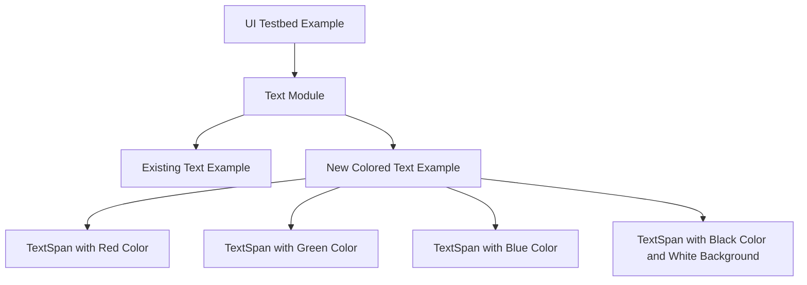

+++
title = "#20836 Add coloured text to the ui testbed example's text module"
date = "2025-09-02T00:00:00"
draft = false
template = "pull_request_page.html"
in_search_index = true

[taxonomies]
list_display = ["show"]

[extra]
current_language = "en"
available_languages = {"en" = { name = "English", url = "/pull_request/bevy/2025-09/pr-20836-en-20250902" }, "zh-cn" = { name = "中文", url = "/pull_request/bevy/2025-09/pr-20836-zh-cn-20250902" }}
labels = ["D-Trivial", "C-Examples", "A-UI", "C-Testing", "A-Text", "M-Deliberate-Rendering-Change"]
+++

# Add coloured text to the ui testbed example's text module

## Basic Information
- **Title**: Add coloured text to the ui testbed example's text module
- **PR Link**: https://github.com/bevyengine/bevy/pull/20836
- **Author**: ickshonpe
- **Status**: MERGED
- **Labels**: D-Trivial, C-Examples, A-UI, S-Ready-For-Final-Review, C-Testing, A-Text, M-Deliberate-Rendering-Change
- **Created**: 2025-09-02T19:21:04Z
- **Merged**: 2025-09-02T20:13:13Z
- **Merged By**: alice-i-cecile

## Description Translation
# Objective

Add some coloured text to the UI testbed example.

## The Story of This Pull Request

The UI testbed example in Bevy serves as a demonstration platform for various UI components and features. While it already included basic text rendering capabilities, it lacked examples showing how to use colored text - a common UI requirement.

The developer identified this gap and implemented a straightforward enhancement to demonstrate text coloring capabilities. The solution involved adding a new text element with multiple colored spans, showing how different colors can be applied to individual text segments within a single UI element.

The implementation follows Bevy's established patterns for UI construction. It uses the existing `TextSpan` component structure with `TextColor` and `TextBackgroundColor` components to control text and background colors. The approach demonstrates proper use of Bevy's color system by importing from `bevy::color::palettes::css::*` to access predefined color constants.

This enhancement provides immediate value to developers exploring Bevy's UI capabilities by showing:
- How to use multiple colors within a single text element
- Proper import patterns for accessing color constants
- The relationship between text spans and color components
- How to combine text colors with background colors

The changes are minimal and focused, adding only what's necessary to demonstrate the feature without disrupting the existing example structure. This follows the principle of keeping examples clear and focused on specific capabilities.

## Visual Representation



## Key Files Changed

- `examples/testbed/ui.rs` (+29/-1)

The main change adds a new colored text demonstration to the UI testbed's text module:

```rust
// File: examples/testbed/ui.rs
// Before:
mod text {
    use bevy::prelude::*;

    pub fn setup(mut commands: Commands, asset_server: Res<AssetServer>) {
        commands.spawn((Camera2d, DespawnOnExitState(super::Scene::Text)));
        commands.spawn((
            Text::new("Hello World!"),
            TextFont {
                font: asset_server.load("fonts/FiraSans-Bold.ttf"),
                ..default()
            },
            DespawnOnExitState(super::Scene::Text),
        ));
    }
}

// After:
mod text {
    use bevy::{color::palettes::css::*, prelude::*};

    pub fn setup(mut commands: Commands, asset_server: Res<AssetServer>) {
        commands.spawn((Camera2d, DespawnOnExitState(super::Scene::Text)));
        commands.spawn((
            Text::new("Hello World!"),
            TextFont {
                font: asset_server.load("fonts/FiraSans-Bold.ttf"),
                ..default()
            },
            DespawnOnExitState(super::Scene::Text),
        ));

        commands.spawn((
            Node {
                left: px(100.),
                top: px(250.),
                ..Default::default()
            },
            Text::new("white "),
            TextFont {
                font: asset_server.load("fonts/FiraSans-Bold.ttf"),
                ..default()
            },
            DespawnOnExitState(super::Scene::Text),
            children![
                (TextSpan::new("red "), TextColor(RED.into()),),
                (TextSpan::new("green "), TextColor(GREEN.into()),),
                (TextSpan::new("blue "), TextColor(BLUE.into()),),
                (
                    TextSpan::new("black"),
                    TextColor(Color::BLACK),
                    TextFont {
                        font: asset_server.load("fonts/FiraSans-Bold.ttf"),
                        ..default()
                    },
                    TextBackgroundColor(Color::WHITE)
                ),
            ],
        ));
    }
}
```

The changes add:
1. Import of CSS color palette constants
2. A new text node with multiple colored spans
3. Demonstration of both text color and background color properties
4. Proper positioning of the new text element

## Further Reading

- [Bevy UI Guide](https://bevy-cheatbook.github.io/ui.html)
- [Bevy Text Documentation](https://docs.rs/bevy/latest/bevy/text/index.html)
- [Bevy Color Systems](https://bevyengine.org/news/bevy-0-13/#colorspaces-and-more-expressive-color-types)