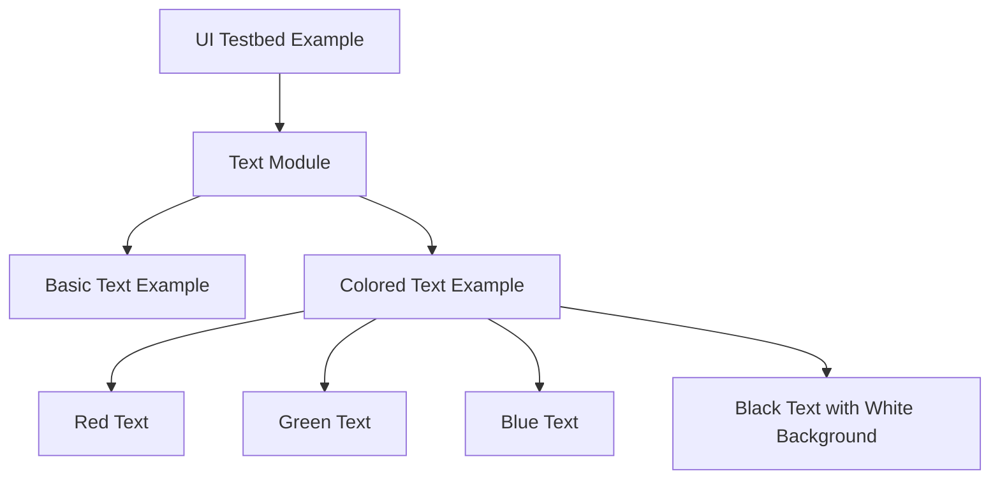

+++
title = "#20836 Add coloured text to the ui testbed example's text module"
date = "2025-09-02T00:00:00"
draft = false
template = "pull_request_page.html"
in_search_index = false

[extra]
current_language = "zh-cn"
available_languages = {"en" = { name = "English", url = "/pull_request/bevy/2025-09/pr-20836-en-20250902" }, "zh-cn" = { name = "中文", url = "/pull_request/bevy/2025-09/pr-20836-zh-cn-20250902" }}
+++

# Add coloured text to the ui testbed example's text module

## 基本信息
- **标题**: Add coloured text to the ui testbed example's text module
- **PR链接**: https://github.com/bevyengine/bevy/pull/20836
- **作者**: ickshonpe
- **状态**: 已合并
- **标签**: D-Trivial, C-Examples, A-UI, S-Ready-For-Final-Review, C-Testing, A-Text, M-Deliberate-Rendering-Change
- **创建时间**: 2025-09-02T19:21:04Z
- **合并时间**: 2025-09-02T20:13:13Z
- **合并者**: alice-i-cecile

## 描述翻译
# Objective

为UI测试床示例添加一些彩色文本。

## 这个Pull Request的故事

这个PR解决了一个简单但重要的需求：增强Bevy引擎UI测试示例的可视化效果。在UI开发和测试过程中，能够直观地展示文本颜色功能对于开发者理解和使用Bevy的文本渲染能力至关重要。

问题的核心在于现有的UI测试示例(`ui.rs`)中的text模块只展示了基本的文本渲染，缺乏对文本颜色功能的演示。这在教学和功能展示方面存在明显不足，开发者无法通过示例快速了解如何使用Bevy的文本着色功能。

开发者采取了直接有效的解决方案：在现有的text模块中添加彩色文本示例。这个方案的优势在于：
1. 最小化代码变更，不影响现有功能
2. 直接展示多种颜色使用方法
3. 保持代码结构清晰易懂

具体实现上，开发者首先添加了颜色调色板的导入：
```rust
use bevy::{color::palettes::css::*, prelude::*};
```

然后创建了一个新的文本实体，展示了多种颜色文本的组合使用：
```rust
commands.spawn((
    Node {
        left: px(100.),
        top: px(250.),
        ..Default::default()
    },
    Text::new("white "),
    TextFont {
        font: asset_server.load("fonts/FiraSans-Bold.ttf"),
        ..default()
    },
    DespawnOnExitState(super::Scene::Text),
    children![
        (TextSpan::new("red "), TextColor(RED.into()),),
        (TextSpan::new("green "), TextColor(GREEN.into()),),
        (TextSpan::new("blue "), TextColor(BLUE.into()),),
        (
            TextSpan::new("black"),
            TextColor(Color::BLACK),
            TextFont {
                font: asset_server.load("fonts/FiraSans-Bold.ttf"),
                ..default()
            },
            TextBackgroundColor(Color::WHITE)
        ),
    ],
));
```

这个实现巧妙地展示了：
- 使用CSS颜色常量(RED, GREEN, BLUE)
- 文本背景色设置(TextBackgroundColor)
- 多颜色文本在同一节点中的组合
- 保持字体一致性的最佳实践

从技术角度看，这个修改体现了Bevy ECS架构的优势：通过组件组合(TextSpan, TextColor, TextBackgroundColor)来实现复杂的文本渲染效果。同时展示了Bevy颜色系统的使用方法，包括预定义颜色常量和自定义颜色值。

这个修改虽然简单，但对Bevy生态系统有重要意义：
1. 提供了文本颜色使用的标准示例
2. 增强了测试床示例的实用性和教学价值
3. 为开发者提供了即用型的代码模板

性能方面，这个改动几乎没有任何负面影响，只是在示例初始化时多创建了几个文本实体，不会影响运行时性能。

## 可视化表示



## 关键文件更改

- `examples/testbed/ui.rs` (+29/-1)

主要修改在text模块中，添加了彩色文本示例：

```rust
// File: examples/testbed/ui.rs
// Before:
mod text {
    use bevy::prelude::*;
    
    pub fn setup(mut commands: Commands, asset_server: Res<AssetServer>) {
        // ... 基本文本示例代码
    }
}

// After:
mod text {
    use bevy::{color::palettes::css::*, prelude::*};
    
    pub fn setup(mut commands: Commands, asset_server: Res<AssetServer>) {
        // ... 基本文本示例代码
        
        // 新增彩色文本示例
        commands.spawn((
            Node {
                left: px(100.),
                top: px(250.),
                ..Default::default()
            },
            Text::new("white "),
            TextFont {
                font: asset_server.load("fonts/FiraSans-Bold.ttf"),
                ..default()
            },
            DespawnOnExitState(super::Scene::Text),
            children![
                (TextSpan::new("red "), TextColor(RED.into()),),
                (TextSpan::new("green "), TextColor(GREEN.into()),),
                (TextSpan::new("blue "), TextColor(BLUE.into()),),
                (
                    TextSpan::new("black"),
                    TextColor(Color::BLACK),
                    TextFont {
                        font: asset_server.load("fonts/FiraSans-Bold.ttf"),
                        ..default()
                    },
                    TextBackgroundColor(Color::WHITE)
                ),
            ],
        ));
    }
}
```

这个修改在现有的text模块中添加了一个新的彩色文本示例，展示了如何使用Bevy的颜色系统和文本组件来创建具有不同颜色的文本内容。

## 进一步阅读

建议阅读以下资源来深入了解相关概念：
1. [Bevy官方文档 - Text](https://bevyengine.org/learn/books/introduction/ui/text)
2. [Bevy颜色系统指南](https://bevyengine.org/learn/books/introduction/colors)
3. [Bevy UI系统概述](https://bevyengine.org/learn/books/introduction/ui)
4. [Bevy ECS架构说明](https://bevyengine.org/learn/books/introduction/ecs)

# 完整代码差异
```diff
diff --git a/examples/testbed/ui.rs b/examples/testbed/ui.rs
index 7cc26d6c90304..1e84d7373d34b 100644
--- a/examples/testbed/ui.rs
+++ b/examples/testbed/ui.rs
@@ -89,7 +89,7 @@ mod image {
 }
 
 mod text {
-    use bevy::prelude::*;
+    use bevy::{color::palettes::css::*, prelude::*};
 
     pub fn setup(mut commands: Commands, asset_server: Res<AssetServer>) {
         commands.spawn((Camera2d, DespawnOnExitState(super::Scene::Text)));
@@ -102,6 +102,34 @@ mod text {
             },
             DespawnOnExitState(super::Scene::Text),
         ));
+
+        commands.spawn((
+            Node {
+                left: px(100.),
+                top: px(250.),
+                ..Default::default()
+            },
+            Text::new("white "),
+            TextFont {
+                font: asset_server.load("fonts/FiraSans-Bold.ttf"),
+                ..default()
+            },
+            DespawnOnExitState(super::Scene::Text),
+            children![
+                (TextSpan::new("red "), TextColor(RED.into()),),
+                (TextSpan::new("green "), TextColor(GREEN.into()),),
+                (TextSpan::new("blue "), TextColor(BLUE.into()),),
+                (
+                    TextSpan::new("black"),
+                    TextColor(Color::BLACK),
+                    TextFont {
+                        font: asset_server.load("fonts/FiraSans-Bold.ttf"),
+                        ..default()
+                    },
+                    TextBackgroundColor(Color::WHITE)
+                ),
+            ],
+        ));
     }
 }
 
```