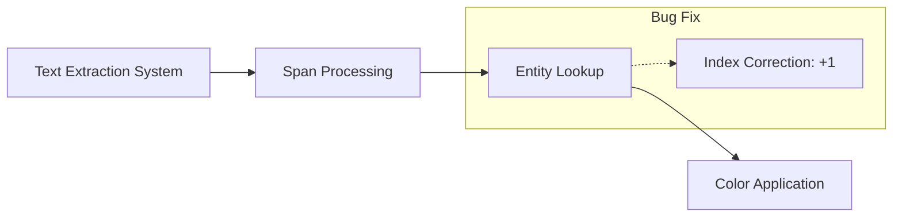

+++
title = "#20837 Fix text span colors"
date = "2025-09-02T00:00:00"
draft = false
template = "pull_request_page.html"
in_search_index = true

[taxonomies]
list_display = ["show"]

[extra]
current_language = "en"
available_languages = {"en" = { name = "English", url = "/pull_request/bevy/2025-09/pr-20837-en-20250902" }, "zh-cn" = { name = "中文", url = "/pull_request/bevy/2025-09/pr-20837-zh-cn-20250902" }}
labels = ["C-Bug", "D-Trivial", "A-UI", "A-Text", "M-Deliberate-Rendering-Change"]
+++

# Fix text span colors

## Basic Information
- **Title**: Fix text span colors
- **PR Link**: https://github.com/bevyengine/bevy/pull/20837
- **Author**: ickshonpe
- **Status**: MERGED
- **Labels**: C-Bug, D-Trivial, A-UI, S-Ready-For-Final-Review, A-Text, M-Deliberate-Rendering-Change
- **Created**: 2025-09-02T19:33:12Z
- **Merged**: 2025-09-02T21:18:24Z
- **Merged By**: mockersf

## Description Translation
# Objective

Fixes #20834

## Solution

The previous span index was being used to look up the `TextSpan` entity with the color of the next span. Just increment it by one.

## The Story of This Pull Request

This PR addresses a specific indexing bug in Bevy's UI text rendering system. The issue was reported in #20834, where text span colors were incorrectly applied due to an off-by-one error in entity lookup.

The core problem occurred in the `extract_text_sections` function, which processes text spans for rendering. When iterating through text spans, the system was using the current span index to look up the corresponding entity in the computed block's entity list. However, this approach caused each span to incorrectly use the color of the next span in the sequence.

The fix is straightforward but precise: incrementing the span index by one when performing the entity lookup. This ensures that each text span retrieves its own color value rather than the color of the subsequent span. The change is minimal but critical for correct text rendering behavior.

The implementation demonstrates a common pattern in systems programming where careful attention to indexing is required when working with entity-component systems. The fix maintains the existing architecture while correcting the logical error in the indexing operation.

This change affects text rendering where multiple spans with different colors are used within a single text element. With the fix applied, each span will now correctly display its intended color rather than inheriting the color of the next span in the sequence.

## Visual Representation



## Key Files Changed

### `crates/bevy_ui_render/src/lib.rs`
This file contains the text extraction system for UI rendering. The change fixes an off-by-one error in span color lookup.

**Before:**
```rust
.get(
    computed_block
        .entities()
        .get(*span_index)
        .map(|t| t.entity)
        .unwrap_or(Entity::PLACEHOLDER),
)
```

**After:**
```rust
.get(
    computed_block
        .entities()
        .get(*span_index + 1)
        .map(|t| t.entity)
        .unwrap_or(Entity::PLACEHOLDER),
)
```

The modification ensures that each text span correctly references its own entity when retrieving color information, rather than accidentally using the next span's entity.

## Further Reading

- [Bevy UI System Documentation](https://bevyengine.org/learn/books/introduction/)
- [Entity Component System Pattern](https://en.wikipedia.org/wiki/Entity_component_system)
- [Text Rendering in Game Engines](https://learnopengl.com/In-Practice/Text-Rendering)

# Full Code Diff
```diff
diff --git a/crates/bevy_ui_render/src/lib.rs b/crates/bevy_ui_render/src/lib.rs
index 99c18ee31ac35..acaa6aacc15d0 100644
--- a/crates/bevy_ui_render/src/lib.rs
+++ b/crates/bevy_ui_render/src/lib.rs
@@ -973,7 +973,7 @@ pub fn extract_text_sections(
                     .get(
                         computed_block
                             .entities()
-                            .get(*span_index)
+                            .get(*span_index + 1)
                             .map(|t| t.entity)
                             .unwrap_or(Entity::PLACEHOLDER),
                     )
```