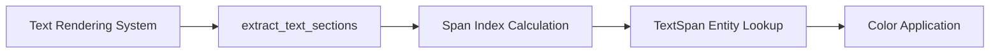

+++
title = "#20837 Fix text span colors"
date = "2025-09-02T00:00:00"
draft = false
template = "pull_request_page.html"
in_search_index = false

[extra]
current_language = "zh-cn"
available_languages = {"en" = { name = "English", url = "/pull_request/bevy/2025-09/pr-20837-en-20250902" }, "zh-cn" = { name = "中文", url = "/pull_request/bevy/2025-09/pr-20837-zh-cn-20250902" }}
+++

# Fix text span colors

## 基本信息
- **标题**: Fix text span colors
- **PR链接**: https://github.com/bevyengine/bevy/pull/20837
- **作者**: ickshonpe
- **状态**: 已合并
- **标签**: C-Bug, D-Trivial, A-UI, S-Ready-For-Final-Review, A-Text, M-Deliberate-Rendering-Change
- **创建时间**: 2025-09-02T19:33:12Z
- **合并时间**: 2025-09-02T21:18:24Z
- **合并人**: mockersf

## 描述翻译
### Objective
修复 #20834

### Solution
之前的 span 索引被用来查找下一个 span 颜色的 `TextSpan` 实体。只需将其加一。

## 本次 Pull Request 的故事

这个 PR 解决了一个 UI 文本渲染中的颜色显示错误问题。在 Bevy 的 UI 系统中，文本可以使用不同的样式 span 来设置不同的颜色、字体等属性。然而，在 #20834 报告中，开发者发现文本 span 的颜色显示不正确。

问题的根本原因在于 `extract_text_sections` 函数中的索引计算错误。该函数负责从计算后的文本块中提取各个 span 的实体信息，但在查找颜色时使用了错误的索引值。

具体来说，代码原本使用 `*span_index` 来获取对应的实体：
```rust
computed_block
    .entities()
    .get(*span_index)  // 这里使用了当前索引
```

但实际上应该使用下一个索引 `*span_index + 1`，因为文本 span 的实体存储方式决定了颜色信息存储在下一个索引位置。这个 off-by-one 错误导致每个 span 都错误地使用了下一个 span 的颜色值。

这个修复虽然简单，但体现了 UI 文本渲染系统中索引管理的重要性。正确的索引计算确保了文本样式（特别是颜色）能够正确映射到对应的文本段。

## 视觉表示



## 关键文件更改

### `crates/bevy_ui_render/src/lib.rs` (+1/-1)

这个文件包含了 UI 渲染的核心逻辑。修改发生在 `extract_text_sections` 函数中，该函数负责处理文本段的提取和样式应用。

**修改前：**
```rust
.get(
    computed_block
        .entities()
        .get(*span_index)  // 错误的索引
        .map(|t| t.entity)
        .unwrap_or(Entity::PLACEHOLDER),
)
```

**修改后：**
```rust
.get(
    computed_block
        .entities()
        .get(*span_index + 1)  // 修正的索引
        .map(|t| t.entity)
        .unwrap_or(Entity::PLACEHOLDER),
)
```

这个单行修改确保了正确的文本 span 实体查找，从而解决了颜色显示错误的问题。

## 扩展阅读

- [Bevy UI 系统文档](https://bevyengine.org/learn/books/introduction/ui)
- [文本渲染原理](https://learnopengl.com/In-Practice/Text-Rendering)
- [实体组件系统模式](https://en.wikipedia.org/wiki/Entity_component_system)