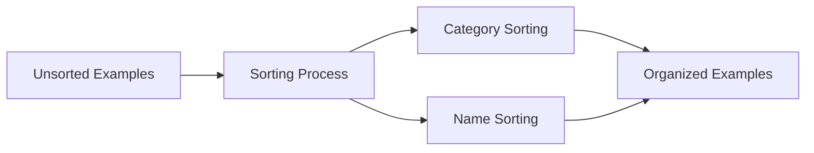

+++
title = "#20839 sort examples categories on the website"
date = "2025-09-03T00:00:00"
draft = false
template = "pull_request_page.html"
in_search_index = true

[taxonomies]
list_display = ["show"]

[extra]
current_language = "en"
available_languages = {"en" = { name = "English", url = "/pull_request/bevy/2025-09/pr-20839-en-20250903" }, "zh-cn" = { name = "中文", url = "/pull_request/bevy/2025-09/pr-20839-zh-cn-20250903" }}
labels = ["D-Trivial", "C-Examples"]
+++

# Title: sort examples categories on the website

## Basic Information
- **Title**: sort examples categories on the website
- **PR Link**: https://github.com/bevyengine/bevy/pull/20839
- **Author**: mockersf
- **Status**: MERGED
- **Labels**: D-Trivial, C-Examples, S-Ready-For-Final-Review
- **Created**: 2025-09-02T23:38:51Z
- **Merged**: 2025-09-03T00:26:07Z
- **Merged By**: alice-i-cecile

## Description Translation
# Objective

- We should stop this madness


## Solution

- Sort

## The Story of This Pull Request

This PR addresses a straightforward but important usability issue in Bevy's example showcase. The problem was that examples were being displayed in an unpredictable order on the website, creating a poor user experience for developers trying to navigate and find specific examples.

The issue originated from how the example showcase tool processed and displayed examples. Without explicit sorting, the examples appeared in whatever order they were read from the filesystem or processed by the tool, which typically depends on filesystem implementation details and is not guaranteed to be consistent or logical.

The solution was simple but effective: sort the examples before generating the showcase. The implementation adds just two lines of code that:
1. Make the examples vector mutable (`mut examples_to_run`)
2. Apply a sort operation using a composite key of category and name

This approach ensures that examples are grouped by category and alphabetically ordered within each category, providing a consistent and predictable browsing experience. The sorting uses a straightforward string-based comparison by formatting the category and name into a single string for sorting, which works effectively for this use case.

The changes are minimal and focused, affecting only the display order without modifying any example functionality or underlying data structures. This is a classic example of addressing technical debt in tooling - a small quality-of-life improvement that significantly enhances the developer experience.

## Visual Representation



## Key Files Changed

**File**: `tools/example-showcase/src/main.rs`

**Changes**: Added sorting functionality to the example processing pipeline

**Code Snippet**:
```rust
// Before:
let examples_to_run = parse_examples();

// After:
let mut examples_to_run = parse_examples();
examples_to_run.sort_by_key(|e| format!("{}-{}", e.category, e.name));
```

The change is minimal but effective:
1. The `examples_to_run` variable is now declared as mutable to allow sorting
2. The `sort_by_key` method organizes examples using a composite key of category followed by name
3. This ensures consistent alphabetical ordering within categories

## Further Reading

- Rust std::vec::Vec.sort_by_key: https://doc.rust-lang.org/std/vec/struct.Vec.html#method.sort_by_key
- Bevy Examples Guide: https://github.com/bevyengine/bevy/tree/main/examples#examples
- String formatting in Rust: https://doc.rust-lang.org/std/fmt/