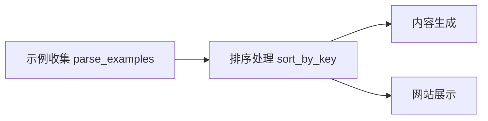

+++
title = "#20839 sort examples categories on the website"
date = "2025-09-03T00:00:00"
draft = false
template = "pull_request_page.html"
in_search_index = false

[extra]
current_language = "zh-cn"
available_languages = {"en" = { name = "English", url = "/pull_request/bevy/2025-09/pr-20839-en-20250903" }, "zh-cn" = { name = "中文", url = "/pull_request/bevy/2025-09/pr-20839-zh-cn-20250903" }}
labels = ["D-Trivial", "C-Examples"]
+++

# Title
sort examples categories on the website

## Basic Information
- **Title**: sort examples categories on the website
- **PR Link**: https://github.com/bevyengine/bevy/pull/20839
- **Author**: mockersf
- **Status**: MERGED
- **Labels**: D-Trivial, C-Examples, S-Ready-For-Final-Review
- **Created**: 2025-09-02T23:38:51Z
- **Merged**: 2025-09-03T00:26:07Z
- **Merged By**: alice-i-cecile

## Description Translation
# Objective

- 我们应该停止这种混乱的情况


## Solution

- 排序

## The Story of This Pull Request

这个PR解决了一个看似简单但影响用户体验的问题：示例分类的显示顺序混乱。在Bevy引擎的官方网站上，示例（examples）按照类别进行组织展示，但由于缺乏明确的排序逻辑，不同类别的显示顺序是不确定的，这给用户浏览和查找特定示例带来了不便。

问题的核心在于`tools/example-showcase`工具中解析示例后没有进行排序处理。当工具收集完所有示例信息后，直接使用收集时的顺序进行展示，而这个顺序取决于文件系统的读取顺序，在不同环境或不同时间可能产生不同的结果。

开发者采取的解决方案直接而有效：在示例收集完成后立即进行排序。具体实现是在`parse_examples()`函数返回结果后，对示例向量进行可变排序。排序键使用了`format!("{}-{}", e.category, e.name)`，这意味着示例首先按类别（category）字母顺序排序，然后在同一类别内按示例名称（name）字母顺序排序。

这种排序策略的选择很有意义：
1. 按类别排序让用户能够更容易地找到相关功能的示例
2. 在同一类别内按名称排序提供了可预测的浏览顺序
3. 使用组合键确保了排序的稳定性和一致性

从技术实现角度看，这个修改虽然只有两行代码，但体现了良好的工程实践：
- 使用`sort_by_key`而不是`sort`或`sort_by`，因为键生成逻辑简单明确
- 保持代码简洁，没有引入不必要的复杂性
- 修改位置恰当，在数据处理阶段就解决展示问题

这个修改的影响是立即可见的：网站上的示例分类现在会以一致的字母顺序显示，提高了用户体验和可发现性。对于开发者来说，这也使得示例的维护更加容易，因为添加新示例不会意外改变现有示例的显示顺序。

## Visual Representation



## Key Files Changed

### `tools/example-showcase/src/main.rs` (+2/-1)

这个文件是示例展示工具的主要入口，负责收集、处理和生成示例展示内容。

**修改内容：**
```rust
// 修改前：
let examples_to_run = parse_examples();

// 修改后：
let mut examples_to_run = parse_examples();
examples_to_run.sort_by_key(|e| format!("{}-{}", e.category, e.name));
```

**修改说明：**
1. 将`examples_to_run`从不可变绑定改为可变绑定（`let mut`）
2. 添加了对示例列表的排序操作，使用类别和名称的组合作为排序键
3. 这个修改确保了后续处理阶段使用的示例列表是有序的

## Further Reading

- [Rust Vec::sort_by_key 文档](https://doc.rust-lang.org/std/vec/struct.Vec.html#method.sort_by_key)
- [Bevy 示例展示系统](https://github.com/bevyengine/bevy/tree/main/tools/example-showcase)
- [字符串排序算法](https://en.wikipedia.org/wiki/Lexicographic_order)

# Full Code Diff
```
diff --git a/tools/example-showcase/src/main.rs b/tools/example-showcase/src/main.rs
index 9d41939b98b1a..a437533674fe1 100644
--- a/tools/example-showcase/src/main.rs
+++ b/tools/example-showcase/src/main.rs
@@ -486,7 +486,8 @@ fn main() {
             content_folder,
             api,
         } => {
-            let examples_to_run = parse_examples();
+            let mut examples_to_run = parse_examples();
+            examples_to_run.sort_by_key(|e| format!("{}-{}", e.category, e.name));
 
             let root_path = Path::new(&content_folder);
```