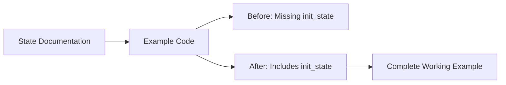

+++
title = "#20840 Add init_state to State example docs"
date = "2025-09-03T00:00:00"
draft = false
template = "pull_request_page.html"
in_search_index = true

[taxonomies]
list_display = ["show"]

[extra]
current_language = "en"
available_languages = {"en" = { name = "English", url = "/pull_request/bevy/2025-09/pr-20840-en-20250903" }, "zh-cn" = { name = "中文", url = "/pull_request/bevy/2025-09/pr-20840-zh-cn-20250903" }}
labels = ["C-Docs", "D-Trivial", "A-States"]
+++

# Add init_state to State example docs

## Basic Information
- **Title**: Add init_state to State example docs
- **PR Link**: https://github.com/bevyengine/bevy/pull/20840
- **Author**: lkolbly
- **Status**: MERGED
- **Labels**: C-Docs, D-Trivial, S-Ready-For-Final-Review, A-States
- **Created**: 2025-09-03T00:30:58Z
- **Merged**: 2025-09-03T04:02:32Z
- **Merged By**: alice-i-cecile

## Description Translation
The original PR description in English:

# Objective

Shows the call to init_state in the State docs.

## Solution

Shows the call to init_state in the State docs.

## Testing

Docs change

## The Story of This Pull Request

This PR addresses a documentation gap in Bevy's state management system. The problem was straightforward: the example code in the State documentation was missing a critical initialization step. Without calling `init_state`, developers trying to use the example code would encounter runtime errors because the state resource wouldn't be properly initialized.

The solution approach was minimal and precise - add the missing `init_state` call to the documentation example. This ensures developers see the complete setup required for state management in Bevy. The implementation required only a single line addition to the documentation example, demonstrating how small documentation improvements can significantly impact developer experience.

The technical insight here is that Bevy's state system requires explicit initialization through `init_state` before state-dependent systems can function properly. This call registers the state type with Bevy's ECS and sets up the necessary resources and systems for state transitions.

The impact of this change is immediate and practical: developers following the documentation example will now have working code from the start, reducing confusion and support requests. This exemplifies the importance of complete, runnable examples in documentation.

## Visual Representation



## Key Files Changed

**File**: `crates/bevy_state/src/state/states.rs` (+2/-0)

This file contains the documentation for Bevy's state system. The change adds a single line to the example code showing how to initialize a state.

**Code Change**:
```rust
// Before:
/// # struct AppMock;
/// # impl AppMock {
/// #     fn add_systems<S, M>(&mut self, schedule: S, systems: impl IntoScheduleConfigs<ScheduleSystem, M>) {}
/// # }

// After:
/// # struct AppMock;
/// # impl AppMock {
/// #     fn init_state<S>(&mut self) {}
/// #     fn add_systems<S, M>(&mut self, schedule: S, systems: impl IntoScheduleConfigs<ScheduleSystem, M>) {}
/// # }
```

The key addition is the `init_state` method stub in the mock implementation, which allows the example to compile and demonstrates the required initialization call.

## Further Reading

- [Bevy States Documentation](https://docs.rs/bevy/latest/bevy/state/index.html)
- [Bevy ECS Concepts](https://bevyengine.org/learn/ecs/)
- [State Management Patterns in Game Engines](https://gameprogrammingpatterns.com/state.html)

## Full Code Diff
```diff
diff --git a/crates/bevy_state/src/state/states.rs b/crates/bevy_state/src/state/states.rs
index 2bbdd615baa43..9c18c041bef4a 100644
--- a/crates/bevy_state/src/state/states.rs
+++ b/crates/bevy_state/src/state/states.rs
@@ -46,11 +46,13 @@ use core::hash::Hash;
 ///
 /// # struct AppMock;
 /// # impl AppMock {
+/// #     fn init_state<S>(&mut self) {}
 /// #     fn add_systems<S, M>(&mut self, schedule: S, systems: impl IntoScheduleConfigs<ScheduleSystem, M>) {}
 /// # }
 /// # struct Update;
 /// # let mut app = AppMock;
 ///
+/// app.init_state::<GameState>();
 /// app.add_systems(Update, handle_escape_pressed.run_if(in_state(GameState::MainMenu)));
 /// app.add_systems(OnEnter(GameState::SettingsMenu), open_settings_menu);
 /// ```
```