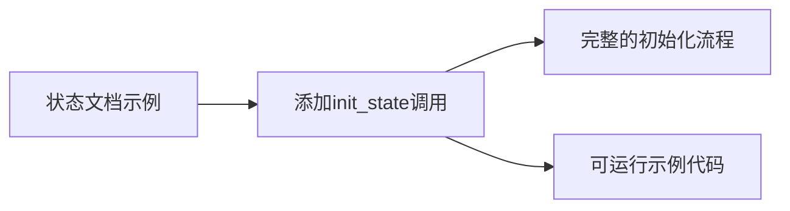

+++
title = "#20840 Add init_state to State example docs"
date = "2025-09-03T00:00:00"
draft = false
template = "pull_request_page.html"
in_search_index = false

[extra]
current_language = "zh-cn"
available_languages = {"en" = { name = "English", url = "/pull_request/bevy/2025-09/pr-20840-en-20250903" }, "zh-cn" = { name = "中文", url = "/pull_request/bevy/2025-09/pr-20840-zh-cn-20250903" }}
+++

# Add init_state to State example docs

## 基本信息
- **标题**: Add init_state to State example docs
- **PR链接**: https://github.com/bevyengine/bevy/pull/20840
- **作者**: lkolbly
- **状态**: 已合并
- **标签**: C-Docs, D-Trivial, S-Ready-For-Final-Review, A-States
- **创建时间**: 2025-09-03T00:30:58Z
- **合并时间**: 2025-09-03T04:02:32Z
- **合并者**: alice-i-cecile

## 描述翻译
# Objective

在状态(State)文档中展示init_state的调用。

## Solution

在状态(State)文档中展示init_state的调用。

## Testing

文档变更

## 本次PR的技术分析

这个PR虽然看起来很小，但解决了一个实际开发中常见的问题：文档示例的完整性。在Bevy引擎的状态管理系统文档中，原来的代码示例缺少了关键的一步——初始化状态。

在Bevy的状态管理中，`init_state`是一个必要的步骤，它负责将状态资源插入到应用中。如果没有这个调用，后续的状态检查和状态转换系统都无法正常工作。原来的文档示例只展示了如何添加基于状态的系统，但没有展示如何初始化状态本身，这可能会导致开发者在使用时遇到困惑。

修改前的文档示例存在一个明显的断层：它展示了如何使用`in_state`条件运行系统和在状态进入时执行系统，但没有展示如何首先设置初始状态。这种不完整的示例对于新开发者来说尤其容易造成困惑，他们可能会直接复制示例代码却发现无法正常工作。

PR的解决方案很简单但很有效：在示例代码中添加了对`app.init_state::<GameState>()`的调用。这个修改确保了示例的完整性和可运行性，让开发者能够清楚地看到状态管理的完整流程。

从技术实现来看，这个修改涉及在原有的mock代码结构中添加了一个空的`init_state`方法实现，这是为了保持示例代码的编译通过性。在实际的Bevy应用中，`init_state`是由Bevy框架提供的真实方法。

```rust
// 修改前：
# struct AppMock;
# impl AppMock {
#     fn add_systems<S, M>(&mut self, schedule: S, systems: impl IntoScheduleConfigs<ScheduleSystem, M>) {}
# }

// 修改后：
# struct AppMock;
# impl AppMock {
#     fn init_state<S>(&mut self) {}
#     fn add_systems<S, M>(&mut self, schedule: S, systems: impl IntoScheduleConfigs<ScheduleSystem, M>) {}
# }
```

这个小小的文档改进体现了良好的开发者体验(Developer Experience)实践。完整的代码示例能够减少开发者的认知负担和学习曲线，特别是对于刚接触Bevy状态管理系统的开发者来说。

## 可视化表示



## 关键文件变更

- `crates/bevy_state/src/state/states.rs` (+2/-0)

这个文件包含了Bevy状态系统的核心文档。修改的内容是在文档示例中添加了`init_state`方法的调用和mock实现。

```rust
// 修改前：
# struct AppMock;
# impl AppMock {
#     fn add_systems<S, M>(&mut self, schedule: S, systems: impl IntoScheduleConfigs<ScheduleSystem, M>) {}
# }

// 修改后：
# struct AppMock;
# impl AppMock {
#     fn init_state<S>(&mut self) {}
#     fn add_systems<S, M>(&mut self, schedule: S, systems: impl IntoScheduleConfigs<ScheduleSystem, M>) {}
# }
```

以及在实际示例使用中添加了init_state调用：
```rust
// 新增的init_state调用
app.init_state::<GameState>();
```

这些修改确保了文档示例的完整性和正确性，使开发者能够清楚地了解状态管理的完整流程。

## 延伸阅读

- [Bevy状态系统官方文档](https://bevyengine.org/learn/book/next/states/)
- [Bevy ECS和状态管理最佳实践](https://bevy-cheatbook.github.io/programming/states.html)
- [Rust文档测试和示例编写指南](https://doc.rust-lang.org/rustdoc/write-documentation/documentation-tests.html)

# 完整代码差异
```diff
diff --git a/crates/bevy_state/src/state/states.rs b/crates/bevy_state/src/state/states.rs
index 2bbdd615baa43..9c18c041bef4a 100644
--- a/crates/bevy_state/src/state/states.rs
+++ b/crates/bevy_state/src/state/states.rs
@@ -46,11 +46,13 @@ use core::hash::Hash;
 ///
 /// # struct AppMock;
 /// # impl AppMock {
+/// #     fn init_state<S>(&mut self) {}
 /// #     fn add_systems<S, M>(&mut self, schedule: S, systems: impl IntoScheduleConfigs<ScheduleSystem, M>) {}
 /// # }
 /// # struct Update;
 /// # let mut app = AppMock;
 ///
+/// app.init_state::<GameState>();
 /// app.add_systems(Update, handle_escape_pressed.run_if(in_state(GameState::MainMenu)));
 /// app.add_systems(OnEnter(GameState::SettingsMenu), open_settings_menu);
 /// ```
```