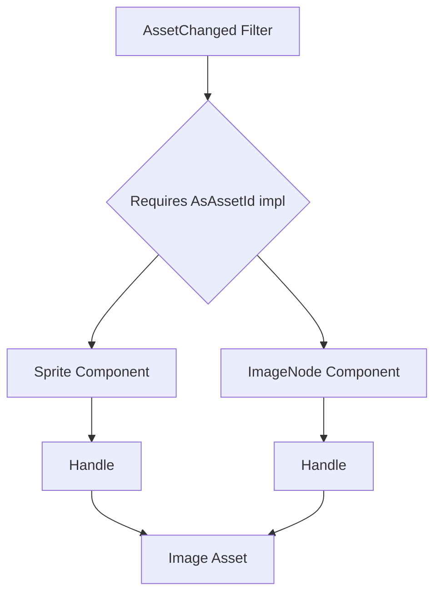

+++
title = "#20841 Impl `AsAssetId` for `Sprite` and `ImageNode`"
date = "2025-09-03T00:00:00"
draft = false
template = "pull_request_page.html"
in_search_index = true

[taxonomies]
list_display = ["show"]

[extra]
current_language = "en"
available_languages = {"en" = { name = "English", url = "/pull_request/bevy/2025-09/pr-20841-en-20250903" }, "zh-cn" = { name = "中文", url = "/pull_request/bevy/2025-09/pr-20841-zh-cn-20250903" }}
labels = ["C-Bug", "D-Trivial", "A-Rendering", "A-Assets"]
+++

# Impl `AsAssetId` for `Sprite` and `ImageNode`

## Basic Information
- **Title**: Impl `AsAssetId` for `Sprite` and `ImageNode`
- **PR Link**: https://github.com/bevyengine/bevy/pull/20841
- **Author**: Glory2Antares
- **Status**: MERGED
- **Labels**: C-Bug, D-Trivial, A-Rendering, A-Assets, S-Ready-For-Final-Review
- **Created**: 2025-09-03T01:22:56Z
- **Merged**: 2025-09-03T03:08:07Z
- **Merged By**: alice-i-cecile

## Description Translation
The original description is in English and is preserved exactly as-is:

# Objective

- Both `Sprite` and `ImageNode` have a 'canonical' handle, but neither struct currently implements `AsAssetId`. Hence they do not work with the `AssetChanged<A>` filter. This is unfortunate, as the ability to do some logic when the `Image` underlying a `Sprite` or `ImageNode` changes is likely useful. 
- Address #20635

## Solution

- Implement `AsAssetId` for `Sprite` and `ImageNode`. `Asset = Image` for both.

## Reservations
- Both `Sprite` and `ImageNode` have a `texture_atlas: Option<TextureAtlas>` field. `TextureAtlas` contains a `Handle<TextureAtlasLayout>`, and it is feasible to imagine a user wanting to query for changes regarding this asset. Since `AsAssetId` only works for a single asset type, the choice must be made as to support either `Image` or `TextureAtlas` , or possibly avoiding an implementation for now. That said, `Image` is the most obvious choice.

---

## Showcase
Now users can filter for `Sprite` components whose underlying `Image` asset has changed.

```rust
fn query_sprites_with_changed_images(query: Query<&Sprite, AssetChanged<Sprite>>) {
    for sprite in &query {
        println!("some logic with the changed image");
    }
}
```

## The Story of This Pull Request

This PR addresses a gap in Bevy's asset system where `Sprite` and `ImageNode` components couldn't be used with the `AssetChanged` filter despite having clear primary asset dependencies. The core issue was straightforward: these components contained `Handle<Image>` fields but lacked the `AsAssetId` trait implementation required for asset change detection.

The problem manifested in practical limitations for developers. Without this implementation, systems couldn't efficiently react to changes in the underlying `Image` assets of sprites or UI image nodes. This forced workarounds like manual asset tracking or less efficient polling mechanisms.

The solution implemented follows Bevy's established patterns for asset change detection. Both `Sprite` and `ImageNode` now implement `AsAssetId<Asset = Image>`, returning the `AssetId` of their primary `image` handle. This enables direct use with `AssetChanged<Sprite>` and `AssetChanged<ImageNode>` filters in queries.

A key consideration during implementation was the potential conflict with other asset types. Both components contain optional `TextureAtlas` fields, which themselves contain `Handle<TextureAtlasLayout>` assets. The PR author made a deliberate choice to prioritize the primary `Image` asset, noting that while texture atlas support might be useful, the `Image` dependency is more fundamental and immediately valuable.

The implementation is minimal and non-breaking - it only adds trait implementations without modifying existing APIs. The changes are consistent across both components, maintaining symmetry in Bevy's API design.

From a technical perspective, this change enables more efficient asset change handling. Systems can now use precise change filters instead of broader change detection, reducing unnecessary processing. The pattern follows Bevy's component-based design philosophy where components themselves can participate in asset systems.

## Visual Representation



## Key Files Changed

### `crates/bevy_sprite/src/sprite.rs` (+9/-1)
**What changed**: Added `AsAssetId` implementation for `Sprite` component
**Why**: To enable asset change detection for sprites' underlying images

```rust
// Before:
use bevy_asset::{Assets, Handle};

// After:
use bevy_asset::{AsAssetId, AssetId, Assets, Handle};

// Added implementation:
impl AsAssetId for Sprite {
    type Asset = Image;

    fn as_asset_id(&self) -> AssetId<Self::Asset> {
        self.image.id()
    }
}
```

### `crates/bevy_ui/src/widget/image.rs` (+9/-1)
**What changed**: Added `AsAssetId` implementation for `ImageNode` component
**Why**: To enable asset change detection for UI image nodes' underlying images

```rust
// Before:
use bevy_asset::{Assets, Handle};

// After:
use bevy_asset::{AsAssetId, AssetId, Assets, Handle};

// Added implementation:
impl AsAssetId for ImageNode {
    type Asset = Image;

    fn as_asset_id(&self) -> AssetId<Self::Asset> {
        self.image.id()
    }
}
```

## Further Reading

- [Bevy Assets Documentation](https://bevyengine.org/learn/books/introduction/assets/)
- [Asset System RFC](https://github.com/bevyengine/rfcs/blob/main/rfcs/19-asset-system.md)
- [Component Change Detection in Bevy](https://bevyengine.org/learn/books/introduction/change-detection/)
- [`AsAssetId` Trait Documentation](https://docs.rs/bevy/latest/bevy/asset/trait.AsAssetId.html)