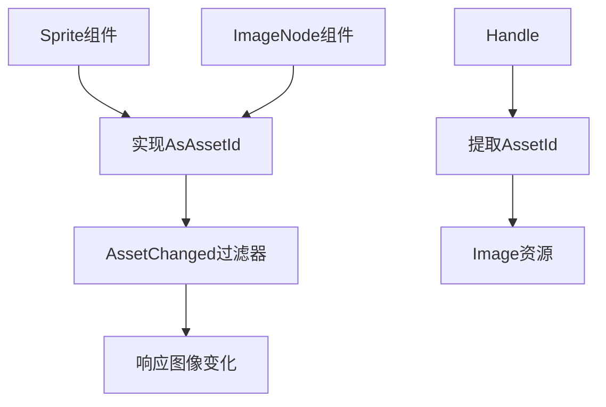

+++
title = "#20841 Impl `AsAssetId` for `Sprite` and `ImageNode"
date = "2025-09-03T00:00:00"
draft = false
template = "pull_request_page.html"
in_search_index = false

[extra]
current_language = "zh-cn"
available_languages = {"en" = { name = "English", url = "/pull_request/bevy/2025-09/pr-20841-en-20250903" }, "zh-cn" = { name = "中文", url = "/pull_request/bevy/2025-09/pr-20841-zh-cn-20250903" }}
+++

# Impl `AsAssetId` for `Sprite` and `ImageNode`

## 基本信息
- **标题**: Impl `AsAssetId` for `Sprite` and `ImageNode`
- **PR链接**: https://github.com/bevyengine/bevy/pull/20841
- **作者**: Glory2Antares
- **状态**: 已合并
- **标签**: C-Bug, D-Trivial, A-Rendering, A-Assets, S-Ready-For-Final-Review
- **创建时间**: 2025-09-03T01:22:56Z
- **合并时间**: 2025-09-03T03:08:07Z
- **合并者**: alice-i-cecile

## 描述翻译
### Objective（目标）

- `Sprite` 和 `ImageNode` 都有一个 'canonical' 句柄，但目前这两个结构体都没有实现 `AsAssetId`。因此它们无法与 `AssetChanged<A>` 过滤器配合使用。这很不方便，因为当 `Sprite` 或 `ImageNode` 底层的 `Image` 发生变化时，能够执行一些逻辑可能是很有用的。
- 解决 #20635

### Solution（解决方案）

- 为 `Sprite` 和 `ImageNode` 实现 `AsAssetId`。两者的 `Asset` 都指定为 `Image`。

### Reservations（考虑事项）

- `Sprite` 和 `ImageNode` 都有一个 `texture_atlas: Option<TextureAtlas>` 字段。`TextureAtlas` 包含一个 `Handle<TextureAtlasLayout>`，可以想象用户可能希望查询与此资源相关的更改。由于 `AsAssetId` 仅适用于单一资源类型，必须选择支持 `Image` 或 `TextureAtlas`，或者可能暂时避免实现。也就是说，`Image` 是最明显的选择。

---

### Showcase（示例展示）

现在用户可以筛选底层 `Image` 资源已发生变化的 `Sprite` 组件。

```rust
fn query_sprites_with_changed_images(query: Query<&Sprite, AssetChanged<Sprite>>) {
    for sprite in &query {
        println!("some logic with the changed image");
    }
}
```

## 本次PR的故事

这个PR解决了一个相对直接但重要的问题：让`Sprite`和`ImageNode`组件能够响应其底层图像资源的变化。

在Bevy的ECS架构中，`AssetChanged<A>`过滤器是一个强大的工具，它允许系统只在特定类型的资源发生变化时运行。然而，要让这个过滤器工作，组件需要实现`AsAssetId` trait，这样系统才能知道如何从组件中提取相关的资源ID。

问题在于，虽然`Sprite`和`ImageNode`组件都包含`Handle<Image>`字段（这实际上是图像的引用），但它们没有实现`AsAssetId` trait。这意味着开发者无法直接使用`AssetChanged<Sprite>`或`AssetChanged<ImageNode>`这样的查询来监听图像资源的变化。

这个PR的解决方案很直接：为两个组件实现`AsAssetId` trait，指定`Image`作为关联的资源类型。实现方式也很简单 - 直接从组件中的`image`字段提取资源ID：

```rust
impl AsAssetId for Sprite {
    type Asset = Image;

    fn as_asset_id(&self) -> AssetId<Self::Asset> {
        self.image.id()
    }
}
```

这里有一个重要的设计决策：虽然这两个组件都可能有`texture_atlas`字段（包含纹理图集信息），但实现选择了专注于主要的`Image`资源。这是一个合理的权衡，因为：
1. 大多数使用场景关注的是图像本身的变化
2. `AsAssetId` trait设计为只处理单一资源类型
3. 如果需要监听纹理图集的变化，可以未来再添加相关实现

这个改动的影响很显著：现在开发者可以编写这样的系统：

```rust
fn on_sprite_image_changed(query: Query<&Sprite, AssetChanged<Sprite>>) {
    for sprite in &query {
        // 当sprite的图像发生变化时执行逻辑
    }
}
```

这对于实现动态资源加载、图像热重载、或者根据资源变化更新UI等场景非常有用。

从技术实现角度看，这个PR遵循了Bevy的良好实践模式：通过trait实现来扩展组件的功能，而不是修改核心逻辑。改动最小但功能增强明显，体现了Bevy的模块化设计哲学。

## 可视化表示



## 关键文件变更

### `crates/bevy_sprite/src/sprite.rs` (+9/-1)
**变更描述**: 为`Sprite`组件实现`AsAssetId` trait

**代码片段**:
```rust
// 新增导入
use bevy_asset::{AsAssetId, AssetId, Assets, Handle};

// 新增实现
impl AsAssetId for Sprite {
    type Asset = Image;

    fn as_asset_id(&self) -> AssetId<Self::Asset> {
        self.image.id()
    }
}
```

### `crates/bevy_ui/src/widget/image.rs` (+9/-1)
**变更描述**: 为`ImageNode`组件实现`AsAssetId` trait

**代码片段**:
```rust
// 新增导入
use bevy_asset::{AsAssetId, AssetId, Assets, Handle};

// 新增实现
impl AsAssetId for ImageNode {
    type Asset = Image;

    fn as_asset_id(&self) -> AssetId<Self::Asset> {
        self.image.id()
    }
}
```

## 延伸阅读

- [Bevy Assets文档](https://docs.rs/bevy_asset/latest/bevy_asset/) - 了解Bevy资源系统的工作原理
- [AsAssetId trait文档](https://docs.rs/bevy_asset/latest/bevy_asset/trait.AsAssetId.html) - 官方trait文档
- [AssetChanged过滤器](https://docs.rs/bevy/latest/bevy/ecs/query/struct.AssetChanged.html) - 学习如何使用资源变化过滤器
- [Bevy ECS查询系统](https://bevy-cheatbook.github.io/programming/queries.html) - 深入了解Bevy的查询系统

# 完整代码差异

```diff
diff --git a/crates/bevy_sprite/src/sprite.rs b/crates/bevy_sprite/src/sprite.rs
index 065effa8d494b..c4e4469dc2178 100644
--- a/crates/bevy_sprite/src/sprite.rs
+++ b/crates/bevy_sprite/src/sprite.rs
@@ -1,4 +1,4 @@
-use bevy_asset::{Assets, Handle};
+use bevy_asset::{AsAssetId, AssetId, Assets, Handle};
 use bevy_camera::visibility::{self, Visibility, VisibilityClass};
 use bevy_color::Color;
 use bevy_derive::{Deref, DerefMut};
@@ -152,6 +152,14 @@ impl From<Handle<Image>> for Sprite {
     }
 }
 
+impl AsAssetId for Sprite {
+    type Asset = Image;
+
+    fn as_asset_id(&self) -> AssetId<Self::Asset> {
+        self.image.id()
+    }
+}
+
 /// Controls how the image is altered when scaled.
 #[derive(Default, Debug, Clone, Reflect, PartialEq)]
 #[reflect(Debug, Default, Clone)]
diff --git a/crates/bevy_ui/src/widget/image.rs b/crates/bevy_ui/src/widget/image.rs
index 10f61405df93b..eb450e6f61eb5 100644
--- a/crates/bevy_ui/src/widget/image.rs
+++ b/crates/bevy_ui/src/widget/image.rs
@@ -1,5 +1,5 @@
 use crate::{ComputedUiRenderTargetInfo, ContentSize, Measure, MeasureArgs, Node, NodeMeasure};
-use bevy_asset::{Assets, Handle};
+use bevy_asset::{AsAssetId, AssetId, Assets, Handle};
 use bevy_color::Color;
 use bevy_ecs::prelude::*;
 use bevy_image::{prelude::*, TRANSPARENT_IMAGE_HANDLE};
@@ -136,6 +136,14 @@ impl From<Handle<Image>> for ImageNode {
     }
 }
 
+impl AsAssetId for ImageNode {
+    type Asset = Image;
+
+    fn as_asset_id(&self) -> AssetId<Self::Asset> {
+        self.image.id()
+    }
+}
+
 /// Controls how the image is altered to fit within the layout and how the layout algorithm determines the space in the layout for the image
 #[derive(Default, Debug, Clone, PartialEq, Reflect)]
 #[reflect(Clone, Default, PartialEq)]
```