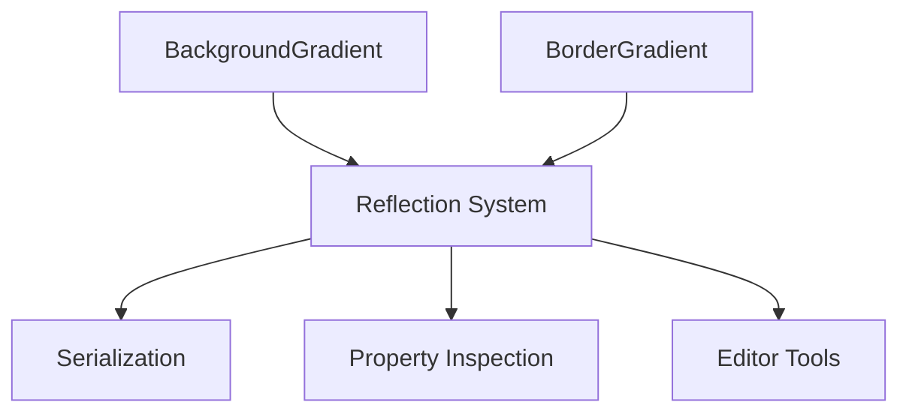

+++
title = "#20842 Adding missing reflect data types to Gradient components"
date = "2025-09-03T00:00:00"
draft = false
template = "pull_request_page.html"
in_search_index = true

[taxonomies]
list_display = ["show"]

[extra]
current_language = "en"
available_languages = {"en" = { name = "English", url = "/pull_request/bevy/2025-09/pr-20842-en-20250903" }, "zh-cn" = { name = "中文", url = "/pull_request/bevy/2025-09/pr-20842-zh-cn-20250903" }}
labels = ["D-Trivial", "A-UI", "A-Reflection"]
+++

# Adding missing reflect data types to Gradient components

## Basic Information
- **Title**: Adding missing reflect data types to Gradient components
- **PR Link**: https://github.com/bevyengine/bevy/pull/20842
- **Author**: eckz
- **Status**: MERGED
- **Labels**: D-Trivial, A-UI, S-Ready-For-Final-Review, A-Reflection
- **Created**: 2025-09-03T08:46:15Z
- **Merged**: 2025-09-03T17:03:46Z
- **Merged By**: alice-i-cecile

## Description Translation
# Objective

- While trying to update `bevy_flair` to bevy 0.17 I found that new gradient components, `BorderGradient` and `BackgroundGradient` were missing `#[reflect(Default)]`

## Solution

- Add missing reflect data types to `BorderGradient` and `BackgroundGradient` .

## Testing

- `cargo ci`: OK

## The Story of This Pull Request

The developer was updating the `bevy_flair` crate to work with Bevy 0.17 when they encountered an issue with the reflection system. The newly introduced gradient components, `BorderGradient` and `BackgroundGradient`, were missing essential reflection attributes that prevented proper serialization and deserialization operations.

The core issue was that these components only had `#[reflect(PartialEq)]` attribute, which was insufficient for full reflection capabilities. Without the complete reflection setup, these components couldn't be properly handled by Bevy's reflection system, which is crucial for operations like scene serialization, property inspection, and editor functionality.

The solution was straightforward but important: add the missing reflection attributes to both components. The developer updated the `#[reflect()]` attribute to include `Component`, `Default`, `PartialEq`, `Debug`, and `Clone` traits. This change ensures these gradient components fully participate in Bevy's reflection system.

The implementation required two key changes:
1. Adding the missing reflect attributes to both component definitions
2. Importing the necessary `ReflectComponent` from `bevy_ecs::reflect`

These changes maintain consistency with other reflected components in the codebase and follow Bevy's established patterns for component reflection. The fix is minimal and focused, addressing exactly the missing functionality without introducing any breaking changes or side effects.

The impact is significant for developers using these gradient components - they can now properly serialize scenes containing these components, use them with Bevy's editor tools, and leverage reflection-based functionality that was previously unavailable.

## Visual Representation



## Key Files Changed

### `crates/bevy_ui/src/gradients.rs` (+3/-3)

This file contains the gradient component definitions. The changes ensure proper reflection support for both gradient components.

**Key modifications:**

```rust
// Before:
use bevy_ecs::component::Component;

// After:
use bevy_ecs::{component::Component, reflect::ReflectComponent};
```

```rust
// Before:
#[reflect(PartialEq)]

// After (for both BackgroundGradient and BorderGradient):
#[reflect(Component, Default, PartialEq, Debug, Clone)]
```

These changes add the necessary reflection capabilities to both gradient components, making them compatible with Bevy's reflection system for serialization, deserialization, and editor functionality.

## Further Reading

- [Bevy Reflection Documentation](https://docs.rs/bevy_reflect/latest/bevy_reflect/)
- [Bevy Component Reflection Guide](https://bevy-cheatbook.github.io/programming/reflection.html)
- [Rust Attribute Macros](https://doc.rust-lang.org/reference/procedural-macros.html#attribute-macros)

# Full Code Diff
```diff
diff --git a/crates/bevy_ui/src/gradients.rs b/crates/bevy_ui/src/gradients.rs
index c6357ae30283e..ce7371fbe552a 100644
--- a/crates/bevy_ui/src/gradients.rs
+++ b/crates/bevy_ui/src/gradients.rs
@@ -1,6 +1,6 @@
 use crate::{UiPosition, Val};
 use bevy_color::{Color, Srgba};
-use bevy_ecs::component::Component;
+use bevy_ecs::{component::Component, reflect::ReflectComponent};
 use bevy_math::Vec2;
 use bevy_reflect::prelude::*;
 use bevy_utils::default;
@@ -524,7 +524,7 @@ impl From<ConicGradient> for Gradient {
 }
 
 #[derive(Component, Clone, PartialEq, Debug, Default, Reflect)]
-#[reflect(PartialEq)]
+#[reflect(Component, Default, PartialEq, Debug, Clone)]
 #[cfg_attr(
     feature = "serialize",
     derive(serde::Serialize, serde::Deserialize),
@@ -540,7 +540,7 @@ impl<T: Into<Gradient>> From<T> for BackgroundGradient {
 }
 
 #[derive(Component, Clone, PartialEq, Debug, Default, Reflect)]
-#[reflect(PartialEq)]
+#[reflect(Component, Default, PartialEq, Debug, Clone)]
 #[cfg_attr(
     feature = "serialize",
     derive(serde::Serialize, serde::Deserialize),
```