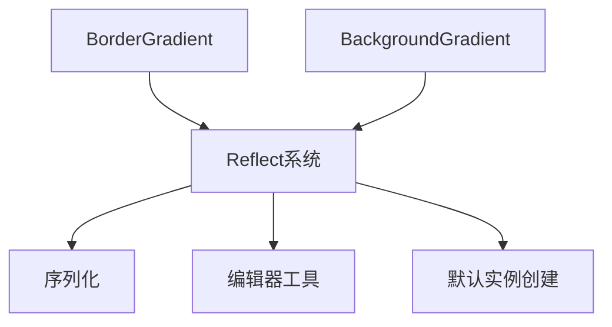

+++
title = "#20842 Adding missing reflect data types to Gradient components"
date = "2025-09-03T00:00:00"
draft = false
template = "pull_request_page.html"
in_search_index = false

[extra]
current_language = "zh-cn"
available_languages = {"en" = { name = "English", url = "/pull_request/bevy/2025-09/pr-20842-en-20250903" }, "zh-cn" = { name = "中文", url = "/pull_request/bevy/2025-09/pr-20842-zh-cn-20250903" }}
+++

# Adding missing reflect data types to Gradient components

## 基本信息
- **标题**: Adding missing reflect data types to Gradient components
- **PR链接**: https://github.com/bevyengine/bevy/pull/20842
- **作者**: eckz
- **状态**: 已合并
- **标签**: D-Trivial, A-UI, S-Ready-For-Final-Review, A-Reflection
- **创建时间**: 2025-09-03T08:46:15Z
- **合并时间**: 2025-09-03T17:03:46Z
- **合并者**: alice-i-cecile

## 描述翻译
# 目标

- 在尝试将 `bevy_flair` 更新到 bevy 0.17 时，我发现新的渐变组件 `BorderGradient` 和 `BackgroundGradient` 缺少 `#[reflect(Default)]`

## 解决方案

- 为 `BorderGradient` 和 `BackgroundGradient` 添加缺失的反射数据类型。

## 测试

- `cargo ci`: 通过

## 本次PR的故事

这个PR的故事始于一位开发者在尝试将外部crate `bevy_flair` 升级到Bevy 0.17版本时遇到的一个具体问题。在升级过程中，他们发现两个新的渐变UI组件 - `BorderGradient` 和 `BackgroundGradient` - 缺少必要的反射属性配置。

在Bevy的ECS架构中，反射系统允许在运行时检查和操作类型信息，这对于编辑器工具、序列化、网络同步等场景至关重要。`#[reflect]` 属性宏用于标记哪些类型和特征应该被纳入反射系统。具体来说，`#[reflect(Component)]` 使得组件能够在反射系统中被识别，而 `#[reflect(Default)]` 则允许通过反射创建默认实例。

问题的核心在于，虽然这两个组件已经使用了 `#[reflect]` 属性，但只包含了 `PartialEq` 特征，缺少了其他必要的反射特征。这意味着在使用反射系统操作这些组件时，无法获取完整的类型信息或创建默认实例，从而导致 `bevy_flair` 这类依赖反射功能的crate在升级后出现兼容性问题。

解决方案相当直接但必要：为这两个组件的 `#[reflect]` 属性添加完整的特征列表。开发者添加了 `Component`、`Default`、`PartialEq`、`Debug` 和 `Clone` 特征，确保这些组件在反射系统中具有完整的功能支持。

从技术实现角度看，这个修改确保了：
1. **组件识别**: `Component` 特征使反射系统能够识别这是一个ECS组件
2. **默认实例创建**: `Default` 特征允许通过反射创建默认实例
3. **相等性比较**: `PartialEq` 特征支持反射时的相等性检查
4. **调试信息**: `Debug` 特征提供调试输出能力
5. **克隆能力**: `Clone` 特征支持通过反射复制实例

这个修改虽然代码量很小，但对于依赖反射系统的功能完整性至关重要。它体现了Bevy生态系统中一个重要的模式：当添加新组件时，必须确保其反射属性配置完整，以保持与整个引擎生态的兼容性。

测试方面，开发者运行了 `cargo ci` 来验证修改没有引入回归问题，这包括编译检查、测试套件运行和代码格式验证。

## 可视化表示



## 关键文件变更

**文件**: `crates/bevy_ui/src/gradients.rs` (+3/-3)

这个文件包含了Bevy UI渐变相关的组件定义。修改涉及两个组件的反射属性配置，从仅包含 `PartialEq` 扩展到包含完整的反射特征集。

**变更前**:
```rust
#[derive(Component, Clone, PartialEq, Debug, Default, Reflect)]
#[reflect(PartialEq)]
// ... 其他属性
pub struct BackgroundGradient {
    pub gradient: Gradient,
}

#[derive(Component, Clone, PartialEq, Debug, Default, Reflect)]
#[reflect(PartialEq)]
// ... 其他属性
pub struct BorderGradient {
    pub gradient: Gradient,
}
```

**变更后**:
```rust
#[derive(Component, Clone, PartialEq, Debug, Default, Reflect)]
#[reflect(Component, Default, PartialEq, Debug, Clone)]
// ... 其他属性
pub struct BackgroundGradient {
    pub gradient: Gradient,
}

#[derive(Component, Clone, PartialEq, Debug, Default, Reflect)]
#[reflect(Component, Default, PartialEq, Debug, Clone)]
// ... 其他属性
pub struct BorderGradient {
    pub gradient: Gradient,
}
```

这些变更确保了这两个渐变组件在反射系统中具有完整的功能支持，解决了外部crate在升级到Bevy 0.17时的兼容性问题。

## 延伸阅读

对于想要深入了解相关概念的开发者，建议阅读以下资源：

1. [Bevy反射系统文档](https://docs.rs/bevy_reflect/latest/bevy_reflect/) - 官方反射系统API文档
2. [Bevy组件指南](https://bevy-cheatbook.github.io/programming/component-basics.html) - 组件基础概念和使用方法
3. [Rust属性宏指南](https://doc.rust-lang.org/reference/procedural-macros.html#attribute-macros) - 理解 `#[derive]` 和 `#[reflect]` 的工作原理

## 完整代码差异
```diff
diff --git a/crates/bevy_ui/src/gradients.rs b/crates/bevy_ui/src/gradients.rs
index c6357ae30283e..ce7371fbe552a 100644
--- a/crates/bevy_ui/src/gradients.rs
+++ b/crates/bevy_ui/src/gradients.rs
@@ -1,6 +1,6 @@
 use crate::{UiPosition, Val};
 use bevy_color::{Color, Srgba};
-use bevy_ecs::component::Component;
+use bevy_ecs::{component::Component, reflect::ReflectComponent};
 use bevy_math::Vec2;
 use bevy_reflect::prelude::*;
 use bevy_utils::default;
@@ -524,7 +524,7 @@ impl From<ConicGradient> for Gradient {
 }
 
 #[derive(Component, Clone, PartialEq, Debug, Default, Reflect)]
-#[reflect(PartialEq)]
+#[reflect(Component, Default, PartialEq, Debug, Clone)]
 #[cfg_attr(
     feature = "serialize",
     derive(serde::Serialize, serde::Deserialize),
@@ -540,7 +540,7 @@ impl<T: Into<Gradient>> From<T> for BackgroundGradient {
 }
 
 #[derive(Component, Clone, PartialEq, Debug, Default, Reflect)]
-#[reflect(PartialEq)]
+#[reflect(Component, Default, PartialEq, Debug, Clone)]
 #[cfg_attr(
     feature = "serialize",
     derive(serde::Serialize, serde::Deserialize),
```