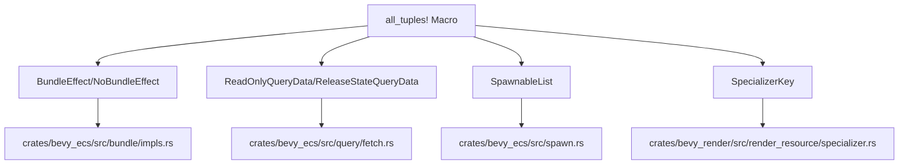

+++
title = "#20847 Add `#[doc(fake_variadic)]` to some places where it's missing"
date = "2025-09-04T00:00:00"
draft = false
template = "pull_request_page.html"
in_search_index = false

[extra]
current_language = "zh-cn"
available_languages = {"en" = { name = "English", url = "/pull_request/bevy/2025-09/pr-20847-en-20250904" }, "zh-cn" = { name = "中文", url = "/pull_request/bevy/2025-09/pr-20847-zh-cn-20250904" }}
labels = ["C-Docs", "A-Rendering", "A-ECS", "D-Straightforward"]
+++

# Title

## Basic Information
- **Title**: Add `#[doc(fake_variadic)]` to some places where it's missing
- **PR Link**: https://github.com/bevyengine/bevy/pull/20847
- **Author**: chescock
- **Status**: MERGED
- **Labels**: C-Docs, A-Rendering, A-ECS, S-Ready-For-Final-Review, X-Uncontroversial, D-Straightforward
- **Created**: 2025-09-03T15:32:31Z
- **Merged**: 2025-09-03T23:50:06Z
- **Merged By**: alice-i-cecile

## Description Translation
**目标**

参见 #14697。我们在大多数元组的 trait 实现中使用了 `#[doc(fake_variadic)]`，但有几个 trait 缺少这个属性，这些 trait 主要是在 #14703 之后添加的：

* `BundleEffect`
* `NoBundleEffect`
* `ReadOnlyQueryData`
* `ReleaseStateQueryData`
* `SpawnableList`
* `SpecializerKey`

**解决方案**

通过 `all_tuples!` 宏为这些 trait 的实现传递 `#[doc(fake_variadic)]` 属性。

**测试**

运行了 `RUSTFLAGS='--cfg docsrs_dep' RUSTDOCFLAGS='--cfg=docsrs' cargo +nightly doc`


## The Story of This Pull Request

这个 PR 解决了一个文档生成的一致性问题。在 Bevy 引擎中，使用 `all_tuples!` 宏为各种 trait 生成元组实现时，需要添加 `#[doc(fake_variadic)]` 属性来确保 Rustdoc 正确显示这些实现。

问题源于 #14697，该 PR 最初引入了 `#[doc(fake_variadic)]` 的使用，但后来添加的几个 trait 实现遗漏了这个属性。这导致生成的文档不一致，某些元组实现显示为独立的实现，而不是统一的变长参数形式。

解决方案很直接：修改相应的宏调用，添加缺失的 `#[doc(fake_variadic)]` 属性。具体来说，需要修改四个文件中的宏定义和调用：

1. 首先修改宏定义，使其能够接受元属性参数
2. 然后在 `all_tuples!` 调用中添加 `#[doc(fake_variadic)]` 属性

这种修改确保了所有使用 `all_tuples!` 宏生成的 trait 实现都具有一致的文档展示方式。从技术角度来看，`#[doc(fake_variadic)]` 是一个 Rust 属性，它告诉 Rustdoc 将这些实现显示为变长参数函数，而不是多个独立的实现，这大大改善了 API 文档的可读性。

测试通过运行特定的 cargo doc 命令来验证修改效果，截图显示文档现在正确显示了变长参数形式的实现。

这个修改是纯粹文档层面的改进，不影响运行时行为，但显著提升了开发者体验和 API 文档的一致性。

## Visual Representation



## Key Files Changed

### `crates/bevy_ecs/src/bundle/impls.rs` (+10/-2)
这个文件修改了 `after_effect_impl` 宏，使其能够接受元属性参数，并在 `all_tuples!` 调用中添加了 `#[doc(fake_variadic)]`。

```rust
// Before:
all_tuples!(after_effect_impl, 0, 15, P);

// After:
all_tuples!(
    #[doc(fake_variadic)]
    after_effect_impl,
    0,
    15,
    P
);
```

### `crates/bevy_ecs/src/query/fetch.rs` (+2/-0)
为 `ReadOnlyQueryData` 和 `ReleaseStateQueryData` 的元组实现添加了 `#[doc(fake_variadic)]` 支持。

```rust
// 添加了元属性支持
$(#[$meta])*
unsafe impl<$($name: ReadOnlyQueryData),*> ReadOnlyQueryData for ($($name,)*) {}

$(#[$meta])*
impl<$($name: ReleaseStateQueryData),*> ReleaseStateQueryData for ($($name,)*) {
```

### `crates/bevy_ecs/src/spawn.rs` (+9/-2)
修改了 `spawnable_list_impl` 宏以支持元属性，并在 `all_tuples!` 调用中添加了 `#[doc(fake_variadic)]`。

```rust
// Before:
all_tuples!(spawnable_list_impl, 0, 12, P);

// After:
all_tuples!(
    #[doc(fake_variadic)]
    spawnable_list_impl,
    0,
    12,
    P
);
```

### `crates/bevy_render/src/render_resource/specializer.rs` (+9/-3)
修改了 `impl_specialization_key_tuple` 宏以支持元属性，并添加了 `#[doc(fake_variadic)]`，同时移除了不再需要的 TODO 注释。

```rust
// Before:
// TODO: How to we fake_variadics this?
all_tuples!(impl_specialization_key_tuple, 0, 12, T);

// After:
all_tuples!(
    #[doc(fake_variadic)]
    impl_specialization_key_tuple,
    0,
    12,
    T
);
```

## Further Reading

- [Rustdoc 属性文档](https://doc.rust-lang.org/rustdoc/write-documentation/advanced-features.html)
- [Bevy ECS 系统](https://bevyengine.org/learn/books/bevy-ecs-book/)
- [宏在 Rust 中的使用](https://doc.rust-lang.org/book/ch19-06-macros.html)
- [原始 PR #14697](https://github.com/bevyengine/bevy/pull/14697) - 最初引入 `#[doc(fake_variadic)]` 的 PR