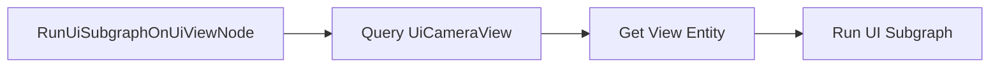

+++
title = "#20850 rename variable"
date = "2025-09-03T00:00:00"
draft = false
template = "pull_request_page.html"
in_search_index = true

[taxonomies]
list_display = ["show"]

[extra]
current_language = "en"
available_languages = {"en" = { name = "English", url = "/pull_request/bevy/2025-09/pr-20850-en-20250903" }, "zh-cn" = { name = "中文", url = "/pull_request/bevy/2025-09/pr-20850-zh-cn-20250903" }}
labels = ["D-Trivial", "A-UI", "C-Code-Quality"]
+++

# Title
Variable Renaming for Clarity in Bevy UI Render Module

## Basic Information
- **Title**: rename variable
- **PR Link**: https://github.com/bevyengine/bevy/pull/20850
- **Author**: ickshonpe
- **Status**: MERGED
- **Labels**: D-Trivial, A-UI, C-Code-Quality, S-Ready-For-Final-Review
- **Created**: 2025-09-03T17:00:55Z
- **Merged**: 2025-09-03T17:57:20Z
- **Merged By**: alice-i-cecile

## Description Translation
# Objective

Naming of this `default_camera_view` variable in the `bevy_ui_render::lib` module is misleading. It's not a default anything, I think it was named this way because iirc `UiCameraView` was called `DefaultCameraView` (or something like that) a few versions ago.

## Solution

Rename `default_camera_view` to `ui_camera_view`.

## The Story of This Pull Request

This PR addresses a straightforward but important code quality issue in Bevy's UI rendering system. The problem was rooted in historical naming conventions that had become misleading over time.

The issue occurred in the `RunUiSubgraphOnUiViewNode` implementation within the bevy_ui_render module. A variable named `default_camera_view` was being used to store a `UiCameraView` component, creating a disconnect between the variable name and its actual purpose. This misleading naming likely originated from a time when the `UiCameraView` component itself had a different name (`DefaultCameraView`), but the variable name wasn't updated when the component was renamed.

The solution was simple but effective: rename the variable from `default_camera_view` to `ui_camera_view` to accurately reflect its purpose and maintain consistency with the current component naming. This change improves code readability and reduces cognitive load for developers working with the UI rendering system.

The implementation involved two minimal changes in the same function:
1. Renaming the variable in the assignment from the query result
2. Updating the usage of that variable when running the UI subgraph

This change doesn't affect runtime behavior or performance - it's purely a code clarity improvement. However, such improvements are valuable for long-term maintainability, especially in complex rendering systems where precise naming helps prevent misunderstandings.

## Visual Representation



## Key Files Changed

**File: `crates/bevy_ui_render/src/lib.rs`**

Changes made to improve variable naming clarity in the UI rendering system:

```rust
// Before:
let Ok(default_camera_view) = render_views.get(world, graph.view_entity()) else {
    return Ok(());
};
graph.run_sub_graph(SubGraphUi, vec![], Some(default_camera_view.0))?;

// After:
let Ok(ui_camera_view) = render_views.get(world, graph.view_entity()) else {
    return Ok(());
};
graph.run_sub_graph(SubGraphUi, vec![], Some(ui_camera_view.0))?;
```

The changes are minimal but significant for code clarity:
1. The variable name now accurately reflects that it holds a `UiCameraView` component
2. The naming is consistent with the current component naming conventions
3. The code is more self-documenting and easier to understand

## Further Reading

- [Bevy UI Rendering Documentation](https://bevyengine.org/learn/books/introduction/ui)
- [Rust Naming Conventions](https://rust-lang.github.io/api-guidelines/naming.html)
- [Code Readability Best Practices](https://github.com/rust-unofficial/patterns/blob/master/patterns/readability.md)