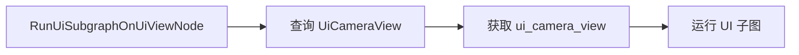

+++
title = "#20850 rename variable"
date = "2025-09-03T00:00:00"
draft = false
template = "pull_request_page.html"
in_search_index = false

[extra]
current_language = "zh-cn"
available_languages = {"en" = { name = "English", url = "/pull_request/bevy/2025-09/pr-20850-en-20250903" }, "zh-cn" = { name = "中文", url = "/pull_request/bevy/2025-09/pr-20850-zh-cn-20250903" }}
+++

# 变量重命名：提升代码可读性的简单修复

## 基本信息
- **标题**: rename variable
- **PR链接**: https://github.com/bevyengine/bevy/pull/20850
- **作者**: ickshonpe
- **状态**: 已合并
- **标签**: D-Trivial, A-UI, C-Code-Quality, S-Ready-For-Final-Review
- **创建时间**: 2025-09-03T17:00:55Z
- **合并时间**: 2025-09-03T17:57:20Z
- **合并人**: alice-i-cecile

## 描述翻译
### 目标

`bevy_ui_render::lib` 模块中的 `default_camera_view` 变量命名存在误导性。它并不是任何默认设置，我认为这样命名是因为在之前的几个版本中 `UiCameraView` 曾被称为 `DefaultCameraView`（或类似名称）。

### 解决方案

将 `default_camera_view` 重命名为 `ui_camera_view`。

## 本次PR的故事

这个PR解决了一个看似简单但重要的代码质量问题：变量命名不准确导致的代码可读性问题。在Bevy引擎的UI渲染模块中，一个关键的变量名 `default_camera_view` 实际上并不表示"默认"的摄像机视图，而是专门用于UI渲染的摄像机视图。

问题的根源在于历史遗留的命名约定。正如作者ickshonpe指出的，在早期版本中，`UiCameraView` 组件可能被称为 `DefaultCameraView`，但随着代码演进，这个名称已经不再准确。保留这样的误导性变量名会给新开发者带来困惑，增加代码维护的认知负担。

解决方案非常直接：将变量名从 `default_camera_view` 改为 `ui_camera_view`。这个修改虽然简单，但体现了良好的代码维护实践。准确的命名能够：

1. 明确表达变量的实际用途
2. 减少新开发者的理解成本
3. 避免未来可能出现的错误假设

从技术实现角度看，这个修改涉及Bevy渲染图(RenderGraph)系统中UI子图的执行逻辑。修改后的变量名 `ui_camera_view` 更准确地反映了其实际功能——它专门用于处理UI摄像机的视图，而不是某种默认或通用的摄像机视图。

这种类型的代码质量改进虽然微小，但对于大型开源项目如Bevy来说至关重要。清晰的命名约定是保持代码库可维护性的基础，特别是在涉及复杂的图形渲染系统时。

## 可视化表示



## 关键文件更改

### `crates/bevy_ui_render/src/lib.rs` (+2/-2)

这个文件包含了Bevy UI渲染系统的核心逻辑。修改涉及`RunUiSubgraphOnUiViewNode`实现中的变量重命名，使其更准确地反映变量的实际用途。

**修改前:**
```rust
let Ok(default_camera_view) = render_views.get(world, graph.view_entity()) else {
    return Ok(());
};

// Run the subgraph on the UI view.
graph.run_sub_graph(SubGraphUi, vec![], Some(default_camera_view.0))?;
```

**修改后:**
```rust
let Ok(ui_camera_view) = render_views.get(world, graph.view_entity()) else {
    return Ok(());
};

// Run the subgraph on the UI view.
graph.run_sub_graph(SubGraphUi, vec![], Some(ui_camera_view.0))?;
```

这个修改将变量名从具有误导性的`default_camera_view`改为更准确的`ui_camera_view`，明确了该变量专门用于UI摄像机视图的上下文。

## 延伸阅读

对于想要了解更多相关概念的开发者，建议阅读：

1. [Bevy Render Graph文档](https://bevyengine.org/learn/books/render-graph/) - 了解Bevy的渲染图系统
2. [Rust API指南：命名约定](https://rust-lang.github.io/api-guidelines/naming.html) - Rust项目的命名最佳实践
3. [代码整洁之道：有意义的命名](https://www.oreilly.com/library/view/clean-code/9780136083238/) - 关于变量命名的重要性和技巧

# 完整代码差异

```diff
diff --git a/crates/bevy_ui_render/src/lib.rs b/crates/bevy_ui_render/src/lib.rs
index acaa6aacc15d0..8955cdeb2fb40 100644
--- a/crates/bevy_ui_render/src/lib.rs
+++ b/crates/bevy_ui_render/src/lib.rs
@@ -419,12 +419,12 @@ impl RenderGraphNode for RunUiSubgraphOnUiViewNode {
         let Some(mut render_views) = world.try_query::<&UiCameraView>() else {
             return Ok(());
         };
-        let Ok(default_camera_view) = render_views.get(world, graph.view_entity()) else {
+        let Ok(ui_camera_view) = render_views.get(world, graph.view_entity()) else {
             return Ok(());
         };
 
         // Run the subgraph on the UI view.
-        graph.run_sub_graph(SubGraphUi, vec![], Some(default_camera_view.0))?;
+        graph.run_sub_graph(SubGraphUi, vec![], Some(ui_camera_view.0))?;
         Ok(())
     }
 }
```