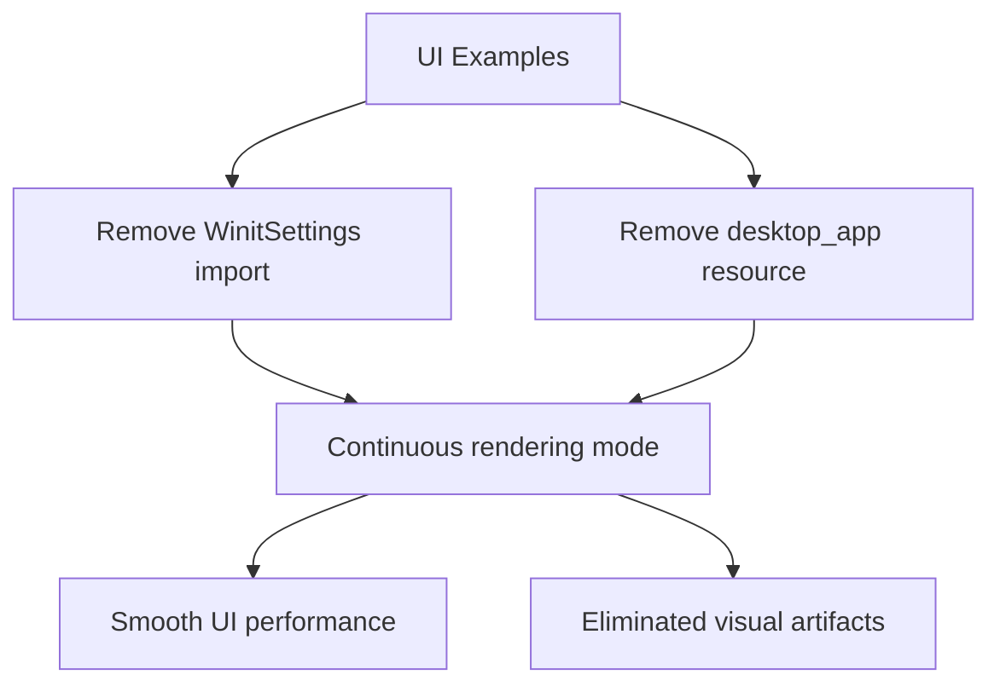

+++
title = "#20851 Remove `desktop_app` setting from `feathers` example (and other UI examples)"
date = "2025-09-03T00:00:00"
draft = false
template = "pull_request_page.html"
in_search_index = true

[taxonomies]
list_display = ["show"]

[extra]
current_language = "en"
available_languages = {"en" = { name = "English", url = "/pull_request/bevy/2025-09/pr-20851-en-20250903" }, "zh-cn" = { name = "中文", url = "/pull_request/bevy/2025-09/pr-20851-zh-cn-20250903" }}
labels = ["C-Examples", "A-UI", "X-Contentious"]
+++

# Remove `desktop_app` setting from `feathers` example (and other UI examples)

## Basic Information
- **Title**: Remove `desktop_app` setting from `feathers` example (and other UI examples)
- **PR Link**: https://github.com/bevyengine/bevy/pull/20851
- **Author**: alice-i-cecile
- **Status**: MERGED
- **Labels**: C-Examples, A-UI, S-Ready-For-Final-Review, X-Contentious
- **Created**: 2025-09-03T17:43:46Z
- **Merged**: 2025-09-03T21:19:01Z
- **Merged By**: alice-i-cecile

## Description Translation

# Objective

While `desktop_app` is arguably correct for a UI focused example, in practice, it doesn't work well currently. The intermittent updates lead to "buggy" behavior: partial loads, stutters and so on.

We should fix those problems, and make the desktop_app setting more useful! But "last minute before release" is not a good time to do so. And simply leaving these apparent bugs in our showcase of the new UI toolkit will both mislead users about the quality and trick them into doing bad things for their own project.

Closes #20796. Fixes (kind of) the problem that motivated #20849.

## Solution

Remove the `desktop_app` setting from this example.

This will cause problems for `accesskit` users (at least on Mac) unfortunately, but that problem is *another* bug: #20515. Telling visually impaired users that they can only use screen readers on low CPU utilization apps in our game framework is not acceptable either.

I've also removed this from the other UI examples for the same reasons. The `low_power` example exists to demonstrate this: we shouldn't clutter the others without good justification.

## Testing

I've run the `feathers` example locally: the bad behavior is no longer observed.

## The Story of This Pull Request

The problem began with Bevy's UI examples exhibiting buggy behavior - partial loads, stutters, and inconsistent rendering. These issues were particularly problematic because they appeared in showcase examples for Bevy's new UI toolkit, potentially misleading users about the framework's quality.

The root cause was the `WinitSettings::desktop_app()` configuration, which enables a low-power mode that only updates the application when there's user input. While this setting is theoretically appropriate for UI-focused applications that don't need continuous rendering, the current implementation caused intermittent updates that resulted in visual artifacts and performance issues.

The developer faced a timing constraint: with an upcoming release, there wasn't sufficient time to properly fix the underlying issues with the `desktop_app` implementation. However, leaving the buggy behavior in the examples was not acceptable, as it would both misrepresent the UI toolkit's capabilities and encourage users to implement problematic patterns in their own projects.

The solution approach was straightforward but impactful: remove the `desktop_app` setting from all affected UI examples. This approach acknowledged that while the low-power mode is conceptually correct for UI applications, the current implementation's flaws made it unsuitable for demonstration purposes. The existing `low_power` example would remain to showcase this functionality when working properly.

The implementation involved modifying 20 UI example files to remove two key elements:
1. The import of `WinitSettings` from `bevy::winit`
2. The insertion of `WinitSettings::desktop_app()` as a resource

For example, in the `feathers` example:

```rust
// Before:
use bevy::{
    // ... other imports ...
    winit::WinitSettings,
};

fn main() {
    App::new()
        .add_plugins(DefaultPlugins)
        // Only run the app when there is user input. This will significantly reduce CPU/GPU use.
        .insert_resource(WinitSettings::desktop_app())
        // ... other configuration ...
        .run();
}

// After:
use bevy::{
    // ... other imports (without winit::WinitSettings) ...
};

fn main() {
    App::new()
        .add_plugins(DefaultPlugins)
        // ... other configuration (without WinitSettings) ...
        .run();
}
```

This change ensures the examples use Bevy's default update mode (continuous rendering) instead of the low-power event-driven mode, eliminating the visual artifacts while maintaining all functional behavior.

The technical insight here is about the trade-off between power efficiency and rendering consistency. The `desktop_app` mode uses `EventLoop::run` with `ControlFlow::Wait`, which only processes events when they occur rather than continuously rendering. While this reduces CPU/GPU usage, it can cause issues with partial rendering and stuttering in complex UI scenarios.

The impact of these changes is immediate: UI examples now render smoothly without visual artifacts, providing a better demonstration of Bevy's UI capabilities. The trade-off is increased CPU/GPU usage in idle states, but this is acceptable for example code that's typically run for short periods.

This change also highlights an important accessibility consideration. The developer noted that removing `desktop_app` might cause issues for AccessKit users on macOS (tracked in #20515), but considered this preferable to suggesting that screen readers only work well in low-power applications.

## Visual Representation



## Key Files Changed

The PR modified 20 UI example files with similar changes. Here are representative examples:

**File: examples/ui/feathers.rs**
```rust
// Before:
use bevy::{
    // ... other imports ...
    winit::WinitSettings,
};

fn main() {
    App::new()
        .add_plugins(DefaultPlugins)
        // Only run the app when there is user input. This will significantly reduce CPU/GPU use.
        .insert_resource(WinitSettings::desktop_app())
        // ... other configuration ...
        .run();
}

// After:
use bevy::{
    // ... other imports (without winit::WinitSettings) ...
};

fn main() {
    App::new()
        .add_plugins(DefaultPlugins)
        // ... other configuration (without WinitSettings) ...
        .run();
}
```

**File: examples/ui/button.rs**
```rust
// Before:
use bevy::{color::palettes::basic::*, input_focus::InputFocus, prelude::*, winit::WinitSettings};

fn main() {
    App::new()
        .add_plugins(DefaultPlugins)
        // Only run the app when there is user input. This will significantly reduce CPU/GPU use.
        .insert_resource(WinitSettings::desktop_app())
        .init_resource::<InputFocus>()
        .add_systems(Startup, setup)
        .run();
}

// After:
use bevy::{color::palettes::basic::*, input_focus::InputFocus, prelude::*};

fn main() {
    App::new()
        .add_plugins(DefaultPlugins)
        .init_resource::<InputFocus>()
        .add_systems(Startup, setup)
        .run();
}
```

These changes remove the problematic low-power mode while maintaining all functional behavior, ensuring smooth rendering in UI examples.

## Further Reading

- [Bevy Winit Settings Documentation](https://docs.rs/bevy/latest/bevy/winit/struct.WinitSettings.html)
- [Bevy UI Examples](https://github.com/bevyengine/bevy/tree/main/examples/ui)
- [Accessibility in Game Development](https://developer.nvidia.com/blog/making-games-accessible-designing-for-motor-disabilities/)
- [Event Loop Control Flow Patterns](https://docs.rs/winit/latest/winit/event_loop/enum.ControlFlow.html)