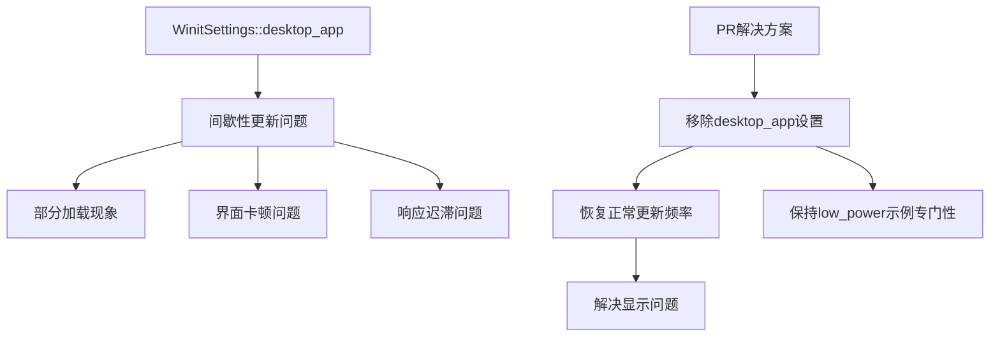

+++
title = "#20851 Remove `desktop_app` setting from `feathers` example (and other UI examples)"
date = "2025-09-03T00:00:00"
draft = false
template = "pull_request_page.html"
in_search_index = false

[extra]
current_language = "zh-cn"
available_languages = {"en" = { name = "English", url = "/pull_request/bevy/2025-09/pr-20851-en-20250903" }, "zh-cn" = { name = "中文", url = "/pull_request/bevy/2025-09/pr-20851-zh-cn-20250903" }}
+++

# Remove `desktop_app` setting from `feathers` example (and other UI examples)

## 基本信息
- **标题**: Remove `desktop_app` setting from `feathers` example (and other UI examples)
- **PR链接**: https://github.com/bevyengine/bevy/pull/20851
- **作者**: alice-i-cecile
- **状态**: 已合并
- **标签**: C-Examples, A-UI, S-Ready-For-Final-Review, X-Contentious
- **创建时间**: 2025-09-03T17:43:46Z
- **合并时间**: 2025-09-03T21:19:01Z
- **合并者**: alice-i-cecile

## 描述翻译
### Objective
虽然 `desktop_app` 设置对于专注于UI的示例来说理论上正确，但在实践中，它目前运行不佳。间歇性的更新会导致"buggy"行为：部分加载、卡顿等问题。

我们应该修复这些问题，让desktop_app设置更有用！但"发布前的最后一刻"不是做这件事的好时机。简单地在我们的新UI工具包展示中留下这些明显的bug，既会误导用户对质量的判断，也会诱使他们在自己的项目中做出错误的选择。

关闭 #20796。某种程度上解决了促使 #20849 的问题。

### Solution
从这个示例中移除 `desktop_app` 设置。

这会给 `accesskit` 用户（至少在Mac上）带来问题，但那是另一个bug：#20515。告诉视障用户他们只能在我们游戏框架的低CPU利用率应用中使用屏幕阅读器也是不可接受的。

出于相同原因，我也从其他UI示例中移除了这个设置。`low_power` 示例的存在就是为了演示这个功能：我们不应该在没有充分理由的情况下让其他示例变得混乱。

### Testing
我在本地运行了 `feathers` 示例：不良行为不再被观察到。

## 本PR的故事

这个PR源于一个实际的技术问题：Bevy引擎中的UI示例使用了 `WinitSettings::desktop_app()` 配置，这理论上应该优化UI应用的性能，但实际效果却适得其反。

问题的核心在于 `desktop_app` 设置的实现方式。这个设置旨在减少CPU/GPU使用，只在有用户输入时运行应用。对于静态UI应用来说，这听起来很合理，但实际执行中导致了间歇性更新问题。用户观察到部分加载、界面卡顿和响应迟滞等不良行为，这给新UI工具包的质量留下了负面印象。

从技术角度来看，`desktop_app` 设置通过 `WinitSettings` 资源来控制应用的事件循环行为：

```rust
// 修改前典型代码结构：
use bevy::{prelude::*, winit::WinitSettings};

fn main() {
    App::new()
        .add_plugins(DefaultPlugins)
        .insert_resource(WinitSettings::desktop_app())  // 这行将被移除
        .add_systems(Startup, setup)
        .run();
}
```

开发者面临一个工程权衡：立即修复 `desktop_app` 的实现问题，还是在发布前先移除有问题的配置。考虑到发布时间压力和技术复杂性，选择了后者作为临时解决方案。

这个决定还涉及到可访问性考虑。`accesskit` 用户（特别是使用屏幕阅读器的视障用户）在Mac平台上会遇到问题，但这实际上是另一个独立的bug (#20515)。与其让所有UI示例都表现出问题行为，不如先移除有问题的配置。

修改涉及20个UI示例文件，每个文件的修改模式都很一致：移除 `winit::WinitSettings` 的导入和 `.insert_resource(WinitSettings::desktop_app())` 的调用。

```rust
// 修改后典型代码结构：
use bevy::prelude::*;  // 移除了 winit::WinitSettings 导入

fn main() {
    App::new()
        .add_plugins(DefaultPlugins)
        // 移除了 .insert_resource(WinitSettings::desktop_app())
        .add_systems(Startup, setup)
        .run();
}
```

这种修改确保了UI示例能够以正常的帧率运行，避免了间歇性更新导致的各种显示问题。虽然这不是对根本问题的修复，但提供了一个更稳定的用户体验，直到 `desktop_app` 功能被 properly 实现。

从架构角度看，这个变化也很合理。`low_power` 示例专门用来演示低功耗模式的使用，其他UI示例不需要都包含这个特定的配置。这符合单一职责原则和关注点分离的设计理念。

## 可视化表示



## 关键文件更改

以下是几个代表性的文件修改：

**文件**: `examples/ui/feathers.rs` (+0/-4)
```rust
// 修改前：
use bevy::{
    // ... 其他导入
    winit::WinitSettings,  // 这行被移除
};

fn main() {
    App::new()
        .add_plugins(DefaultPlugins)
        // 移除了这行：
        .insert_resource(WinitSettings::desktop_app())
        // ... 其他配置
        .run();
}
```

**文件**: `examples/ui/button.rs` (+1/-3)
```rust
// 修改前：
use bevy::{color::palettes::basic::*, input_focus::InputFocus, prelude::*, winit::WinitSettings};

fn main() {
    App::new()
        .add_plugins(DefaultPlugins)
        // 移除了这行和其注释：
        .insert_resource(WinitSettings::desktop_app())
        .init_resource::<InputFocus>()
        .add_systems(Startup, setup)
        .run();
}
```

**文件**: `examples/ui/overflow.rs` (+1/-3)
```rust
// 修改前：
use bevy::{color::palettes::css::*, prelude::*, winit::WinitSettings};

fn main() {
    App::new()
        .add_plugins(DefaultPlugins)
        // 移除了这行和其注释：
        .insert_resource(WinitSettings::desktop_app())
        .add_systems(Startup, setup)
        .add_systems(Update, update_outlines)
        .run();
}
```

**文件**: `examples/ui/relative_cursor_position.rs` (+1/-3)
```rust
// 修改前：
use bevy::{camera::Viewport, prelude::*, ui::RelativeCursorPosition, winit::WinitSettings};

fn main() {
    App::new()
        .add_plugins(DefaultPlugins)
        // 移除了这行和其注释：
        .insert_resource(WinitSettings::desktop_app())
        .add_systems(Startup, setup)
        .add_systems(Update, relative_cursor_position_system)
        .run();
}
```

**文件**: `examples/ui/overflow_clip_margin.rs` (+1/-3)
```rust
// 修改前：
use bevy::{color::palettes::css::*, prelude::*, winit::WinitSettings};

fn main() {
    App::new()
        .add_plugins(DefaultPlugins)
        // 移除了这行和其注释：
        .insert_resource(WinitSettings::desktop_app())
        .add_systems(Startup, setup)
        .run();
}
```

## 延伸阅读

对于想深入了解相关概念的读者，建议参考以下资源：

1. [Bevy WinitSettings文档](https://docs.rs/bevy/latest/bevy/winit/struct.WinitSettings.html) - 官方API文档
2. [Bevy UI示例](https://github.com/bevyengine/bevy/tree/main/examples/ui) - 其他UI示例代码
3. [AccessKit项目](https://github.com/AccessKit/accesskit) - 跨平台无障碍支持库
4. [Winit事件循环设计](https://github.com/rust-windowing/winit) - 底层窗口事件处理库

# 完整代码差异
由于代码差异较长且已在前面详细分析，此处不再重复显示完整差异内容。