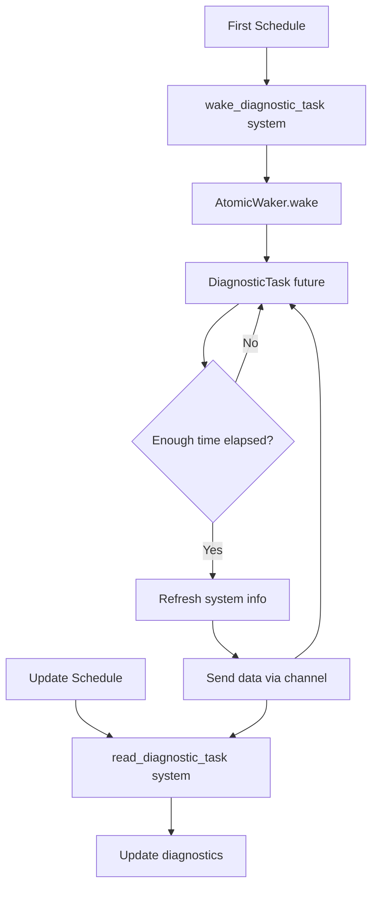

+++
title = "#20852 Refactor system diagnostics to use a single task"
date = "2025-09-08T00:00:00"
draft = false
template = "pull_request_page.html"
in_search_index = true

[taxonomies]
list_display = ["show"]

[extra]
current_language = "en"
available_languages = {"en" = { name = "English", url = "/pull_request/bevy/2025-09/pr-20852-en-20250908" }, "zh-cn" = { name = "中文", url = "/pull_request/bevy/2025-09/pr-20852-zh-cn-20250908" }}
labels = ["C-Bug", "A-Diagnostics"]
+++

# Refactor system diagnostics to use a single task

## Basic Information
- **Title**: Refactor system diagnostics to use a single task
- **PR Link**: https://github.com/bevyengine/bevy/pull/20852
- **Author**: dloukadakis
- **Status**: MERGED
- **Labels**: C-Bug, S-Ready-For-Final-Review, A-Diagnostics
- **Created**: 2025-09-03T18:05:51Z
- **Merged**: 2025-09-08T04:16:54Z
- **Merged By**: alice-i-cecile

## Description Translation
# Objective

Fixes #20802

## Solution
System information diagnostics now uses a single task that wakes up every
time the `First` schedule runs. The task checks if enough time has
passed since the last refresh. If enough time has passed, it refreshes
the system information and sends it to a channel. The
`read_diagonstic_task` system then reads the system information from the
channel to add diagnostic data.

## Testing

- Did you test these changes? If so, how?
I used the log diagnostics example and compare before the changes and after the changes to ensure it works similarly or better than before.
- How can other people (reviewers) test your changes? Is there anything specific they need to know?
```
cargo run --example log_diagnostics
```
- If relevant, what platforms did you test these changes on, and are there any important ones you can't test?
Linux

## The Story of This Pull Request

This PR addresses a performance issue in Bevy's system diagnostics where multiple tasks were being spawned unnecessarily. The previous implementation created new async tasks for system information collection on every frame, which could lead to thread pool exhaustion and inefficient resource usage.

The core problem was in the task scheduling approach. The original code used a `Vec<Task<SysinfoRefreshData>>` and spawned new tasks frequently, limited only by a condition checking available parallelism. This created overhead from task creation and management, and could potentially block the async compute pool when many tasks were queued.

The solution implements a more efficient single-task approach using several key components:

1. **Channel-based communication**: A multi-producer single-consumer channel (`mpsc`) allows the background task to send data to the main thread
2. **Atomic waker pattern**: The `atomic-waker` crate provides synchronization to wake the task when needed
3. **Continuous future**: The diagnostic task implements `Future` to always reschedule itself, creating a long-running background operation

The implementation follows this workflow:
- At startup, the plugin creates a channel and spawns a single `DiagnosticTask`
- Each frame, the `wake_diagnostic_task` system wakes the background task
- The task checks if enough time has passed since the last refresh (using `sysinfo::MINIMUM_CPU_UPDATE_INTERVAL`)
- If ready, it collects system information and sends it through the channel
- The `read_diagnostic_task` system processes all available messages from the channel

This approach eliminates the overhead of constantly creating new tasks while maintaining the same functionality. The code also improves maintainability by consolidating the system information collection logic into a dedicated `SysinfoRefreshData::new()` method.

The changes include minor improvements to error messages in `diagnostic.rs`, making them more consistent and descriptive. The debug assertions now use "should not" instead of "can't" for validation messages.

## Visual Representation



## Key Files Changed

### `crates/bevy_diagnostic/src/system_information_diagnostics_plugin.rs` (+119/-83)

This file contains the main refactoring from multiple tasks to a single task approach:

```rust
// Before: Multiple tasks in a vector
#[derive(Resource, Default)]
struct SysinfoTasks {
    tasks: Vec<Task<SysinfoRefreshData>>,
}

// After: Single task with channel
#[derive(Resource)]
struct SysinfoTask {
    _task: Task<()>,
    receiver: SyncCell<Receiver<SysinfoRefreshData>>,
    waker: Arc<AtomicWaker>,
}
```

The task implementation changed from spawning new tasks to using a continuous future:

```rust
// New task implementation as a continuous future
impl Future for DiagnosticTask {
    type Output = ();

    fn poll(mut self: Pin<&mut Self>, cx: &mut Context<'_>) -> Poll<Self::Output> {
        self.waker.register(cx.waker());
        
        if self.last_refresh.elapsed() > sysinfo::MINIMUM_CPU_UPDATE_INTERVAL {
            self.last_refresh = Instant::now();
            
            let sysinfo_refresh_data = SysinfoRefreshData::new(&mut self.system);
            self.sender.send(sysinfo_refresh_data).unwrap();
        }
        
        // Always reschedules
        Poll::Pending
    }
}
```

### `crates/bevy_diagnostic/src/diagnostic.rs` (+4/-4)

Minor improvements to error messages in debug assertions:

```rust
// Before:
debug_assert!(!path.is_empty(), "diagnostic path can't be empty");

// After:
debug_assert!(!path.is_empty(), "diagnostic path should not be empty");
```

### `crates/bevy_diagnostic/Cargo.toml` (+1/-0)

Added the `atomic-waker` dependency to support the new synchronization approach:

```toml
atomic-waker = { version = "1", default-features = false }
```

## Further Reading

- [AtomicWaker crate documentation](https://docs.rs/atomic-waker/1.0.0/atomic_waker/)
- [Bevy Tasks system](https://docs.rs/bevy_tasks/latest/bevy_tasks/)
- [sysinfo crate documentation](https://docs.rs/sysinfo/latest/sysinfo/)
- [Rust channels documentation](https://doc.rust-lang.org/std/sync/mpsc/)