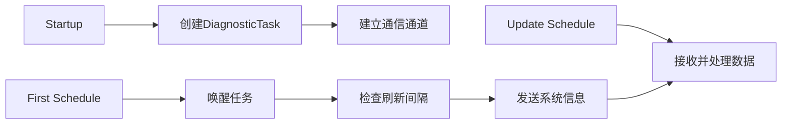

+++
title = "#20852 Refactor system diagnostics to use a single task"
date = "2025-09-08T00:00:00"
draft = false
template = "pull_request_page.html"
in_search_index = false

[extra]
current_language = "zh-cn"
available_languages = {"en" = { name = "English", url = "/pull_request/bevy/2025-09/pr-20852-en-20250908" }, "zh-cn" = { name = "中文", url = "/pull_request/bevy/2025-09/pr-20852-zh-cn-20250908" }}
labels = ["C-Bug", "A-Diagnostics"]
+++

# Refactor system diagnostics to use a single task

## Basic Information
- **Title**: Refactor system diagnostics to use a single task
- **PR Link**: https://github.com/bevyengine/bevy/pull/20852
- **Author**: dloukadakis
- **Status**: MERGED
- **Labels**: C-Bug, S-Ready-For-Final-Review, A-Diagnostics
- **Created**: 2025-09-03T18:05:51Z
- **Merged**: 2025-09-08T04:16:54Z
- **Merged By**: alice-i-cecile

## Description Translation
# Objective

Fixes #20802

## Solution
系统信息诊断现在使用单个任务，该任务在每次 `First` 调度运行时唤醒。任务检查自上次刷新以来是否已经过了足够的时间。如果已经过了足够的时间，它会刷新系统信息并将其发送到通道。然后 `read_diagonstic_task` 系统从通道读取系统信息以添加诊断数据。

## Testing

- 你是否测试了这些更改？如果是，如何测试的？
我使用了日志诊断示例，比较更改前后的表现，确保其工作方式与之前相似或更好。
- 其他人（审阅者）如何测试你的更改？他们需要了解什么特定信息吗？
```
cargo run --example log_diagnostics
```
- 如果相关，你在哪些平台上测试了这些更改，有哪些重要平台你无法测试？
Linux

## The Story of This Pull Request

这个 PR 解决了系统信息诊断中的一个关键问题：原有的实现会在每个满足时间条件的帧生成新的异步任务，导致任务数量无限制增长，最终可能阻塞异步任务池。

**问题背景**
原有的系统信息诊断实现 (`system_information_diagnostics_plugin.rs`) 存在设计缺陷。在 `launch_diagnostic_tasks` 系统中，每次满足时间条件（超过最小 CPU 更新间隔）且任务数量未超过并行度限制时，都会生成新的异步任务来收集系统信息。这导致了两个问题：
1. 任务数量可能无限增长，超出任务池的处理能力
2. 多个任务同时竞争系统资源，造成不必要的开销

**解决方案**
PR 采用了单任务架构重新设计系统：
1. 在 Startup 阶段创建单个长期运行的诊断任务
2. 使用 `AtomicWaker` 和通道机制进行任务间通信
3. 在 First 调度中唤醒任务进行检查
4. 在 Update 调度中读取通道数据更新诊断信息

**实现细节**
核心变化是将多任务模式改为单任务模式。新的 `DiagnosticTask` 是一个 Future 实现，它会：
- 注册 waker 以便外部唤醒
- 检查是否达到刷新时间间隔
- 收集系统信息并通过通道发送
- 始终返回 `Poll::Pending` 以保持任务持续运行

```rust
impl Future for DiagnosticTask {
    type Output = ();

    fn poll(mut self: Pin<&mut Self>, cx: &mut Context<'_>) -> Poll<Self::Output> {
        self.waker.register(cx.waker());
        
        if self.last_refresh.elapsed() > sysinfo::MINIMUM_CPU_UPDATE_INTERVAL {
            self.last_refresh = Instant::now();
            let sysinfo_refresh_data = SysinfoRefreshData::new(&mut self.system);
            self.sender.send(sysinfo_refresh_data).unwrap();
        }
        
        Poll::Pending
    }
}
```

**技术优势**
1. **资源效率**：单个任务代替多个短期任务，减少任务调度开销
2. **线程安全**：通过通道进行线程间通信，避免资源竞争
3. **可控性**：使用明确的唤醒机制，避免无限制的任务生成
4. **维护性**：代码结构更清晰，责任分离更明确

**影响评估**
这个重构解决了潜在的性能问题，使系统信息诊断更加稳定可靠。同时保持了相同的功能接口，对使用者完全透明。修改还包含了错误消息的改进，从口语化的 "can't" 改为更正式的 "should not"。

## Visual Representation



## Key Files Changed

### crates/bevy_diagnostic/src/system_information_diagnostics_plugin.rs (+119/-83)
主要重构文件，实现了单任务架构：

**Before:**
```rust
fn launch_diagnostic_tasks(
    mut tasks: ResMut<SysinfoTasks>,
    mut sysinfo: Local<Option<Arc<Mutex<System>>>>,
    mut last_refresh: Local<Option<Instant>>,
) {
    // 每次满足条件时生成新任务
    if last_refresh.elapsed() > sysinfo::MINIMUM_CPU_UPDATE_INTERVAL
        && tasks.tasks.len() * 2 < available_parallelism()
    {
        let task = thread_pool.spawn(async move {
            // 系统信息收集逻辑
        });
        tasks.tasks.push(task);
    }
}
```

**After:**
```rust
struct DiagnosticTask {
    system: System,
    last_refresh: Instant,
    sender: Sender<SysinfoRefreshData>,
    waker: Arc<AtomicWaker>,
}

fn setup_system(mut diagnostics: ResMut<DiagnosticsStore>, mut commands: Commands) {
    let (tx, rx) = mpsc::channel();
    let diagnostic_task = DiagnosticTask::new(tx);
    let task = AsyncComputeTaskPool::get().spawn(diagnostic_task);
    // 创建单任务资源
}
```

### crates/bevy_diagnostic/src/diagnostic.rs (+4/-4)
改进错误消息的清晰度：

**Before:**
```rust
debug_assert!(!path.is_empty(), "diagnostic path can't be empty");
```

**After:**
```rust
debug_assert!(!path.is_empty(), "diagnostic path should not be empty");
```

### crates/bevy_diagnostic/Cargo.toml (+1/-0)
添加 atomic-waker 依赖：
```toml
atomic-waker = { version = "1", default-features = false }
```

## Further Reading

1. [AtomicWaker 文档](https://docs.rs/atomic-waker/1.0.0/atomic_waker/) - 了解任务唤醒机制
2. [Bevy Tasks 系统](https://bevyengine.org/learn/books/bevy-tasks/) - Bevy 异步任务处理
3. [通道通信模式](https://doc.rust-lang.org/book/ch16-02-message-passing.html) - Rust 消息传递并发
4. [Future 和 Poll 机制](https://rust-lang.github.io/async-book/02_execution/03_wakeups.html) - 异步编程中的唤醒机制